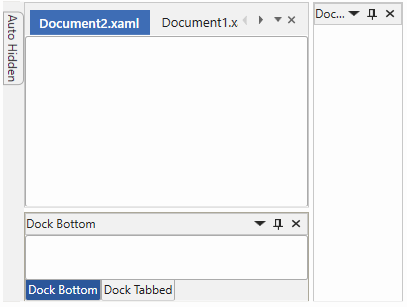

# Overview of WPF DockingManager

The [DockingManager](https://help.syncfusion.com/cr/wpf/Syncfusion.Windows.Tools.Controls.DockingManager.html) control implements an architecture that allows child controls to be docked at any part of a window as in Microsoft Visual Studio. The dock panels containing the child elements can be interactively dragged to any area within the window. These windows can also be floated, tabbed, and auto hidden at run time.

## Key features

**DockState** : Supports the different dock states such as Docking, Floating, AutoHide and Document.

**MDI** : Allows the multiple windows to reside under a single parent window in the Docking Manager.

**TDI** : Allows adding the child window as a document tab in the Docking Manager.

**Themes** : Supports several built-in themes such as Metro, Office2016, and more.

**Tab Switchers** : Supports the various window switchers for navigating between the tabs.

**Customization** : Supports to customize the appearance of Float, Document, AutoHidden and Tabbed windows.

**Nested Layout** : Provides complete support to add the docking manager as a child window to another docking manager.

**Serialization** : Allows you to save and load dock panels states in different formats such as binary and XML.

**ContextMenu** : Provides support to the built-in context menu option for float, close, pin and tab docking windows or child.

**Window Dragging** : Provides support for various styles of window dragging like border, shadow and content dragging.

**Tooltip** : Provides the tooltip support for all default buttons and docking window header.

**Localization** : Supports complete localization to any desired language of header and context menus of the docking windows.
