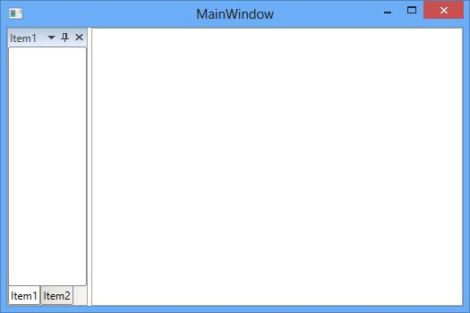
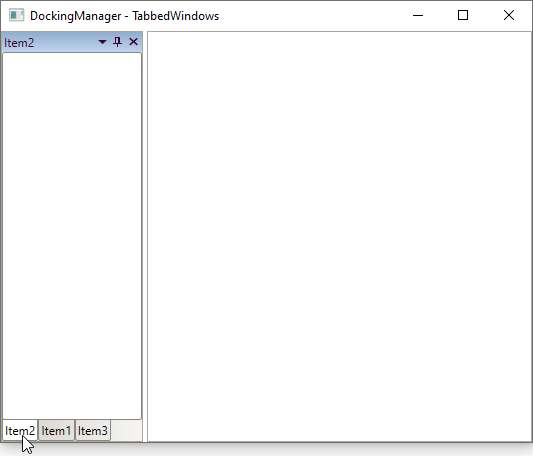

# Tabbed Window in WPF DockingManager

Child window can be arranged as Tabbed windows by setting TargetName and side value as `Tabbed` using the property [SideInDockedMode](https://help.syncfusion.com/cr/wpf/Syncfusion.Windows.Tools.Controls.DockItem.html#Syncfusion_Windows_Tools_Controls_DockItem_SideInDockedMode).

##  Tab alignments

The tabs of the Docked window are placed at the bottom, by default. To place the tabs of the docked window at different sides set the property [DockTabAlignment](https://help.syncfusion.com/cr/wpf/Syncfusion.Windows.Tools.Controls.DockingManager.html#Syncfusion_Windows_Tools_Controls_DockingManager_DockTabAlignment) with desired values such as Top, Bottom, Left and Right. 

* DockTabAlignment as `Bottom`

* Setting DockTabAlignment as `Left`.





<syncfusion:DockingManager x:Name="DockingManager1" DockTabAlignment="Left">

<ContentControl  syncfusion:DockingManager.Header="Item1" x:Name="TabbedWindow1" />
	
<ContentControl syncfusion:DockingManager.Header="Item2" x:Name="TabbedWindow2"
                syncfusion:DockingManager.SideInDockedMode="Tabbed"
				syncfusion:DockingManager.TargetNameInDockedMode="TabbedWindow1"/> 

</syncfusion:DockingManager>





DockingManager1.DockTabAlignment = Dock.Left;





* Setting DockTabAlignment as `Right`





<syncfusion:DockingManager x:Name="DockingManager1" DockTabAlignment="Right">

<ContentControl syncfusion:DockingManager.Header="Item1"  x:Name="TabbedWindow1"/>  

<ContentControl syncfusion:DockingManager.Header="Item2" x:Name="TabbedWindow2"
                syncfusion:DockingManager.SideInDockedMode="Tabbed"
				syncfusion:DockingManager.TargetNameInDockedMode="TabbedWindow1"/>
				
</syncfusion:DockingManager>





DockingManager1.DockTabAlignment = Dock.Right;





* Setting DockTabAlignment as `Top`





<syncfusion:DockingManager x:Name="DockingManager1" DockTabAlignment="Top">

<ContentControl  syncfusion:DockingManager.Header="Item1" x:Name="TabbedWindow1"/> 

<ContentControl syncfusion:DockingManager.Header="Item2" x:Name="TabbedWindow2"
                syncfusion:DockingManager.SideInDockedMode="Tabbed"
				syncfusion:DockingManager.TargetNameInDockedMode="TabbedWindow1"/>  

</syncfusion:DockingManager>




			
SyncDockingManager.DockTabAlignment = Dock.Top;





## Closing a Tabbed window

Tabbed window provides two different closing behaviors. They are CloseActive and CloseAll modes of [CloseTabs](https://help.syncfusion.com/cr/wpf/Syncfusion.Windows.Tools.Controls.DockingManager.html#Syncfusion_Windows_Tools_Controls_DockingManager_CloseTabs) property.

`CloseActive` – Used to close the active element of Tabbed window.





<syncfusion:DockingManager x:Name="DockingManager1" CloseTabs="CloseActive">

<ContentControl syncfusion:DockingManager.Header="Item1" x:Name="TabbedWindow1" />  

<ContentControl syncfusion:DockingManager.Header="Item2" x:Name="TabbedWindow2"
                syncfusion:DockingManager.SideInDockedMode="Tabbed"
				syncfusion:DockingManager.TargetNameInDockedMode="TabbedWindow1"/>  

<ContentControl syncfusion:DockingManager.Header="Item3" x:Name="TabbedWindow3"
                syncfusion:DockingManager.SideInDockedMode="Tabbed"
				syncfusion:DockingManager.TargetNameInDockedMode="TabbedWindow1"/>                         

</syncfusion:DockingManager>





//To close the active element of Tabbed window.

SyncDockingManager.CloseTabs = CloseTabsMode.CloseActive;





 `CloseAll` – Used to close all the Tabbed window.





<syncfusion:DockingManager x:Name="DockingManager1" CloseTabs="CloseAll">

<ContentControl syncfusion:DockingManager.Header="Item1" x:Name="TabbedWindow1"/>  

<ContentControl syncfusion:DockingManager.Header="Item2" x:Name="TabbedWindow2"
                syncfusion:DockingManager.SideInDockedMode="Tabbed"
				syncfusion:DockingManager.TargetNameInDockedMode="TabbedWindow1"/>  

<ContentControl syncfusion:DockingManager.Header="Item3" x:Name="TabbedWindow3"
                syncfusion:DockingManager.SideInDockedMode="Tabbed"
				syncfusion:DockingManager.TargetNameInDockedMode="TabbedWindow1"/>                         

</syncfusion:DockingManager>





//To close all the Tabbed window.

SyncDockingManager.CloseTabs = CloseTabsMode.CloseAll;





## Tabbed window order changed notification

You can notified when the tabbed window's order is changed by using the [TabOrderChanged](https://help.syncfusion.com/cr/wpf/Syncfusion.Windows.Tools.Controls.DockingManager.html#Syncfusion_Windows_Tools_Controls_DockingManager_TabOrderChanged) event. You can get the order changed tabbed window with its old and new index values by using the [TargetItem](https://help.syncfusion.com/cr/wpf/Syncfusion.Windows.Tools.Controls.TabOrderChangedEventArgs.html#Syncfusion_Windows_Tools_Controls_TabOrderChangedEventArgs_TargetItem), [OldIndex](https://help.syncfusion.com/cr/wpf/Syncfusion.Windows.Tools.Controls.TabOrderChangedEventArgs.html#Syncfusion_Windows_Tools_Controls_TabOrderChangedEventArgs_OldIndex) and [NewIndex](https://help.syncfusion.com/cr/wpf/Syncfusion.Windows.Tools.Controls.TabOrderChangedEventArgs.html#Syncfusion_Windows_Tools_Controls_TabOrderChangedEventArgs_NewIndex) properties.

N> The `TabOrderChanged` event occurs only during drag and drop operation. Not occurs when add or remove items using code behind.  




<syncfusion:DockingManager TabOrderChanged="DockingManager1_TabOrderChanged"  
                           DockTabAlignment="Bottom"
                           x:Name="dockingManager1">
    <ContentControl syncfusion:DockingManager.Header="Item1" x:Name="tabbedWindow1" />
    <ContentControl syncfusion:DockingManager.Header="Item2" x:Name="tabbedWindow2"
                    syncfusion:DockingManager.SideInDockedMode="Tabbed"
                    syncfusion:DockingManager.TargetNameInDockedMode="tabbedWindow1"/>
    <ContentControl syncfusion:DockingManager.Header="Item3" x:Name="tabbedWindow3"
                    syncfusion:DockingManager.SideInDockedMode="Tabbed"
                    syncfusion:DockingManager.TargetNameInDockedMode="tabbedWindow2"/>
</syncfusion:DockingManager>




dockingManager1.DockTabAlignment = Dock.Bottom;
dockingManager1.TabOrderChanged += DockingManager1_TabOrderChanged;




You can handle the event as follows,




private void DockingManager1_TabOrderChanged(object sender, TabOrderChangedEventArgs e)
{
    var dragged_Item = e.TargetItem;
    var oldIndex = e.OldIndex;
    var newIndex = e.NewIndex;
}




N> [View Sample in GitHub](https://github.com/SyncfusionExamples/syncfusion-wpf-docking-manager-wpf-examples/tree/master/Samples/TabbedWindowOrdering)

## Restrict tabbed window reordering

If you want to restrict the user to reordering the tabbed window by drag and drop operation, use the [TabOrderChanging](https://help.syncfusion.com/cr/wpf/Syncfusion.Windows.Tools.Controls.DockingManager.html#Syncfusion_Windows_Tools_Controls_DockingManager_TabOrderChanging) event and set `Cancel` property value as `true`.

N> The `TabOrderChanging` event occurs only during drag and drop operation. Not occurs when add or remove items using code behind.  




<syncfusion:DockingManager TabOrderChanging="DockingManager1_TabOrderChanging"
                           DockTabAlignment="Bottom"
                           x:Name="DockingManager1">
    <ContentControl  syncfusion:DockingManager.Header="Item1" x:Name="TabbedWindow1" />
    <ContentControl syncfusion:DockingManager.Header="Item2" x:Name="TabbedWindow2"
                    syncfusion:DockingManager.SideInDockedMode="Tabbed"
                    syncfusion:DockingManager.TargetNameInDockedMode="TabbedWindow1"/>
    <ContentControl syncfusion:DockingManager.Header="Item3" x:Name="TabbedWindow3"
                    syncfusion:DockingManager.SideInDockedMode="Tabbed"
                    syncfusion:DockingManager.TargetNameInDockedMode="TabbedWindow2"/>
</syncfusion:DockingManager>




dockingManager1.DockTabAlignment = Dock.Bottom;
dockingManager1.TabOrderChanging += DockingManager1_TabOrderChanging;




You can handle the event as follows,




private void DockingManager1_TabOrderChanging(object sender, Syncfusion.Windows.Tools.Controls.TabOrderChangedEventArgs e)
{
    // Restrict the Tab item order changing
    e.Cancel = true;

    var dragged_Item = e.TargetItem;
    var oldIndex = e.OldIndex;
    var newIndex = e.NewIndex;
}




N> [View Sample in GitHub](https://github.com/SyncfusionExamples/syncfusion-wpf-docking-manager-wpf-examples/tree/master/Samples/TabbedWindowOrdering)
