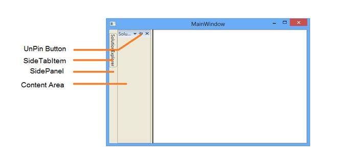
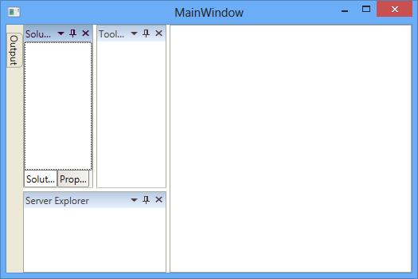
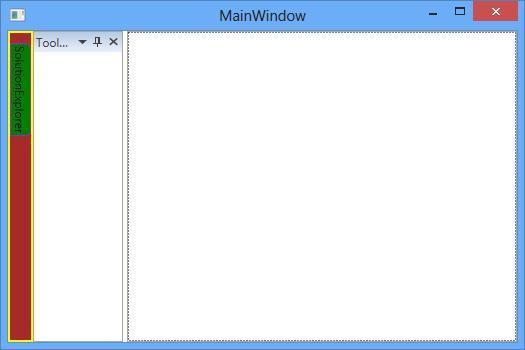
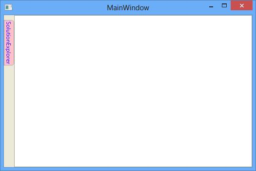
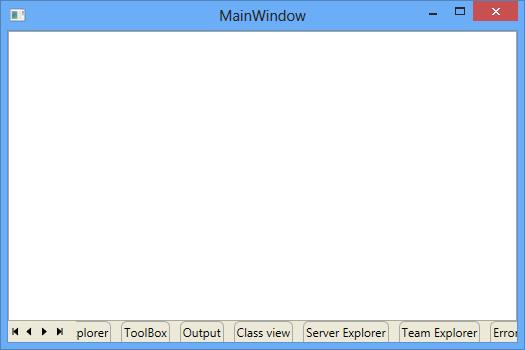
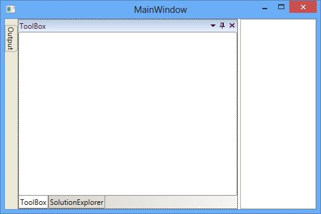
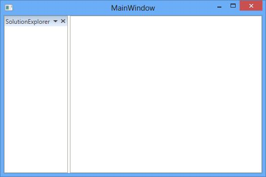

# Auto Hide Window

AutoHide window is one of the state in the DockingManager. To enable Autohidden for DockingManager's children, set its `State` value as `AutoHidden`.

## Configuring window in Different Side

AutoHidden window can be placed in four different sides such as Top, Bottom, Left and Right. To place the four autohidden children in four different sides, set `SideInDockedMode` property according to its corresponding values in the DockingManager.



<ContentControl syncfusion:DockingManager.Header="Top” x:Name="AutoHideWindow1"
                syncfusion:DockingManager.State="AutoHidden” syncfusion:DockingManager.SideInDockedMode="Top” />

<ContentControl syncfusion:DockingManager.Header="Left" x:Name="AutoHideWindow2"
                syncfusion:DockingManager.State="AutoHidden” syncfusion:DockingManager.SideInDockedMode="Left" />

<ContentControl syncfusion:DockingManager.Header="Right" x:Name="AutoHideWindow3"
                syncfusion:DockingManager.State="AutoHidden" syncfusion:DockingManager.SideInDockedMode="Right" />

<ContentControl syncfusion:DockingManager.Header="Bottom" x:Name="AutoHideWindow4"
                syncfusion:DockingManager.State="AutoHidden" syncfusion:DockingManager.SideInDockedMode="Bottom" />





The AutoHidewindow can be placed on a required target window through the `TargetNameInDockedMode` property of the DockingManager. DockingWindow will autohidden in place according to its Parent position, if any target exist. For example: Here "Output" docked at bottom of "SolutionExplorer" which docked at left side. While autohiding Output window, it will autohide at left due to it's TargetWindow side.





<syncfusion:DockingManager>

<ContentControl syncfusion:DockingManager.Header="SolutionExplorer" x:Name="SolutionExplorer"/>

<ContentControl syncfusion:DockingManager.Header="Server Explorer"
                syncfusion:DockingManager.SideInDockedMode="Bottom"
                syncfusion:DockingManager.TargetNameInDockedMode="AutoHideWindow1" />

<ContentControl syncfusion:DockingManager.Header="ToolBox"
                syncfusion:DockingManager.SideInDockedMode="Right"
                syncfusion:DockingManager.TargetNameInDockedMode="AutoHideWindow1" />

<ContentControl syncfusion:DockingManager.Header="Output"
                syncfusion:DockingManager.SideInDockedMode="Bottom"
                syncfusion:DockingManager.TargetNameInDockedMode="AutoHideWindow1" />

<ContentControl syncfusion:DockingManager.Header="Properties"
                syncfusion:DockingManager.SideInDockedMode="Tabbed"
                syncfusion:DockingManager.TargetNameInDockedMode="AutoHideWindow1" />

</syncfusion:DockingManager>





## Side panel Customization

The side panel and side panel header can be customized by applying its Background, BorderBrush and BorderThickness through SidePanelBackground, SidePanelBorderBrush, SidePanelBorderThickness, SideItemBackground and SideItemBorderBrush properties of the DockingManager.





<syncfusion:DockingManager SidePanelBackground="Brown"
                           SidePanelBorderBrush="Yellow" SideItemsBackground="Green"
                           SidePanelBorderThickness="2,2,2,2" SideItemsBorderBrush="BlueViolet">

<ContentControl syncfusion:DockingManager.Header="SolutionExplorer" syncfusion:DockingManager.State="AutoHidden" />

<ContentControl syncfusion:DockingManager.Header="ToolBox" />

</syncfusion:DockingManager>





### SideTabItem Customization

The SideTabItem can be customized using the attached properties `SideTabItemForeground` and `SideTabItemBackground` of DockingManager.





<syncfusion:DockingManager x:Name="DockingManager">

<ContentControl syncfusion:DockingManager.Header="SolutionExplorer" syncfusion:DockingManager.State="AutoHidden"
                syncfusion:DockingManager.SideTabItemForeground="Blue" syncfusion:DockingManager.SideTabItemBackground="Pink"/>

</syncfusion:DockingManager>





## Excel-like Scrollable panel

The `EnableScrollableSidePanel` feature is used to provide scroll support when Auto Hidden tab items overflow onto the side panel.  By default EnableScrollableSidePanel value is `False`, to enable this feature you can set its value to `True`.





<syncfusion:DockingManager x:Name="dockingManager" EnableScrollableSidePanel="True">

<ContentControl syncfusion:DockingManager.SideInDockedMode="Bottom"
                syncfusion:DockingManager.State="AutoHidden" syncfusion:DockingManager.Header="SolutionExplorer"/>

<ContentControl syncfusion:DockingManager.SideInDockedMode="Bottom"
                syncfusion:DockingManager.State="AutoHidden" syncfusion:DockingManager.Header="ToolBox"/>

<ContentControl syncfusion:DockingManager.SideInDockedMode="Bottom"
                syncfusion:DockingManager.State="AutoHidden" syncfusion:DockingManager.Header="Output" />

<ContentControl syncfusion:DockingManager.SideInDockedMode="Bottom"
                syncfusion:DockingManager.State="AutoHidden" syncfusion:DockingManager.Header="Class view" />

<ContentControl syncfusion:DockingManager.SideInDockedMode="Bottom"
                syncfusion:DockingManager.State="AutoHidden" syncfusion:DockingManager.Header="Server Explorer" />

<ContentControl syncfusion:DockingManager.SideInDockedMode="Bottom"
                syncfusion:DockingManager.State="AutoHidden" syncfusion:DockingManager.Header="Team Explorer" />

<ContentControl syncfusion:DockingManager.SideInDockedMode="Bottom"
                syncfusion:DockingManager.State="AutoHidden" syncfusion:DockingManager.Header="ErrorList" />

</syncfusion:DockingManager >





## Changing pinning behavior

Auto Hidden Tabbed window provides two different pinning behaviors `AutoHideActive` and `AutoHideGroup` modes.

`AutoHideActive` – Used to auto-hide current active element of tabbed dock window.




<syncfusion:DockingManager x:Name="DockingManager" AutoHideTabsMode="AutoHideActive">

<ContentControl syncfusion:DockingManager.Header="SolutionExplorer" />

<ContentControl syncfusion:DockingManager.Header="ToolBox" />

<ContentControl syncfusion:DockingManager.Header="Output"  />

</syncfusion:DockingManager>





`AutoHideGroup` – Used to auto-hide the entire tabbed dock window as a group.





<syncfusion:DockingManager x:Name="DockingManager" AutoHideTabsMode="AutoHideGroup">

<ContentControl syncfusion:DockingManager.Header="SolutionExplorer" />

<ContentControl syncfusion:DockingManager.Header="ToolBox" />

<ContentControl syncfusion:DockingManager.Header="Output" />

</syncfusion:DockingManager>





### Configuring Auto Hide Animation

The Animation speed while auto hiding a window can be configured by setting required time delay in `AnimationDelay` property.





<ContentControl syncfusion:DockingManager.Header="item1"
                syncfusion:DockingManager.State="AutoHidden" syncfusion:DockingManager.AnimationDelay="100"/>





### Making different animation for AutoHideWindow

DockingManager supports three different built–in animations while auto-hiding the windows such as `Fade`, `scale` and `slide` that can be set through the property `AutoHideAnimationMode`.

`Fade` – AutoHidewindow fades while autohiding





<syncfusion:DockingManager AutoHideAnimationMode="Fade">

<ContentControl syncfusion:DockingManager.Header="SolutionExplorer" syncfusion:DockingManager.State="AutoHidden” />

</syncfusion:DockingManager>





`Scale` – AutoHidewindow scale while autohiding





<syncfusion:DockingManager AutoHideAnimationMode="Scale">

<ContentControl syncfusion:DockingManager.Header="SolutionExplorer" syncfusion:DockingManager.State="AutoHidden"/>

</syncfusion:DockingManager>





`Slide` – AutoHidewindow slides while autohiding.





<syncfusion:DockingManager AutoHideAnimationMode="Slide">

<ContentControl syncfusion:DockingManager.Header="SolutionExplorer"  syncfusion:DockingManager.State="AutoHidden"/>

</syncfusion:DockingManager>





## Enabling and disabling the Autohide functionality

The Pin button that performs Auto Hide functionality can be visible by default. It can be invisible to disable the AutoHide functionality through `AutoHideVisibility` property.





<syncfusion:DockingManager  AutoHideVisibility="False">

<ContentControl x:Name="AutoHideWindow" syncfusion:DockingManager.Header="SolutionExplorer"/>

</syncfusion:DockingManager>





To enable or disable the Autohide functionality for a specific child in the DockingManager, `CanAutoHide` can be used. By default its value is `true`, this functionality can disable by set its value as `false`.





<ContentControl syncfusion:DockingManager.Header="SolutionExplorer" syncfusion:DockingManager.CanAutoHide="False" />

<ContentControl syncfusion:DockingManager.Header="ToolBox" syncfusion:DockingManager.CanAutoHide="True" />





## AutoHide Animation enabled on Mouse Click

On mouse over the AutoHidden tab, the autohide animation starts. To disable this functionality, set the property `IsAnimationEnabledOnMouseOver` as `False` that changes the autohide tab start animation behaviour. By default, its values is `True`.





<syncfusion:DockingManager IsAnimationEnabledOnMouseOver="False">

<ContentControl x:Name="AutoHideWindow1"
                syncfusion:DockingManager.Header="SolutionExplorer"
                syncfusion:DockingManager.State="AutoHidden" />

</syncfusion:DockingManager>





## Pinning / UnPinning All Window

To autohide all docked windows in the DockingManager, call `AutoHideAllDockWindow` method of the Docking Manager.





DockingManager.AutoHideAllDockWindow();





DockingManager.AutoHideAllDockWindow();





To unpin all autohide windows in the DockingManager, call `UnPinAllAutoHide` method of the Docking Manager.





DockingManager.UnPinAllAutoHide();





DockingManager.UnPinAllAutoHide();





