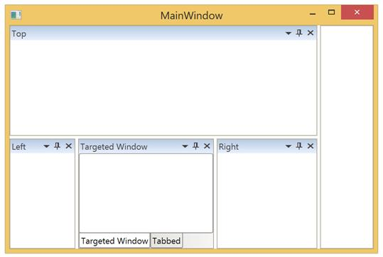
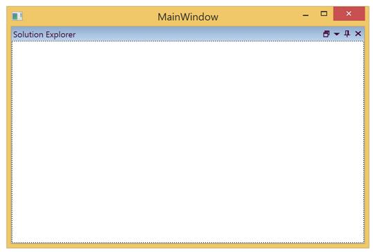

# Docking Window

Docking windows is one of the states of DockingManager, Since `Dock` is the default value, so initially all the children stay in Docking Window
.

## Configuring window in Different Sides

The five sides that can be docked are 

* Left
* Right
* Top
* Bottom
* Tabbed

To dock 4 children of a DockingManager in 4 different sides, then use `SideInDockedMode` property with the required values.


<ContentControl x:Name="DockingWindow1" syncfusion:DockingManager.Header="Docking Left" syncfusion:DockingManager.SideInDockedMode= "Left" />

<ContentControl x:Name="DockingWindow2" syncfusion:DockingManager.Header="Docking Top"  syncfusion:DockingManager.SideInDockedMode= "Top"/>

<ContentControl x:Name="DockingWindow3" syncfusion:DockingManager.Header="Docking Right"  syncfusion:DockingManager.SideInDockedMode= "Right"/>

<ContentControl x:Name="DockingWindow4" syncfusion:DockingManager.Header="Docking Bottom"  syncfusion:DockingManager.SideInDockedMode="Bottom" />



To set as Tabbed Window, the window should be made aware of a Target window name, as explained here. 

## Docking window in various Targets 

Docking window can also be docked at any side of the Target Docking Window, through an attached property named `TargetNameInDockedMode`. 

The following code helps to arrange children of DockingManager that targets a single Docking window, and docked along Left, Top, Right and Tabbed.


<ContentControl x:Name="DockingWindow1" syncfusion:DockingManager.Header="Targeted Window" />

<ContentControl x:Name="DockingWindow2" syncfusion:DockingManager.Header="Top"  syncfusion:DockingManager.SideInDockedMode= "Top" syncfusion:DockingManager.TargetNameInDockedMode="DockingWindow1"/><!--Targeted to Docking indow1 on Top Side-->

<ContentControl x:Name="DockingWindow3" syncfusion:DockingManager.Header="Right"  syncfusion:DockingManager.SideInDockedMode= "Right" syncfusion:DockingManager.TargetNameInDockedMode="DockingWindow1"/> <!--Targeted to DockingWindow1 on Right Side-->

<ContentControl x:Name="DockingWindow4" syncfusion:DockingManager.Header="Left"  syncfusion:DockingManager.SideInDockedMode="Left" syncfusion:DockingManager.TargetNameInDockedMode="DockingWindow1"/><!--Targeted to DockingWindow1 on Left Side-->

<ContentControl x:Name="DockingWindow5" syncfusion:DockingManager.Header="Tabbed"  syncfusion:DockingManager.SideInDockedMode="Tabbed" syncfusion:DockingManager.TargetNameInDockedMode="DockingWindow1"/><!--Targeted to DockingWindow to tab-->      



## Maximize/Minimize Support

This feature helps to Maximize/Minimize Docked Windows for better usage of each window. This support is enabled only when the parent container of a specific element contains more than one host.

* It helps a particular docked window to provide a maximized view
* It can minimize a docked window and can be restored when needed

### Enabling Maximization feature

To enable the feature of maximizing the Docking Window, set `“MaximizeButtonEnabled”` to `“True”`


<syncfusion:DockingManager x:Name="SyncDockingManager" MaximizeButtonEnabled="True">

<ContentControl x:Name="SolutionExplorer" syncfusion:DockingManager.Header="Solution Explorer"/>

<ContentControl x:Name="ToolBox" syncfusion:DockingManager.Header="Toolbox"/>

</syncfusion:DockingManager>



### Maximize Docking Window to full screen

Using `MaximizeMode` property to `FullScreen` then the Docking Windows occupies entire screen when it is in the Maximized state.


<syncfusion:DockingManager x:Name="SyncDockingManager" MaximizeButtonEnabled="True" MaximizeMode="FullScreen"/>



### Enabling Minimization feature

To enable the feature of minimizing the Docking Window, set `MinimizeButtonEnabled` to `True`


<syncfusion:DockingManager x:Name="SyncDockingManager" MinimizeButtonEnabled="True">

<ContentControl x:Name="SolutionExplorer" syncfusion:DockingManager.Header="Solution Explorer"/>

<ContentControl x:Name="ToolBox" syncfusion:DockingManager.Header="Toolbox"/>

</syncfusion:DockingManager>



### Restrict Maximization or Minimization for a specific children

DockingManager provides two attached property named `CanMaximize` and `CanMinimize` to enable or disable Maximizing and Minimizing buttons respectively to the specific window.


<syncfusion:DockingManager x:Name="SyncDockingManager"  MaximizeButtonEnabled="True" MinimizeButtonEnabled="True">

<ContentControl x:Name="SolutionExplorer" syncfusion:DockingManager.Header="Solution Explorer" syncfusion:DockingManager.CanMinimize="False" />

<ContentControl x:Name="ToolBox" syncfusion:DockingManager.Header="Toolbox" syncfusion:DockingManager.CanMaximize="False"/>

</syncfusion:DockingManager>



## Hot Drag the window

The DockWindow Header can be highlighted when the mouse is hovered on an active Docking window, through `IsEnableHotTracking` property. By default its value is `False`, to enable this functionality turn its value to `True`.



<syncfusion:DockingManager x:Name="SyncDockingManager" IsEnableHotTracking="True"/>



## Enabling and disabling the dock functionality

The `CanDock` property can help to enable or disable the docking functionality by setting its value as `True` or `False` respectively. By default its value is `True`, to disable this functionality turn its value to `False`.



<ContentControl syncfusion:DockingManager.CanDock="False" />



## Enabling and disabling the Header Visibility

`NoHeader` is a property, that is used to hide the header of the Docked Window, by default its value is `False`. To hide the Header, turn its value to `True`.



<ContentControl x:Name="SolutionExplorer" syncfusion:DockingManager.Header="Solution Explorer"  syncfusion:DockingManager.NoHeader="True" /> <!--NoHeader enabled to this child-->

<ContentControl x:Name="ToolBox" syncfusion:DockingManager.Header="Toolbox"/>



