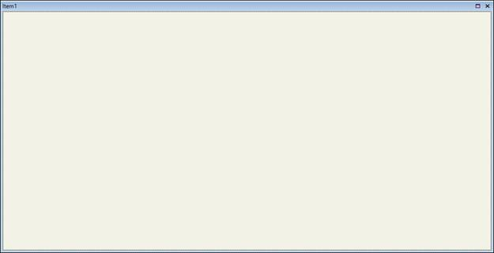
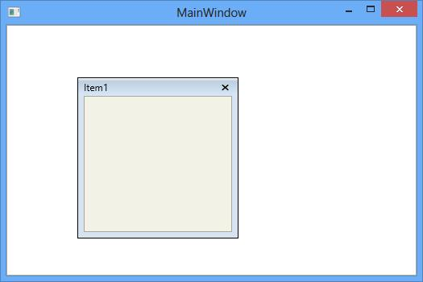
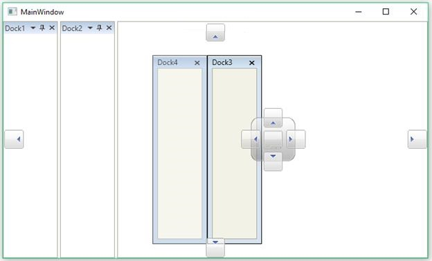

# Floating Window

Floating window is one of the state in the DockingManager. To make children of the DockingManager as Float, set its [State](https://help.syncfusion.com/cr/wpf/Syncfusion.Tools.Wpf~Syncfusion.Windows.Tools.Controls.DockItem~State.html) values as `Float`.

Floating window is like a Popup and it has some limitation in resizing. To avoid this limitation, set the [UseNativeFloatWindow](https://help.syncfusion.com/cr/wpf/Syncfusion.Tools.Wpf~Syncfusion.Windows.Tools.Controls.DockingManager~UseNativeFloatWindow.html) property of the DockingManager as `True`.





<syncfusion:DockingManager x:Name="SyncDockingManager" UseNativeFloatWindow="True">

<ContentControl syncfusion:DockingManager.Header="Item1" syncfusion:DockingManager.State="Float"/>

</syncfusion:DockingManager>





SyncDockingManager.UseNativeFloatWindow = true;





## Rolling Up support

The float window is rolled up to top using the property [IsRollUpTopProperty](https://help.syncfusion.com/cr/wpf/Syncfusion.Tools.Wpf~Syncfusion.Windows.Tools.Controls.DockingManager~IsRollupFloatWindow.html). To enable this functionality set its value as `True`, by default its value is `False`.        





<syncfusion:DockingManager IsRollupFloatWindow="True">

<ContentControl syncfusion:DockingManager.Header="Item1" syncfusion:DockingManager.State="Float"/>

</syncfusion:DockingManager>





SyncDockingManager.IsRollupFloatWindow = true;





## Displaying Float Windows in Taskbar

Taskbar displays the icon of running applications for the purpose of switching between applications. Similarly `DockingManager` allows to display [NativeFloatWindow](https://help.syncfusion.com/cr/wpf/Syncfusion.Tools.Wpf~Syncfusion.Windows.Tools.Controls.NativeFloatWindow.html) in taskbar. It can be set using ShowFloatWindowInTaskbar property for all the [NativeFloatWindow](https://help.syncfusion.com/cr/wpf/Syncfusion.Tools.Wpf~Syncfusion.Windows.Tools.Controls.NativeFloatWindow.html) in `DockingManager` and default is false. Only [NativeFloatWindow](https://help.syncfusion.com/cr/wpf/Syncfusion.Tools.Wpf~Syncfusion.Windows.Tools.Controls.NativeFloatWindow.html) icon can be displayed in taskbar so it is necessary to set [UseNativeFloatWindow](https://help.syncfusion.com/cr/wpf/Syncfusion.Tools.Wpf~Syncfusion.Windows.Tools.Controls.DockingManager~UseNativeFloatWindow.html) to true. 





<syncfusion:DockingManager ShowFloatWindowInTaskbar="True" UseNativeFloatWindow="True">

<ContentControl syncfusion:DockingManager.Header="Toolbox"
                syncfusion:DockingManager.State="Float"
                Content="No items to display in toolbox"/>
                
<ContentControl syncfusion:DockingManager.Header="Solution Explorer"
                syncfusion:DockingManager.State="Float"
                Content="Loading failed"/>
                
</syncfusion:DockingManager>





SyncDockingManager.UseNativeFloatWindow = true;

SyncDockingManager.ShowFloatWindowInTaskbar = true;
		




### Show or Hide the Taskbar support for Selective Windows

To enable or disable the taskbar support for particular window, use the attached property [ShowInTaskbar](https://help.syncfusion.com/cr/wpf/Syncfusion.Tools.Wpf~Syncfusion.Windows.Tools.Controls.DockItem~ShowInTaskbar.html) of `DockingManager` and the default is true. It is necessary to set [ShowFloatWindowInTaskbar](https://help.syncfusion.com/cr/wpf/Syncfusion.Tools.Wpf~Syncfusion.Windows.Tools.Controls.DockingManager~ShowFloatWindowInTaskbar.html) property of `DockingManager` to true for displaying even a single `NativeFloatWindow` in taskbar.





<syncfusion:DockingManager ShowFloatWindowInTaskbar="True" UseNativeFloatWindow="True">

<ContentControl syncfusion:DockingManager.Header="Toolbox" syncfusion:DockingManager.State="Float"
                syncfusion:DockingManager.ShowInTaskbar="False"
                Content="No items to display in toolbox"/>

<ContentControl syncfusion:DockingManager.Header="Solution Explorer"
                syncfusion:DockingManager.State="Float"
                Content="Loading failed"/>

</syncfusion:DockingManager>





SyncDockingManager.UseNativeFloatWindow = true;

SyncDockingManager.ShowFloatWindowInTaskbar = true;

DockingManager.SetShowInTaskbar(Toolbox, false);





## Multiple Monitor functionalities

The default behavior of the float window remains as Popup in the DockingManager. 

On using MultiMonitor scenario, the FloatWindow behavior as follows:

* FloatWindow can be resized both in primary and secondary monitor.
* On showing half of the float window between primary and secondary monitor, the float window remains in half between the monitor while plugged in and plugged out of the secondary monitor.
* When float window is moved to secondary monitor from primary monitor, the float window remains at the secondary monitor itself while plugged in.

To make float window behave like a WPF window in multiple monitor, set the property [UseNativeFloatWindow](https://help.syncfusion.com/cr/wpf/Syncfusion.Tools.Wpf~Syncfusion.Windows.Tools.Controls.DockingManager~UseNativeFloatWindow.html) as `True`. 

## Enabling or Disabling the float functionality

The [CanFloat](https://help.syncfusion.com/cr/wpf/Syncfusion.Tools.Wpf~Syncfusion.Windows.Tools.Controls.DockItem~CanFloat.html) property helps to enable or disable the floating functionality by setting its value as `True` or `False` respectively. By default its value is `True`, to disable this functionality turn its value to `False`.





<syncfusion:DockingManager x:Name="DockingManager1" >

<ContentControl syncfusion:DockingManager.Header="Item1" syncfusion:DockingManager.CanFloat="True"/>

<ContentControl syncfusion:DockingManager.Header="Item2" syncfusion:DockingManager.CanFloat="False"/>

</syncfusion:DockingManager>





//To Enable the Float Functionality 

DockingManager.SetCanFloat(Item1, true);

//To disable the Float Functionality

DockingManager.SetCanFloat(Item2, false);
			




## Enabling and Disabling the float functionality Operation on Double Click

The float window changes its state to `Dock` when double click its header by default. To disable this functionality for the specific child, set [NoDock](https://help.syncfusion.com/cr/wpf/Syncfusion.Tools.Wpf~Syncfusion.Windows.Tools.Controls.DockItem~NoDock.html) property as `True`.       





<syncfusion:DockingManager x:Name="DockingManager1">

<ContentControl syncfusion:DockingManager.Header="Item1" x:Name="Content1" 
                syncfusion:DockingManager.State="Float" syncfusion:DockingManager.NoDock="True"/>                      

</syncfusion:DockingManager>





DockingManager.SetNoDock(Content1, true);





## Maximize/Minimize Support

The float window provides Maximization support for better usability and it is only applicable for NativeFloatWindow. To enable the maximizing feature for the Float window, set [CanFloatMaximize](https://help.syncfusion.com/cr/wpf/Syncfusion.Tools.Wpf~Syncfusion.Windows.Tools.Controls.DockItem~CanFloatMaximize.html) for the specific child as `True`. By default, its value is `False`.





<syncfusion:DockingManager UseNativeFloatWindow="True">

<ContentControl syncfusion:DockingManager.Header="Item1" x:Name="Content1" 
                syncfusion:DockingManager.State="Float" syncfusion:DockingManager.CanFloatMaximize="True"/>    

</syncfusion:DockingManager>





SyncDockingManager.UseNativeFloatWindow = true;

DockingManager.SetCanFloatMaximize(Content1, true);





## Positioning on desire location

The FloatWindow can be placed at any desired location. To position the FloatWindow at the desired location with the required Rect Bounds, call [SetFloatingWindowRect](https://help.syncfusion.com/cr/wpf/Syncfusion.Tools.Wpf~Syncfusion.Windows.Tools.Controls.DockingManager~SetFloatingWindowRect.html) method of the DockingManager.





DockingManager.SetFloatingWindowRect(Content1,new Rect(200,200,200,200));





DockingManager.SetFloatingWindowRect(Content1, New Rect(200, 200, 200, 200)) 





## Snapping Float window

Float window can be snapped with the edge of another float window and moving all together in `DockingManager`. To enable snapping window feature for the Float window, set [AllowSnap](https://help.syncfusion.com/cr/wpf/Syncfusion.Tools.Wpf~Syncfusion.Windows.Tools.Controls.DockingManager~AllowSnapProperty.html) for the specific child as `True` and set [EnableSnappingFloatWindow](https://help.syncfusion.com/cr/wpf/Syncfusion.Tools.Wpf~Syncfusion.Windows.Tools.Controls.DockingManager~EnableSnappingFloatWindowProperty.html) as `True` in `DockingManager`. By default, its value is `False`





<syncfusion:DockingManager  EnableSnappingFloatWindow="True">
  <ContentControl x:Name="Dock1" syncfusion:DockingManager.Header="Dock1"
                                 syncfusion:DockingManager.AllowSnap="True"/>
  <ContentControl x:Name="Dock2" syncfusion:DockingManager.Header="Dock2"
                                 syncfusion:DockingManager.AllowSnap="True"/>
  <ContentControl x:Name="Dock3" syncfusion:DockingManager.Header="Dock3"
                                 syncfusion:DockingManager.AllowSnap="True"/>
  <ContentControl x:Name="Dock4" syncfusion:DockingManager.Header="Dock4"
                                 syncfusion:DockingManager.AllowSnap="True"/>

</syncfusion:DockingManager>





SyncDockingManager.EnableSnappingFloatWindow = true;
			
DockingManager.SetAllowSnap(Dock1, true);

DockingManager.SetAllowSnap(Dock2, true);

DockingManager.SetAllowSnap(Dock3, true);

DockingManager.SetAllowSnap(Dock4, true);





We can get the snapped windows collection for specific float child using [GetSnappedWindows](https://help.syncfusion.com/cr/wpf/Syncfusion.Tools.Wpf~Syncfusion.Windows.Tools.Controls.DockingManager~GetSnappedWindows.html) method.





DockingManager.GetSnappedWindows(Dock1); 



