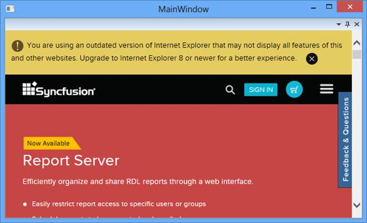

# Hosting Windows Form control as a window

## Hosting a Windows Form control

DockingManager allows to host a WindowsForm control as a Docking Child. Here a Windows Forms WebBrowser control added as Child Window





<syncfusion:DockingManager x:Name="DockingManager1" DockFill="True" >

<WebBrowser Name="Web1" />

</syncfusion:DockingManager> 





WebBrowser web1 = new WebBrowser();

web1.Name = "Web1";

dock.Children.Add(web1);

Web1.Navigate("http://www.syncfusion.com/downloads/metrostudio");





## Interaction with control hosted by Win32 Host 

* While interacting the  WindowsForm control with WPF controls, it leads to inaccessibility of WPF controls behind WindowsForm control, since the WindowsForm control is on top. 
* While floating the WindowsForm control in DockingManager, it is  invisible. For these cases, set [UseInteropCompatibilityMode](https://help.syncfusion.com/cr/wpf/Syncfusion.Tools.Wpf~Syncfusion.Windows.Tools.Controls.DockingManager~UseInteropCompatibilityMode.html) property as `True` for the DockingManager. 





<syncfusion:DockingManager x:Name="DockingManager1" DockFill="True" UseInteropCompatibilityMode="True">

<WebBrowser Name="Web1" />

</syncfusion:DockingManager>





DockingManager1.UseInteropCompatibilityMode = true;



