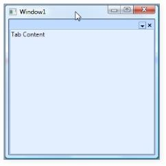

## Hide the TDI header on a child

This property is used to hide the header of a TDI document when the DocumentTabControl has a TDI child.



<syncfusion:DockingManager Name="DockingManager"HideTDIHeaderOnSingleChild="True" UseDocumentContainer="True"><Grid Name="grid1" syncfusion:DockingManager.State="Document">   <TextBlock Text="Tab Content"/></Grid></syncfusion:DockingManager>

DockingManager.HideTDIHeaderOnSingleChild = true;


