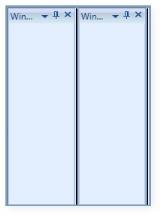

## Set splitter background and size

SplitterBackground is the property used to apply background to splitter between docked Children.


<syncfusion:DockingManager Name="DockingManager" SplitterBackground="Black"> 
   <Grid Name="grid1" syncfusion:DockingManager.Header="Window1"/>  
   <Grid Name="grid2" syncfusion:DockingManager.Header="Window2"/>
   </syncfusion:DockingManager>
 

	DockingManager.SplitterBackground = Brushes.Black;


