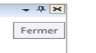
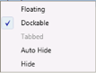

# Localization

Localization customizes the application towards a specific language and region. Syncfusion Tools allow you to set custom resource through the Resx file. In the following table, DockingManager’s property is localized in English and French.

<table>
<tr>
<td>
 Property</td><td>
Description</td></tr>
<tr>
<td>
FloatButtonTooltipText </td><td>
Sets the string for the ToolTip of Float button in the DockingManager.</td></tr>
<tr>
<td colspan = "2">
Float(en-US)                                           Flotteur(c)</td></tr>
<tr>
<td>
AwlButtonTooltipText</td><td>
Sets the string for the ToolTip of Auto Hide button in the DockingManager.</td></tr>
<tr>
<td colspan = "2">

{:.image }

{:.image }
</td></tr>
<tr>
<td>
CloseButtonTooltipText</td><td>
Sets the string for ToolTipof Close button in DockingManager.</td></tr>
<tr>
<td colspan = "2">

{:.image }

{:.image }
{{{ ''_CloseButtonTooltipText(en-US)                                      CloseButtonTooltipText(fr-FR)_'' | markdownify }}}</td></tr>
<tr>
<td>
ContextMenuButtonTooltipText</td><td>
Sets the string for the ToolTip of Context Menu button in DockingManager.</td></tr>
<tr>
<td colspan = "2">

{:.image }

{:.image }
</td></tr>
<tr>
<td>
TabbedAutoHideHide</td><td>
Sets the string for the context menu item in DockingManager.</td></tr>
<tr>
<td colspan = "2">

{:.image }

{:.image }
{{{ ''_ContextMenu(en-US)                                     ContextMenu(fr-FR)_'' | markdownify }}}</td></tr>
<tr>
<td>
MoveToNextTabGroup </td><td>
Sets the string for MoveToNextTabGroup context menu item in the DockingManager and Document Container.</td></tr>
<tr>
<td colspan = "2">

{:.image }

{:.image }
{{{ ''_MoveToNextTabGroup(en-US)                                        MoveToNextTabGroup(fr-FR)_'' | markdownify }}}</td></tr>
<tr>
<td>
MoveToPreviousTabGroup</td><td>
Sets the string for MoveToPreviousTabGroup context menu item in the DockingManager and Document Container.</td></tr>
<tr>
<td colspan = "2">

{:.image }

{:.image }
{{{ ''_MoveToPreviousTabGroup(en-US)                           MoveToPreviousTabGroup(fr-FR)_'' | markdownify }}}</td></tr>
<tr>
<td>
NewTabgroupMenuItemCancel</td><td>
Sets the string for the Tab context menu item in the DockingManager and Document Container.</td></tr>
<tr>
<td colspan = "2">

{:.image }

{:.image }
{{{ ''_NewTabGroup(en-US)                            NewTabGroup(fr-FR)_'' | markdownify }}}</td></tr>
<tr>
<td>
TabCloseCloseAllButThisTabCloseAllFloatingDocumentDockableNewHorizontalTabGroupNewVerticalTabGroup</td><td>
Sets the string for the menu item in the Document Container and DockingManager.</td></tr>
<tr>
<td colspan = "2">

{:.image }

{:.image }
{{{ ''_MenuItem(en-US)                                                  MenuItem(fr-FR)_'' | markdownify }}}</td></tr>
</table>

