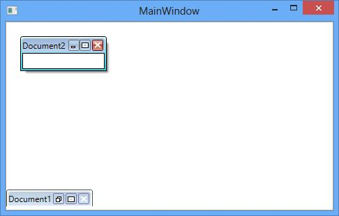
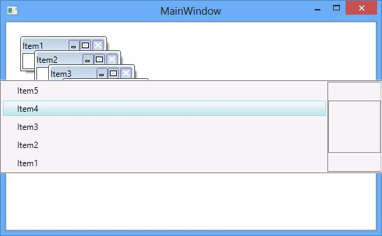
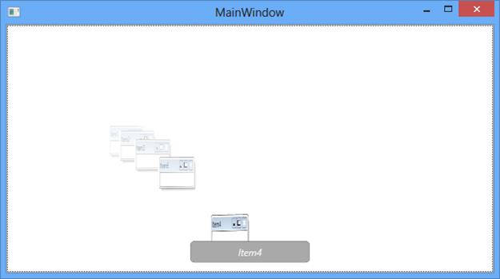
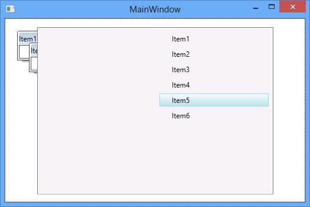
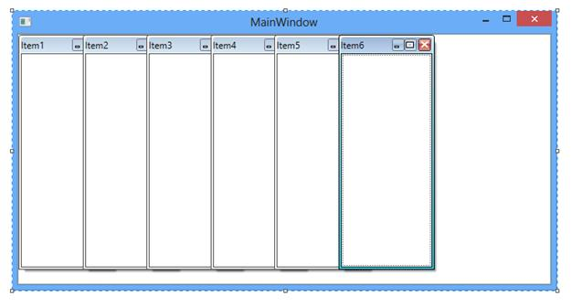
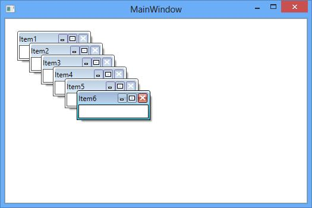
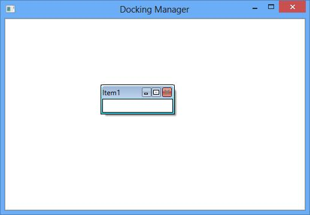
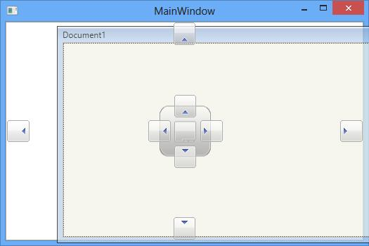
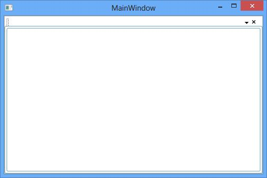

## MDI/ TDI functionalities

The MDI and TDI functionalities are applicable for the Document window in the DockingManager.

The Document window can be displayed in both Multiple Document Interface and Tabbed Document Interface. To switch this functionality between MDI and TDI mode for the Document window, set the property **ContainerMode** with its respective values.

By default, the document state window is in TDI mode, with the display tab as tabbed document.



<syncfusion:DockingManager x:Name="DockingManager1" UseDocumentContainer="True"  ContainerMode="TDI">        

<ContentControl x:Name="Content1" syncfusion:DockingManager.Header="Document1" "/>   

<ContentControl x:Name="Content2" syncfusion:DockingManager.Header="Document2" "

syncfusion:DockingManager.State="Document"/> 

</syncfusion:DockingManager>



To make the document child window as MDI document, set the **ContainerMode** as **MDI**



<syncfusion:DockingManager x:Name="DockingManager1" UseDocumentContainer="True"  ContainerMode="MDI">        

<ContentControl x:Name="Content1" syncfusion:DockingManager.Header="Document1"

syncfusion:DockingManager.State="Document"/>   

<ContentControl x:Name="Content2" syncfusion:DockingManager.Header="Document2"

syncfusion:DockingManager.State="Document"/> 

</syncfusion:DockingManager>



### Setting MDI Window state

The differenet state for the MDI Window can be set using the **SetMDIWindowState()** method of DocumentContainer. 

* Setting MDIWindowstate as Minimized



DocumentContainer.SetMDIWindowState(Content1,MDIWindowState.Minimized);



* Setting MDIWindowstate as Maximized



DocumentContainer.SetMDIWindowState(Content1,MDIWindowState.Maximized);



### Getting state of the MDI window

The state for the MDI window can be detect using the **GetMDIWindowState()** method of DocumentContainer.



DocumentContainer.GetMDIWindowState(Content1);



### Detecting the maximized state of the MDI window

To get the Maximized state of the MDI window of the Document state window, set the property **IsInMDIMaximizedState** of DocumentContainer as **True**. The container can be fetched for the DockingManager using the **DocContainer** property.



(DockingManager1.DocContainer as DocumentContainer).IsInMDIMaximizedState = true;



### Resizing MDI

MDI document window can be able to resize using the navigation arrows, to restrict resizing the MDI document windows, disable the Property **IsAllowMDIResize** of the **Documentcontainer** that can be get using the **DocContainer** property of the DockingManager. By default, its values is **False**.



(DockingManager1.DocContainer as DocumentContainer).IsAllowMDIResize = false;



### Different Keyboard Navigation Modes

DockingManager allows you to navigate between the TDI and MDI windows easily using the keyboard keys with combination of **CTRL** **+** **TAB** in five different modes through the property **SwitchMode** of the Documentcontainer that can be fetched using the DocContainer in the DocumentContainer loaded event.

There are five switch modes.

* Immediate
* List
* QuickTabs
* VS2005
* Vista Flip

* Immediate – Switch the MDI document windows immediately.



DockingManager1.SwitchMode =SwitchMode.Immediate;



* List – Switch the MDI document windows in list format.



DockingManager1.SwitchMode = SwitchMode.List;



* QuickTabs



DockingManager1.SwitchMode = SwitchMode.QuickTabs;



* VistaFlip –



DockingManager1.SwitchMode = SwitchMode.VistaFlip;



* Vs2005



DockingManager1.SwitchMode = SwitchMode.VS2005;



### Setting MDI Layout

DockingManager allows you to set the different layout for the MDI windows with the different MDILayout values such as **Horizontal****,** **Vertical****,** **and** **Cascade** layout through the property **SetLayout****()** of DocumentContainer.

* Horizontal - Arranges the MDI windows horizontally.



void DocumentContainer_Loaded(object sender, RoutedEventArgs e)
{
(DockingManager1.DocContainer as DocumentContainer).SetLayout(MDILayout.Horizontal);
}



* Vertical – Arranges the MDI windows vertically.



void DocumentContainer_Loaded(object sender, RoutedEventArgs e)
{
(DockingManager1.DocContainer as DocumentContainer).SetLayout(MDILayout.Vertical);
}



* Cascade - Arranges the layout in a cascade manner.



void DocumentContainer_Loaded(object sender, RoutedEventArgs e){(DockingManager1.DocContainer as DocumentContainer).SetLayout(MDILayout.Vertical);}



### Closing a MDI Windows

To enable and disable closing of the MDI windows, set **CanClose** an attached property of DockingManager with its respective values. By default, its value is “**True****”**



<syncfusion:DockingManager x:Name="DockingManager1" UseDocumentContainer="True" ContainerMode="MDI">   <ContentControl x:Name="Content1" syncfusion:DockingManager.Header="Item1"  syncfusion:DockingManager.State="Document"                          syncfusion:DockingManager.CanClose="False"></ContentControl>                                 </syncfusion:DockingManager>    </td></tr>


### Indexing an Item in TDI

A document window can be placed at different index position using the **SetTDIIndex****()** method of the TDILayoutPanel. 



<syncfusion:DockingManager x:Name="DockingManager1" UseDocumentContainer="True"  >        <ContentControl x:Name="Content1" syncfusion:DockingManager.Header="Document1"

syncfusion:DockingManager.State="Document"/>   

<ContentControl x:Name="Content2" syncfusion:DockingManager.Header="Document2"

syncfusion:DockingManager.State="Document"/> 

</syncfusion:DockingManager>

TDILayoutPanel.SetTDIIndex(Content1,0);



### Drag / Drop support in TDI

The TDI document index can be changed by dragging and dropping it like Visual Studio. This functionality can be enabled or disabled through the property **IsTDIDragDropEnabled** of DockingManager depends upon its value **True** or **False** respectively.



<syncfusion:DockingManager x:Name="DockingManager1" UseDocumentContainer="True"  IsTDIDragDropEnabled="True" >

<ContentControl x:Name="Content1" syncfusion:DockingManager.Header="Document1"

syncfusion:DockingManager.State="Document"/>

<ContentControl x:Name="Content2" syncfusion:DockingManager.Header="Document2"

syncfusion:DockingManager.State="Document"/>

<ContentControl x:Name="Content3" syncfusion:DockingManager.Header="Document3"

syncfusion:DockingManager.State="Document"/>

</syncfusion:DockingManager>



### Customizing Close Menu

When two or more documents used in the DockingManager the Close, CloseAll and CloseAllButThis menu items are available for the document window. To collapse the visibility of these menu item, set the property **ShowClose** , **ShowCloseAll** and **ShowCloseAllButThis** as **False**.



<ContentControl x:Name="Content1" syncfusion:DockingManager.Header="Item1"  

syncfusion:DockingManager.State="Document"

syncfusion:DockingManager.ShowCloseMenuItem="False"

syncfusion:DockingManager.ShowCloseAllMenuItem="False" syncfusion:DockingManager.ShowCloseAllButThisMenuItem="False"

/>                                                 

<ContentControl x:Name="Content2" syncfusion:DockingManager.Header="Item2"  

syncfusion:DockingManager.State="Document"

syncfusion:DockingManager.ShowCloseMenuItem="False"

syncfusion:DockingManager.ShowCloseAllMenuItem="False"

syncfusion:DockingManager.ShowCloseAllButThisMenuItem="False"/>             



### Grouping Document Tab Group

TDI document can be grouped like VisualStudio. It can be grouped by drag and Drop and also using the options in context menu items.

#### Creating Vertical Tab Group 

To create a vertical tab group in the Tabbed document, select the **New** **Vertical** **Tab** **Group** context menu item and also it can be created programmatically by calling the method **CreateVerticallTabGroup(UIElement)** of the DocumentContainer in its loaded event.



(DockingManager1.DocContainer as DocumentContainer).Loaded += DocumentContainer_Loaded;

private void DocumentContainer_Loaded(object sender, RoutedEventArgs e)
{
(DockingManager1.DocContainer as DocumentContainer). CreateVerticalTabGroup(Content1) (Content1);
}



#### Creating Horizontal Tab Group 

To create a horizontal tab group in the Tabbed document, select the **New** **Horizontal** **Tab** **Group** context menu item and also it can be created programmatically by calling the method **CreateHorizontalTabGroup(UIElement)** of the DocumentContainer in its loaded event.



(DockingManager1.DocContainer as DocumentContainer).Loaded += DocumentContainer_Loaded;

private void DocumentContainer_Loaded(object sender, RoutedEventArgs e)
{
	(DockingManager1.DocContainer as DocumentContainer).CreateHorizontalTabGroup(Content1);
}



#### Adding Tab in a Group 

In TDI document, a new tab group can be created by dragging the TabItem into the Document area and click the **New** **Tab** **Group** Menu from context menu item.

#### Disable TabGroups

Vertical and Horizontal Tab Grouping feature can be enabled or disabled using the property TabGroupEnabled in DockingManager. 

TabGroupEnabled
Enables or disables the ability to create tab groups. It is a boolean property.
 
Disabling Tab Groups
Setting TabGroupEnabled=”False” does not display New Horizontal Tab Group and New Vertical Tab Group context menu items even when ShowHorizontalTabGroupMenuItem is true. Drag and drop support to create new tab group is also restricted. TabGroupEnabled property can be set as shown here:



dockingManager.TabGroupEnabled = false;





<syncfusion:DockingManager x:Name="dockingManager" TabGroupEnabled="False" >
</Syncfusion:DockingManager>


 


### VS2010 Behavior of TDI

TDI document of DockingManager can be changed to Float while dragging its TDI header like the Visual Studio. This functionality can be enabled or disabled using the property **IsVs2010DraggingEnabled** depends upon its value **True** or **False** respectively. 



<syncfusion:DockingManager x:Name="DockingManager1" UseDocumentContainer="True" IsVS2010DraggingEnabled="True"   >

<ContentControl x:Name="Content1" syncfusion:DockingManager.Header="Document1"

syncfusion:DockingManager.State="Document"/>

</syncfusion:DockingManager>



### TDI Header Renaming Support

To enable the functionality of editing the TDI document header when you double click the document header at runtime, set the property **EnableDocumentTabHeaderEdit** of the DockingManager as **True**. By default, its value is **False**.



<syncfusion:DockingManager x:Name="DockingManager1" UseDocumentContainer="True" EnableDocumentTabHeaderEdit="True">



### Hiding TDI Header

To hide the TDI document header when a single document child present in a DockingManager set the property **HideTDIHeaderOnSingleChild** as **True**. By default its value is **False**.



<syncfusion:DockingManager x:Name="DockingManager1" UseDocumentContainer="True" HideTDIHeaderOnSingleChild="True">

<ContentControl x:Name="Content1" syncfusion:DockingManager.Header="Document1"                                          syncfusion:DockingManager.State="Document" />

</syncfusion:DockingManager>



### Add new button in Header Panel

In DockingManager, the new button can be added in the Document state windows using the **IsNewButtonEnabled** property of the DocumentTabControl. To achieve this, the DocumentTabControl must be fetched from the DockingManager using the VisualUtils in Document container loaded event.



//shows the loaded event for the DocumentContainer.
(DockingManager1.DocContainer as DocumentContainer).Loaded += DocumentContainer_Loaded;  void DocumentContainer_Loaded(object sender, RoutedEventArgs e)  {  DocumentTabControl tab = VisualUtils.FindDescendant(DockingManager1,  typeof (DocumentTabControl)) as DocumentTabControl;
if (tab != null)
{
tab.IsNewButtonEnabled = true;
tab.NewButtonBackground = Brushes.Green;}}



