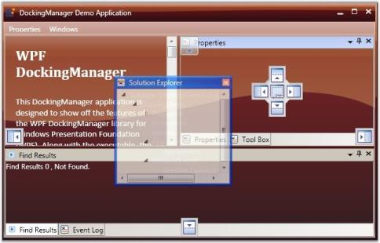
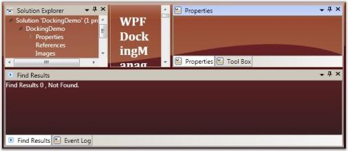
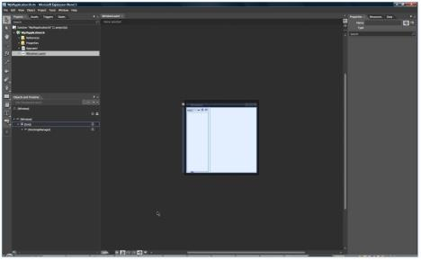
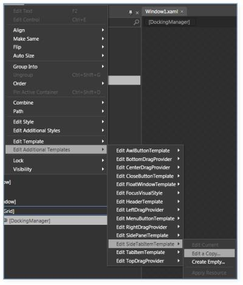
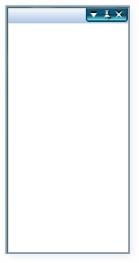

# Styles and Templates

## Customizing the Drag Provider

Drag providers are those which appear, when you drag a window over another window. This guides you to dock the window on any side of the Parent window. The DockingManager has four drag providers with respect to the sides of a window. They are LeftDragProvider, RightDragProvider, TopDragProvider, BottomDragProvider and CenterDragProvider. This section discusses all these drag providers.

### Left Drag Provider

The LeftDragProvider property of the DockingManager is used to apply custom templates to the Left Drag Provider. The following code snippet is used for this purpose.

[XAML]

        &lt;sftools:DockingManager.LeftDragProvider&gt;

            &lt;ControlTemplate TargetType="{x:Type ContentControl}"&gt;

                &lt;Image Name="Img" sftool:DockPreviewManagerVS2005.ProviderAction="GlobalLeft" Source="\Images\left_normal.png" /&gt;

                &lt;ControlTemplate.Triggers&gt;

                    <DataTrigger Binding="{Binding Path=IsSideButtonActive, RelativeSource={RelativeSource FindAncestor, AncestorType={x:Type

            sftools:DockPreviewMainButtonVS2005}}}"Value="true">

                        &lt;Setter TargetName="Img" Property="Source" Value="\Images\left_mouseover.png"/&gt;

                    &lt;/DataTrigger&gt;

                &lt;/ControlTemplate.Triggers&gt;

            &lt;/ControlTemplate&gt;

        &lt;/sftools:DockingManager.LeftDragProvider&gt;

{  | markdownify }
{:.image }

### Right Drag Provider

The Custom control template for right drag provider is applied using the RightDragProvider property of the DockingManager. The following code snippet is used for this purpose.

[XAML]

        &lt;sftools:DockingManager.RightDragProvider&gt;

            &lt;ControlTemplate TargetType="{x:Type ContentControl}"&gt;

                &lt;Image Name="Img" sftools:DockPreviewManagerVS2005.ProviderAction="GlobalRight" Source="\Images\right_normal.png" /&gt;

                &lt;ControlTemplate.Triggers&gt;

                    <DataTrigger Binding="{Binding Path=IsSideButtonActive, RelativeSource={RelativeSource FindAncestor, AncestorType={x:Type 

                 sftools:DockPreviewMainButtonVS2005}}}" Value="true">

                        &lt;Setter TargetName="Img" Property="Source" Value="\Images\right_mouseover.png"/&gt;

                    &lt;/DataTrigger&gt;

                &lt;/ControlTemplate.Triggers&gt;

            &lt;/ControlTemplate&gt;

        &lt;/sftools:DockingManager.RightDragProvider&gt;

{  | markdownify }
{:.image }

### Top Drag Provider

Control templates for top drag providers is applied using the TopDragProvider property of the DockingManager. The following code snippet can be used for this purpose.

[XAML]

        &lt;sftools:DockingManager.TopDragProvider&gt;

            &lt;ControlTemplate x:Key="TopDragProviderTemplate" TargetType="{x:Type ContentControl}"&gt;

                &lt;Image Name="Img" Width="35" Height="34" sftools:DockPreviewManagerVS2005.ProviderAction="GlobalTop" Source="\Images\up_normal.png"/&gt;

                &lt;ControlTemplate.Triggers&gt;

                    &lt;DataTrigger Binding="{Binding Path=IsSideButtonActive, RelativeSource={RelativeSource FindAncestor, AncestorType={x:Type sftools:DockPreviewMainButtonVS2005}}}" Value="true"&gt;

                        &lt;Setter TargetName="Img" Property="Source" Value="\Images\up_mouseover.png"/&gt;

                    &lt;/DataTrigger&gt;

                &lt;/ControlTemplate.Triggers&gt;

            &lt;/ControlTemplate&gt;

        &lt;/sftools:DockingManager.TopDragProvider&gt;

{  | markdownify }
{:.image }

### Bottom Drag Provider

This Drag provider is the bottom button that appears while dragging a window over another, allowing the window to be docked to the bottom of the parent element. To override the default template, the user can use the BottomDrag providers. To add a BottomDrag Provider, use the following code snippet.

[XAML]

        &lt;!--Declaring Docking Manager--&gt;

        &lt;syncfusion:DockingManager&gt;

            &lt;!--Setting the Bottom Drag Provider for the Docking Manager--&gt;

            &lt;syncfusion:DockingManager.BottomDragProvider&gt;

                &lt;ControlTemplate TargetType="{x:Type ContentControl}"&gt;

                    &lt;Image Name="Img" Width="27" Height="27" syncfusion:DockPreviewManagerVS2005.ProviderAction="GlobalBottom" Source="Images\CustomDragProvider.png" /&gt;

                    &lt;ControlTemplate.Triggers&gt;

                        &lt;DataTrigger Binding="{Binding Path=IsSideButtonActive, RelativeSource={RelativeSource FindAncestor, AncestorType={x:Type syncfusion:DockPreviewMainButtonVS2005}}}" Value="true"&gt;

                            &lt;Setter TargetName="Img" Property="Source" Value="Images\CustomDragProviderOver.png"/&gt;

                        &lt;/DataTrigger&gt;

                    &lt;/ControlTemplate.Triggers&gt;

                &lt;/ControlTemplate&gt;

            &lt;/syncfusion:DockingManager.BottomDragProvider&gt;

            &lt;!--Children for the Docking Manager--&gt;

            <StackPanel syncfusion:DockingManager.Header="Element one"

              syncfusion:DockingManager.State="Dock"

              syncfusion:DockingManager.SideInDockedMode="Left"/>

        &lt;/syncfusion:DockingManager&gt;

If CustomDragProvider.png and CustomDragProviderOver.png are in the Images folder of the solution file, then you need to call using the key in the C# Code using the key defined in the template as given below

[C#]

//Creating the instance of the Docking Manager.

DockingManager = new DockingManager();

//Applying the template using the Resource look up logic.

DockingManager.BottomDragProvider = (ControlTemplate)FindResource("BottomButtonCustomTemplate");

### Center Drag Provider

This drag provider is the center button that appears while dragging a window over another, which allows the window to be docked to fill the parent element. To override the default template you can use the CenterDragProvider as follows. 

<table>
<tr>
<td>
[XAML]        &lt;Window.Resources&gt;            &lt;ControlTemplate x:Key="CenterButtonCustomTemplate" TargetType="{x:Type ContentControl}"&gt;                &lt;Grid&gt;                    &lt;Grid.RowDefinitions&gt;                        &lt;RowDefinition Height="30" /&gt;                        &lt;RowDefinition Height="30" /&gt;                        &lt;RowDefinition Height="30" /&gt;                    &lt;/Grid.RowDefinitions&gt;                    &lt;Grid.ColumnDefinitions&gt;                        &lt;ColumnDefinition Width="30" /&gt;                        &lt;ColumnDefinition Width="30" /&gt;                        &lt;ColumnDefinition Width="30" /&gt;                    &lt;/Grid.ColumnDefinitions&gt;                    &lt;Image Name="TopImg" Grid.Column="1" Grid.Row="0" Width="27" Height="27" syncfusion:DockPreviewManagerVS2005.ProviderAction="Top" Source="Images\CustomDragProvider.png" /&gt;                    &lt;Image Name="LeftImg" Grid.Column="0" Grid.Row="1" Width="27" Height="27" syncfusion:DockPreviewManagerVS2005.ProviderAction="Left" Source="Images\CustomDragProvider.png" /&gt;                    &lt;Image Name="CenterImg" Grid.Column="1" Grid.Row="1" Width="27" Height="27" syncfusion:DockPreviewManagerVS2005.ProviderAction="Center" Source="Images\CustomDragProvider.png" /&gt;                    &lt;Image Name="RightImg" Grid.Column="2" Grid.Row="1" Width="27" Height="27" syncfusion:DockPreviewManagerVS2005.ProviderAction="Right" Source="Images\CustomDragProvider.png" /&gt;                    &lt;Image Name="BottomImg" Grid.Column="1" Grid.Row="2" Width="27" Height="27" syncfusion:DockPreviewManagerVS2005.ProviderAction="Bottom" Source="Images\CustomDragProvider.png" /&gt;                &lt;/Grid&gt;            &lt;/ControlTemplate&gt;        &lt;/Window.Resources&gt;        &lt;Grid&gt;            &lt;!--Declaring Docking Manager and calling the CenterDrag provider using the Resource look up logic --&gt;            &lt;syncfusion:DockingManager CenterDragProvider="{StaticResource CenterButtonCustomTemplate}"&gt;                &lt;!--Children for the Docking Manager--&gt;                <StackPanel syncfusion:DockingManager.Header="Element one"              syncfusion:DockingManager.State="Dock"              syncfusion:DockingManager.SideInDockedMode="Left"/>            &lt;/syncfusion:DockingManager&gt;        &lt;/Grid&gt; ></td></tr>
<tr>
<td>
[C#]//Creating the instance of the Docking Manager.DockingManager = new DockingManager();//Applying the template using the Resource look up logic.DockingManager.CenterDragProvider = (ControlTemplate)FindResource("CenterButtonCustomTemplate");</td></tr>
</table>
## Customizing Auto Hide Button

The Auto hide button in the docked window is customized by using the AwlButtonTemplate property. A control template of TargetType, ToggleButton is created and applied to this property in order to have a customized look and feel for the Auto hide button in the docked window. To apply the AwlButtonTemplate, use the following code:

[XAML]

        &lt;!--Declaring Docking Manager AutoHideVisibility to False --&gt;

        &lt;syncfusion:DockingManager&gt;

            &lt;!--Declaring the Template for the AutoHide button using AwlButtonTemplate--&gt;

            &lt;syncfusion:DockingManager.AwlButtonTemplate&gt;

                &lt;ControlTemplate TargetType="{x:Type ToggleButton}"&gt;

                    &lt;Border Name="Border"&gt;

                        &lt;TextBlock Name="TextBlock1" Text="||" Foreground="Black"/&gt;

                    &lt;/Border&gt;

                    &lt;ControlTemplate.Triggers&gt;

                        &lt;Trigger Property="IsMouseOver" Value="True" &gt;

                            &lt;Setter TargetName="Border" Property="Background" Value="Black" /&gt;

                            &lt;Setter TargetName="TextBlock1" Property="Foreground" Value="White" /&gt;

                        &lt;/Trigger&gt;

                    &lt;/ControlTemplate.Triggers&gt;

                &lt;/ControlTemplate&gt;

            &lt;/syncfusion:DockingManager.AwlButtonTemplate&gt;

            &lt;!--Children for the Docking Manager--&gt;

            <StackPanel syncfusion:DockingManager.Header="Element one"

              syncfusion:DockingManager.State="Dock"

              syncfusion:DockingManager.SideInDockedMode="Left"/>

        &lt;/syncfusion:DockingManager&gt;

> _Note: For adding the Custom AutoHideButton template to the Docking Manager, you must have the DockingManager in which you are going to add the AutoHideButton template, because the AwlButtonTemplate is the attached property._

{  | markdownify }
{:.image }

## Customizing Header Template

The DockingManager facilitates you to apply an user-defined custom Header Template to give a customized appearance. Using the following code snippet, you can create a sample DataTemplate as a Header Template for the Docking Manager.

[XAML]

        &lt;sftools:DockingManager.HeaderTemplate&gt;

            &lt;DataTemplate&gt;

                &lt;DockPanel LastChildFill="True" &gt;

                    &lt;Image DockPanel.Dock="Left"  Source="/Images/DocIO.gif" /&gt;

                    &lt;TextBlock Text="Docking"/&gt;

                &lt;/DockPanel&gt;

            &lt;/DataTemplate&gt;

        &lt;/sftools:DockingManager.HeaderTemplate&gt;

> _Note: For adding the Custom header template to the Docking Manager, you must have the DockingManager in which you are going to add the Header, because the HeaderTemplate is an attached property._

{  | markdownify }
{:.image }

## Customizing Close Button

The CloseButton Template is used to get or set the control template for the close button used in the DockingManager control. These templates can give the customized appearance for the close button, while the entire Docking application is customized. As the close button is also of type Toggle button, you must create a control template with the target type set to Toggle button. 

The following code illustrates this: 

[XAML]

        &lt;Window.Resources&gt;

            &lt;!--Declaring the template--&gt;

            &lt;ControlTemplate x:Key="closebuttontemplate" TargetType="{x:Type ToggleButton}"&gt;

                &lt;StackPanel&gt;

                    &lt;Border x:Name="brdBack" Width="15" Height="15" Margin="0,0,1,1" BorderThickness="1" BorderBrush="Transparent" &gt;

                        <Path Name="pathButton" SnapsToDevicePixels="False" Stretch="Fill" StrokeThickness="2"

Stroke="Red" Data="M109,51 L216,142 M215,52 L109,142" HorizontalAlignment="Center" VerticalAlignment="Center" Width="9" Height="8"/>

                    &lt;/Border&gt;

                &lt;/StackPanel&gt;

            &lt;/ControlTemplate&gt;

        &lt;/Window.Resources&gt;

        &lt;Grid&gt;

            &lt;!--Declaring Docking Manager--&gt;

            &lt;syncfusion:DockingManager CloseButtonTemplate="{StaticResource closebuttontemplate}"&gt;

                &lt;!--Children for the Docking Manager--&gt;

                <StackPanel syncfusion:DockingManager.State="Dock"

                 syncfusion:DockingManager.SideInDockedMode="Left"/>

            &lt;/syncfusion:DockingManager&gt;

        &lt;/Grid&gt;

To apply the template using the C# code, use the following code snippet.

[C#]

//Creating the instance of the Docking Manager.

DockingManager = new DockingManager();

//Applying the template using the Resource look up logic.

DockingManager.CloseButtonTemplate = (ControlTemplate)FindResource("closebuttontemplate");

> _Note: For adding the Custom Close Button template to the DockingManager, you must already have the DockingManager in which you are going to add the Close Button template, because the CloseButtonTemplate is an attached property._

{  | markdownify }
{:.image }

## Customizing Menu Button

The Context Menu button in the dock window header can be changed in order to have a customized look and feel for the application. The MenuButtonTemplate property of the DockingManager can be applied with a control template to enhance the button appearance. The following code snippet is used as a sample for applying the Menu Button template.

[XAML]

        &lt;sftools:DockingManager.MenuButtonTemplate&gt;

            &lt;ControlTemplate TargetType="{x:Type ToggleButton}"&gt;

                &lt;Border Name="Border"&gt;

                    &lt;TextBlock Name="TextBlock1" Text="$" /&gt;

                &lt;/Border&gt;

                &lt;ControlTemplate.Triggers&gt;

                    &lt;Trigger Property="IsMouseOver" Value="True" &gt;

                        &lt;Setter TargetName="Border" Property="Background" Value="Black" /&gt;

                        &lt;Setter TargetName="TextBlock1" Property="Foreground" Value="White" /&gt;

                    &lt;/Trigger&gt;

                &lt;/ControlTemplate.Triggers&gt;

            &lt;/ControlTemplate&gt;

        &lt;/sftools:DockingManager.MenuButtonTemplate&gt;

> _Note: For adding the Custom Menu Button template to the DockingManager, you must already have the DockingManager in which you are going to add the Menu Button template, because MenuButtonTemplate is the attached property._

{  | markdownify }
{:.image }

## Customizing FloatWindow

You can apply the styles for the float window using the FloatWindowStyle property. It gets or sets the style used by the Float Window when it is rendered.

Here is the code snippet for setting this property.

[XAML]

        &lt;syncfusion:DockingManager&gt;

            &lt;syncfusion:DockingManager.FloatWindowStyle&gt;

                &lt;Style TargetType="{x:Type syncfusion:AutoTemplatedContentControl}"&gt;

                    &lt;Setter Property="Background" Value="Yellow"/&gt;

                &lt;/Style&gt;

            &lt;/syncfusion:DockingManager.FloatWindowStyle&gt;

            <StackPanel syncfusion:DockingManager.State="Float"

              Name="elementone"

              syncfusion:DockingManager.SideInDockedMode="Left"/>

        &lt;/syncfusion:DockingManager&gt;

## Dock Window Header Style

The DockHeaderStyle is a dependency property which is used to get or set the style used by the dock header when it is rendered. 

The following code snippet example clearly explains the usage of using the DockHeaderStyle property.

[XAML]

        &lt;syncfusion:DockingManager Name="DockingManager"&gt;

            &lt;syncfusion:DockingManager.DockHeaderStyle&gt;

                &lt;Style TargetType="{x:Type syncfusion:DockHeaderPresenter}"&gt;

                    &lt;Setter Property="MinHeight" Value="50"/&gt;

                &lt;/Style&gt;

            &lt;/syncfusion:DockingManager.DockHeaderStyle&gt;

            &lt;StackPanel syncfusion:DockingManager.State="Dock"/&gt;

        &lt;/syncfusion:DockingManager&gt;

## TabControl and TabItem Styles

The TabControl and TabItem Style is used to customize the tabbed child tabcontrol in the DockingManager.

[XAML]

&lt;syncfusion:DockingManager&gt;

&lt;syncfusion:DockingManager.TabControlStyle&gt;

&lt;Style TargetType="{x:Type TabControl}"&gt;

&lt;Setter Property="Background" Value="Blue"/&gt;

&lt;/Style&gt;

&lt;/syncfusion:DockingManager.TabControlStyle&gt;

&lt;Grid Name="grid1" /&gt;

&lt;Grid Name="grid2" syncfusion:DockingManager.TargetNameInDockedMode="grid1" syncfusion:DockingManager.SideInDockedMode="Tabbed"/&gt; &lt;/syncfusion:DockingManager&gt;

[XAML]

&lt;syncfusion:DockingManager&gt;

            &lt;syncfusion:DockingManager.TabItemStyle&gt;

                &lt;Style TargetType="{x:Type TabItem}"&gt;

                    &lt;Setter Property="Background" Value="Blue"/&gt;

                &lt;/Style&gt;

            &lt;/syncfusion:DockingManager.TabItemStyle&gt;

            &lt;Grid Name="grid1" syncfusion:DockingManager.Header="tab1"/&gt;

            &lt;Grid Name="grid2" syncfusion:DockingManager.Header="tab2" syncfusion:DockingManager.TargetNameInDockedMode="grid1" syncfusion:DockingManager.SideInDockedMode="Tabbed"/&gt;

        &lt;/syncfusion:DockingManager&gt;

## Editing Styles and Templates Using Expression Blend

You can edit the style and template properties that are available in DockingManager. To do this, open your project in blend and now you will find the below screen.

{  | markdownify }
{:.image }

1. Select the DockingManager on the Object and timeline pane on the left side.
2. Click the object and you will see the Additional Template option.  

Using the option, you can edit the template of the available DockingManager parts. 

{  | markdownify }
{:.image }

Similarly you can use the Edit Additional Styles to edit the available style properties.

You can customize the AutoHideButton, Menu Button, and Close Button by editing the control templates. The following is the custom style applied for these three buttons.

AwlButtonTemplate

[XAML]

&lt;ControlTemplate x:Key="awltemplate" TargetType="ToggleButton"&gt;

            &lt;Border Height="18" BorderBrush="#FF094161" BorderThickness="0,0,0,2"  &gt;

                &lt;Border.Background&gt;

                    &lt;LinearGradientBrush StartPoint="0.5,0.978679" EndPoint="0.5,0.0213225"&gt;

                        &lt;GradientStop Color="#FF5DECF4" Offset="0"/&gt;

                        &lt;GradientStop Color="#FF032649" Offset="0.499975"/&gt;

                        &lt;GradientStop Color="#FF0C5777" Offset="0.500025"/&gt;

                    &lt;/LinearGradientBrush&gt;

                &lt;/Border.Background&gt;

                &lt;Grid Height="20" Width="16"&gt;

                    &lt;Border&gt;

                        &lt;Grid&gt;

                            &lt;Border x:Name="uncheckedArrow" Margin="0,0,1,1" BorderThickness="1" BorderBrush="Transparent" Width="18" Height="15" &gt;

                                &lt;Canvas Width="15" Height="5" &gt;

                                    &lt;Path x:Name="backPath" Stretch="Fill" Fill="#FF000000" Data="F1 M 1881.12,-312.749C 1881.98,-312.701 1882.68,-311.447 1882.68,-309.911C 1882.68,-308.372 1881.98,-307.118 1881.12,-307.069L 1881.12,-312.749 Z M 1892.19,-310.27L 1898.69,-309.845L 1892.16,-309.546L 1892.19,-310.27 Z M 1888.15,-309.918C 1888.15,-312.516 1889.66,-314.619 1891.53,-314.619L 1891.54,-305.22C 1889.66,-305.22 1888.15,-307.325 1888.15,-309.918 Z M 1891.05,-305.796L 1891.05,-307.226C 1890.78,-307.22 1889.24,-307.21 1889.01,-307.778C 1889.01,-307.778 1889.05,-306.175 1891.05,-305.796 Z M 1883.27,-311.497L 1887.72,-311.64C 1887.52,-311.076 1887.4,-310.48 1887.4,-309.848C 1887.4,-309.247 1887.52,-308.677 1887.69,-308.14L 1883.25,-308.28C 1883.42,-308.758 1883.51,-309.313 1883.51,-309.911C 1883.51,-310.489 1883.43,-311.026 1883.27,-311.497 Z M 1887.31,-308.515C 1887.31,-308.515 1887.5,-308.733 1887.19,-308.812L 1884.06,-308.909C 1884.06,-308.909 1883.7,-308.951 1883.9,-308.636L 1887.31,-308.515 Z " Height="8" HorizontalAlignment="Right" Width="15"  RenderTransformOrigin="0.5,0.5"&gt;

                                        &lt;Path.RenderTransform&gt;

                                            &lt;TransformGroup&gt;

                                                &lt;ScaleTransform/&gt;

                                                &lt;SkewTransform/&gt;

                                                &lt;RotateTransform Angle="90"/&gt;

                                                &lt;TranslateTransform X="0.957" Y="0.95699999999999985"/&gt;

                                            &lt;/TransformGroup&gt;

                                        &lt;/Path.RenderTransform&gt;

                                    &lt;/Path&gt;

                                    &lt;Path x:Name="unCheckPath" Stretch="Fill" Fill="#FFFFFFFF" Data="F1 M 1881.12,-310.834C 1881.98,-310.786 1882.68,-309.533 1882.68,-307.995C 1882.68,-306.455 1881.98,-305.202 1881.12,-305.154L 1881.12,-310.834 Z M 1892.19,-308.355L 1898.69,-307.929L 1892.16,-307.632L 1892.19,-308.355 Z M 1888.15,-308.004C 1888.15,-310.601 1889.66,-312.704 1891.53,-312.704L 1891.54,-303.305C 1889.66,-303.305 1888.15,-305.409 1888.15,-308.004 Z M 1891.05,-303.881L 1891.05,-305.309C 1890.78,-305.305 1889.24,-305.293 1889.01,-305.864C 1889.01,-305.864 1889.05,-304.26 1891.05,-303.881 Z M 1883.27,-309.581L 1887.72,-309.723C 1887.52,-309.161 1887.4,-308.564 1887.4,-307.933C 1887.4,-307.33 1887.52,-306.762 1887.69,-306.223L 1883.25,-306.364C 1883.42,-306.843 1883.51,-307.397 1883.51,-307.995C 1883.51,-308.573 1883.43,-309.111 1883.27,-309.581 Z M 1887.31,-306.598C 1887.31,-306.598 1887.5,-306.817 1887.19,-306.897L 1884.06,-306.994C 1884.06,-306.994 1883.7,-307.036 1883.9,-306.72L 1887.31,-306.598 Z " Height="8" HorizontalAlignment="Right"  Width="15"  RenderTransformOrigin="0.5,0.5"&gt;

                                        &lt;Path.RenderTransform&gt;

                                            &lt;TransformGroup&gt;

                                                &lt;ScaleTransform/&gt;

                                                &lt;SkewTransform/&gt;

                                                &lt;RotateTransform Angle="90"/&gt;

                                                &lt;TranslateTransform X="-0.958" Y="-0.95799999999999985"/&gt;

                                            &lt;/TransformGroup&gt;

                                        &lt;/Path.RenderTransform&gt;

                                    &lt;/Path&gt;

                                &lt;/Canvas&gt;

                            &lt;/Border&gt;

                            &lt;Border Margin="0,0,1,1" BorderThickness="1" BorderBrush="Transparent" Width="15" Height="15" Opacity="0" RenderTransformOrigin="0.5,0.5" x:Name="checkedArrow" &gt;

                                &lt;Canvas Width="15" Height="3" &gt;

                                    &lt;Path x:Name="backheckPath" Stretch="Fill" Fill="#FF000000" Data="F1 M 1881.12,-312.749C 1881.98,-312.701 1882.68,-311.447 1882.68,-309.911C 1882.68,-308.372 1881.98,-307.118 1881.12,-307.069L 1881.12,-312.749 Z M 1892.19,-310.27L 1898.69,-309.845L 1892.16,-309.546L 1892.19,-310.27 Z M 1888.15,-309.918C 1888.15,-312.516 1889.66,-314.619 1891.53,-314.619L 1891.54,-305.22C 1889.66,-305.22 1888.15,-307.325 1888.15,-309.918 Z M 1891.05,-305.796L 1891.05,-307.226C 1890.78,-307.22 1889.24,-307.21 1889.01,-307.778C 1889.01,-307.778 1889.05,-306.175 1891.05,-305.796 Z M 1883.27,-311.497L 1887.72,-311.64C 1887.52,-311.076 1887.4,-310.48 1887.4,-309.848C 1887.4,-309.247 1887.52,-308.677 1887.69,-308.14L 1883.25,-308.28C 1883.42,-308.758 1883.51,-309.313 1883.51,-309.911C 1883.51,-310.489 1883.43,-311.026 1883.27,-311.497 Z M 1887.31,-308.515C 1887.31,-308.515 1887.5,-308.733 1887.19,-308.812L 1884.06,-308.909C 1884.06,-308.909 1883.7,-308.951 1883.9,-308.636L 1887.31,-308.515 Z " Height="8" HorizontalAlignment="Right" Width="15"  RenderTransformOrigin="0.5,0.5"&gt;

                                        &lt;Path.RenderTransform&gt;

                                            &lt;TransformGroup&gt;

                                                &lt;ScaleTransform/&gt;

                                                &lt;SkewTransform/&gt;

                                                &lt;RotateTransform Angle="90"/&gt;

                                                &lt;TranslateTransform X="0.957" Y="0.95699999999999985"/&gt;

                                            &lt;/TransformGroup&gt;

                                        &lt;/Path.RenderTransform&gt;

                                    &lt;/Path&gt;

                                    &lt;Path x:Name="checkPath" Stretch="Fill" Fill="#FFFFFFFF" Data="F1 M 1881.12,-310.834C 1881.98,-310.786 1882.68,-309.533 1882.68,-307.995C 1882.68,-306.455 1881.98,-305.202 1881.12,-305.154L 1881.12,-310.834 Z M 1892.19,-308.355L 1898.69,-307.929L 1892.16,-307.632L 1892.19,-308.355 Z M 1888.15,-308.004C 1888.15,-310.601 1889.66,-312.704 1891.53,-312.704L 1891.54,-303.305C 1889.66,-303.305 1888.15,-305.409 1888.15,-308.004 Z M 1891.05,-303.881L 1891.05,-305.309C 1890.78,-305.305 1889.24,-305.293 1889.01,-305.864C 1889.01,-305.864 1889.05,-304.26 1891.05,-303.881 Z M 1883.27,-309.581L 1887.72,-309.723C 1887.52,-309.161 1887.4,-308.564 1887.4,-307.933C 1887.4,-307.33 1887.52,-306.762 1887.69,-306.223L 1883.25,-306.364C 1883.42,-306.843 1883.51,-307.397 1883.51,-307.995C 1883.51,-308.573 1883.43,-309.111 1883.27,-309.581 Z M 1887.31,-306.598C 1887.31,-306.598 1887.5,-306.817 1887.19,-306.897L 1884.06,-306.994C 1884.06,-306.994 1883.7,-307.036 1883.9,-306.72L 1887.31,-306.598 Z " Height="8" HorizontalAlignment="Right"  Width="15"  RenderTransformOrigin="0.5,0.5"&gt;

                                        &lt;Path.RenderTransform&gt;

                                            &lt;TransformGroup&gt;

                                                &lt;ScaleTransform/&gt;

                                                &lt;SkewTransform/&gt;

                                                &lt;RotateTransform Angle="90"/&gt;

                                                &lt;TranslateTransform X="-0.958" Y="-0.95799999999999985"/&gt;

                                            &lt;/TransformGroup&gt;

                                        &lt;/Path.RenderTransform&gt;

                                    &lt;/Path&gt;

                                &lt;/Canvas&gt;

                                &lt;Border.RenderTransform&gt;

                                    &lt;TransformGroup&gt;

                                        &lt;ScaleTransform/&gt;

                                        &lt;SkewTransform/&gt;

                                        &lt;RotateTransform Angle="90"/&gt;

                                        &lt;TranslateTransform/&gt;

                                    &lt;/TransformGroup&gt;

                                &lt;/Border.RenderTransform&gt;

                            &lt;/Border&gt;

                        &lt;/Grid&gt;

                    &lt;/Border&gt;

                &lt;/Grid&gt;

            &lt;/Border&gt;

        &lt;/ControlTemplate&gt;

MenuButtonTemplate

[XAML]

&lt;ControlTemplate x:Key="menubuttontemplate" TargetType="ToggleButton"&gt;

            &lt;Border  Height="18" Width="20" CornerRadius="0,0,0,3" BorderBrush="#FF094161" BorderThickness="2,0,0,2"&gt;

                &lt;Border.Background&gt;

                    &lt;LinearGradientBrush StartPoint="0.5,0.978679" EndPoint="0.5,0.0213225"&gt;

                        &lt;GradientStop Color="#FF5DECF4" Offset="0"/&gt;

                        &lt;GradientStop Color="#FF032649" Offset="0.499975"/&gt;

                        &lt;GradientStop Color="#FF0C5777" Offset="0.500025"/&gt;

                    &lt;/LinearGradientBrush&gt;

                &lt;/Border.Background&gt;

                &lt;Grid Height="20" Width="16" &gt;

                    &lt;Border&gt;

                        &lt;Canvas Margin="3,6"&gt;

                            &lt;Path x:Name="Path_Copy17" Stretch="Fill" Fill="#FF000000" Data="F1 M 1842.1,-286.934L 1844.1,-282.141L 1846.1,-277.347L 1848.11,-282.141L 1850.11,-286.934L 1846.1,-286.934L 1842.1,-286.934 Z " Height="6"  Margin="0,-2" Width="9" /&gt;

                            &lt;Path x:Name="menuPath" Stretch="Fill" Fill="#FFFFFFFF" Data="F1 M 1842.1,-285.093L 1844.1,-280.301L 1846.1,-275.507L 1848.11,-280.301L 1850.11,-285.093L 1846.1,-285.093L 1842.1,-285.093 Z " Height="6"  Width="9" /&gt;

                        &lt;/Canvas&gt;

                    &lt;/Border&gt;

                &lt;/Grid&gt;

            &lt;/Border&gt;

        &lt;/ControlTemplate&gt;

CloseButtonTemplate

[XAML]

&lt;ControlTemplate x:Key="closebuttontemplate" TargetType="ToggleButton"&gt;

            &lt;Border Height="18" Width="20" CornerRadius="0,0,3,0" BorderBrush="#FF094161" BorderThickness="0,0,2,2" Margin="0,-2,0,0" &gt;

                &lt;Border.Background&gt;

                    &lt;LinearGradientBrush StartPoint="0.5,0.978679" EndPoint="0.5,0.0213225"&gt;

                        &lt;GradientStop Color="#FF5DECF4" Offset="0"/&gt;

                        &lt;GradientStop Color="#FF032649" Offset="0.499975"/&gt;

                        &lt;GradientStop Color="#FF0C5777" Offset="0.500025"/&gt;

                    &lt;/LinearGradientBrush&gt;

                &lt;/Border.Background&gt;

                &lt;Grid Height="20" Width="18"&gt;

                    &lt;Border &gt;

                        &lt;Grid&gt;

                            &lt;Border x:Name="brdBack" Width="15" Height="15" Margin="0,0,1,1" &gt;

                                &lt;Canvas Margin="2,1"&gt;

                                    &lt;Path x:Name="Path_Copy23" Stretch="Fill" Fill="#FF000000" Data="F1 M 1916.11,-287.252L 1911.05,-283.689L 1906,-287.252L 1909.56,-282.2L 1906,-277.147L 1911.05,-280.71L 1916.11,-277.147L 1912.54,-282.2L 1916.11,-287.252 Z " Height="10.104" Width="10.103" Margin="0,-2" /&gt;

                                    &lt;Path x:Name="closePath" Stretch="Fill" Fill="#FFFFFFFF" Data="F1 M 1916.11,-275.231L 1911.05,-278.795L 1906,-275.231L 1909.56,-280.284L 1906,-285.336L 1911.05,-281.773L 1916.11,-285.336L 1912.54,-280.284L 1916.11,-275.231 Z " Height="10.106" HorizontalAlignment="Right" Width="10.103" /&gt;

                                &lt;/Canvas&gt;

                            &lt;/Border&gt;

                        &lt;/Grid&gt;

                    &lt;/Border&gt;

                &lt;/Grid&gt;

            &lt;/Border&gt;

&lt;/ControlTemplate&gt;

The following properties have been applied to customize the Dock Header.

[XAML]

&lt;syncfusion:DockingManager Name="DockingManager"  FloatWindowBorderBrush="#FF094161" HeaderBorderBrush="#FF094161"  DockFill="True" CloseButtonTemplate="{StaticResource closebuttontemplate}" MenuButtonTemplate="{StaticResource menubuttontemplate}"  AwlButtonTemplate="{StaticResource awltemplate}" Loaded="DockingManager_Loaded"  &gt;

            &lt;syncfusion:DockingManager.FloatWindowHeaderBackground&gt;

                &lt;LinearGradientBrush StartPoint="0.5,0.1683" EndPoint="0.5,1.12171"&gt;

                    &lt;GradientStop Color="#FFECF2FA" Offset="0"/&gt;

                    &lt;GradientStop Color="#FF9FBDE3" Offset="1"/&gt;

                &lt;/LinearGradientBrush&gt;

            &lt;/syncfusion:DockingManager.FloatWindowHeaderBackground&gt;

            &lt;syncfusion:DockingManager.TabItemsBackground&gt;

                &lt;LinearGradientBrush StartPoint="0.478193,0.98499" EndPoint="0.478193,0.0150044"&gt;

                    &lt;GradientStop Color="#FF4BC2D0" Offset="0"/&gt;

                    &lt;GradientStop Color="#FF032649" Offset="0.478"/&gt;

                &lt;/LinearGradientBrush&gt;

            &lt;/syncfusion:DockingManager.TabItemsBackground&gt;

            &lt;syncfusion:DockingManager.HeaderBackground&gt;

                &lt;LinearGradientBrush StartPoint="0.5,0.1683" EndPoint="0.5,1.12171"&gt;

                    &lt;GradientStop Color="#FFECF2FA" Offset="0"/&gt;

                    &lt;GradientStop Color="#FF9FBDE3" Offset="1"/&gt;

                &lt;/LinearGradientBrush&gt;

            &lt;/syncfusion:DockingManager.HeaderBackground&gt;

            &lt;Grid/&gt;

&lt;/syncfusion:DockingManager&gt;

{  | markdownify }
{:.image }

