# Styling and Templates

The UI for Dock, Float and Document windows of DockingManager can be changed using different styles and Templates.

## Visual Styles

When you want a rich and professional look and feel for the Dockwindows, you can apply the visual styles. Some of the available visual style are as follows:

<table>
<tr>
<td>
* Blend * Office2007Blue * Office2007Black * Office2007Silver * Office2010Blue * Office2010Black * Office2010Silver * VS2010 * Metro * Transparent </td></tr>
</table>

The visual style can be applied for the DockingManager using the property `VisualStyle` , an attached property of the `SkinStorage`.

* Blend – Set the visual style as Blend for the DockingManager.



SkinStorage.SetVisualStyle(DockingManager1,"Blend");



* Office2007Blue – Set visual style for DockingManager as Office2007Blue.



SkinStorage.SetVisualStyle(DockingManager1,"Office2007Blue");



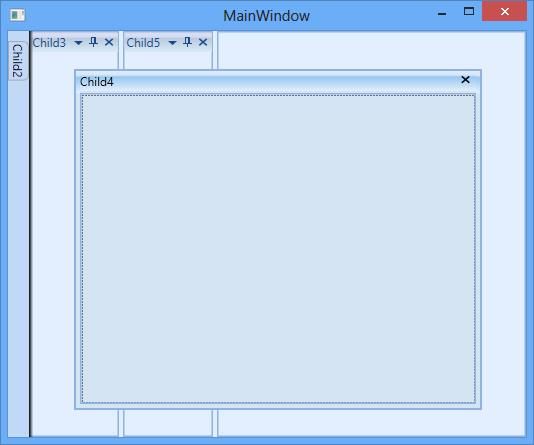

* Office2007Black – Setting visual style for DockingManager as Office2007Black.



SkinStorage.SetVisualStyle(DockingManager1,"Office2007Black");



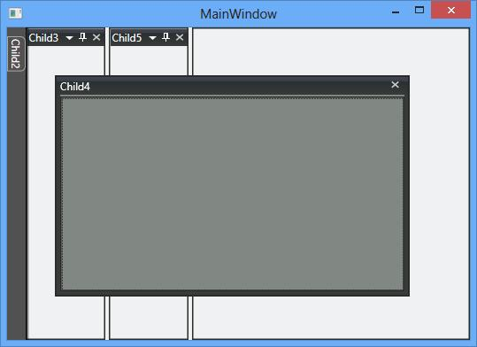

* Office2007Silver – Setting visualstyle for the DockingManager as Office2007Silver.



SkinStorage.SetVisualStyle(DockingManager1,"Office2007Silver");



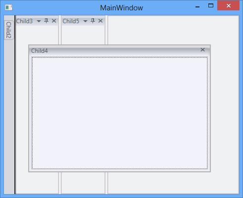

* Office2010Blue – Set the visual style for DockingManager as Office2010Blue.



SkinStorage.SetVisualStyle(DockingManager1,"Office2010Blue");



* Office2010Black – Set visual style for DockingManager as Office2010Black



SkinStorage.SetVisualStyle(DockingManager1,"Office2010Black");



* Office2010SSilver – Set visual style as Office2010Silver.



SkinStorage.SetVisualStyle(DockingManager1,"Office2010Silver");



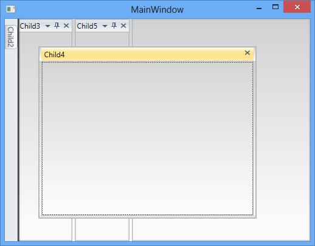

* VS2010- Setting visual style for the DockingManager as VS2010.



SkinStorage.SetVisualStyle(DockingManager1,"VS2010");



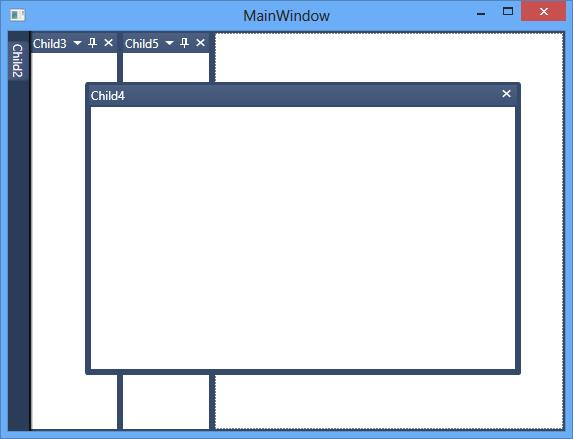

* Metro – Sett visual style for DockingManager as Metro.



SkinStorage.SetVisualStyle(DockingManager1,"Metro");



* Transparent – Setting visual style for DockingManager as Transparent.



SkinStorage.SetVisualStyle(DockingManager1,"Transparent");



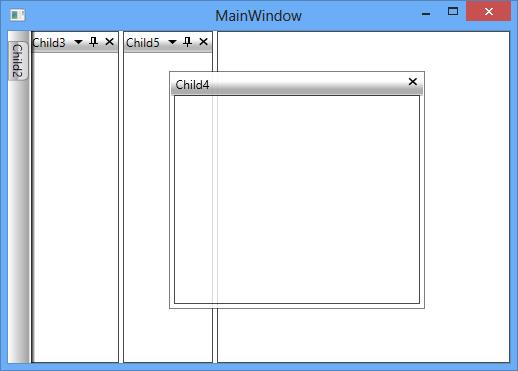

## Dock Window Style

DockingManager allows you to set style for some of the Docking controls such as DockedHeaderPresenter, DockedElementTabbedHost. This is explained in detail under the DockHeaderStyle and DockedElementTabbedHostStyle section.

### AwlButtonTemplate

The style of the pin button of the Dock window can customized using the `AwlButtonTemplate` property of DockingManager with the TargetType as `ToggleButton` to have a customized look and feel for the Pin Button. 


<syncfusion:DockingManager  x:Name="DockingManager1">

<syncfusion:DockingManager.AwlButtonTemplate>

<ControlTemplate TargetType="{x:Type ToggleButton}">

<Border x:Name="Border1">

<TextBlock x:Name="Text1" Text="PinButton" Foreground="White"></TextBlock>

</Border>

<ControlTemplate.Triggers>

<Trigger Property="IsMouseOver" Value="True">

<Setter TargetName="Border1" Property="Background" Value="Black"></Setter>

<Setter TargetName="Text1" Property="Foreground" Value="Red"></Setter>

</Trigger>

</ControlTemplate.Triggers>

</ControlTemplate>

</syncfusion:DockingManager.AwlButtonTemplate>

<ContentControl syncfusion:DockingManager.Header="Child1"/>

<ContentControl syncfusion:DockingManager.Header="Child2"/>

</syncfusion:DockingManager>



### CloseButtonTemplate

The close button for the Docked window can be customized using the `CloseButtonTemplate`, and can be used to get or set the control template for the close button for the windows of DockingManager with TargetType as ToggleButton.



<syncfusion:DockingManager  x:Name="DockingManager1">

<syncfusion:DockingManager.CloseButtonTemplate>

<ControlTemplate TargetType="{x:Type ToggleButton}">

<StackPanel

<Border x:Name="Border1">

<TextBlock x:Name="Block" Background="Red" Text="Close" Foreground="Black"></TextBlock>

</Border>

</StackPanel>

</ControlTemplate>

</syncfusion:DockingManager.CloseButtonTemplate>

<ContentControl

syncfusion:DockingManager.Header="Child1"/>

<ContentControl

syncfusion:DockingManager.Header="Child2"/>

</syncfusion:DockingManager>



### MenuButtonTemplate

The context menu button appearance in the Dock window header can be customized using `MenuButtonTemplate` property by setting with the Target Type as `ToggleButton`.



<syncfusion:DockingManager  x:Name="DockingManager1">

<syncfusion:DockingManager.MenuButtonTemplate>

<ControlTemplate TargetType="{x:Type ToggleButton}">

<StackPanel>

<Border x:Name="Border1">

<TextBlock x:Name="TextBlock" Text="Menu" Foreground="Black"></TextBlock>

</Border>

</StackPanel>

<ControlTemplate.Triggers>

<Trigger Property="IsMouseOver" Value="True">

<Setter TargetName="Border1" Property="Background" Value="Black"></Setter>

<Setter TargetName="TextBlock" Property="Foreground" Value="Red"/>

</Trigger>

</ControlTemplate.Triggers>

</ControlTemplate>

</syncfusion:DockingManager.MenuButtonTemplate>

<ContentControl syncfusion:DockingManager.Header="Child1"/>

<ContentControl syncfusion:DockingManager.Header="Child2"/>

</syncfusion:DockingManager>



### MinimizeButton Template

The minimize button for the dock window can be customized using the `MinimizeButtonTemplate` by setting with the TargetType as `ToggleButton`.



<syncfusion:DockingManager  x:Name="DockingManager1" MinimizeButtonEnabled="True" >

<syncfusion:DockingManager.MinimizeButtonTemplate>

<ControlTemplate TargetType="{x:Type ToggleButton}">

<Border x:Name="Border1">

<TextBlock x:Name="Block" Background="Red" Text="mini" ></TextBlock>

</Border>

<ControlTemplate.Triggers>

<Trigger Property="IsMouseOver" Value="True">

<Setter TargetName="Border1" Property="Background" Value="Black"></Setter>

</Trigger>

</ControlTemplate.Triggers>

</ControlTemplate>

</syncfusion:DockingManager.MinimizeButtonTemplate>

<ContentControl syncfusion:DockingManager.Header="Child1"/>

<ContentControl syncfusion:DockingManager.Header="Child2"/>

</syncfusion:DockingManager>



### MaximizeButtonTemplate

The maximize button for the dock window can be customized using the `MaximizeButtonTemplate` property with the TargetType as `ToggleButton`.



<syncfusion:DockingManager  x:Name="DockingManager1" MaximizeButtonEnabled="True" MinimizeButtonEnabled="True" >

<syncfusion:DockingManager.MaximizeButtonTemplate>

<ControlTemplate TargetType="{x:Type ToggleButton}">

<Border x:Name="Border1">

<TextBlock x:Name="Block" Background="Red" Text="Maxi"/>

</Border>

<ControlTemplate.Triggers>

<Trigger Property="IsMouseOver" Value="True">

<Setter TargetName="Border1" Property="Background" Value="Black"/>

</Trigger>

</ControlTemplate.Triggers>

</ControlTemplate>

</syncfusion:DockingManager.MaximizeButtonTemplate>

<ContentControl syncfusion:DockingManager.Header="Child1"/>

<ContentControl syncfusion:DockingManager.Header="Child2"/>

</syncfusion:DockingManager>



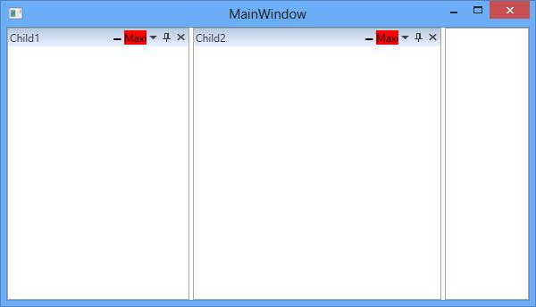

### RestoreButtonTemplate 

The Restore button for the dock window can be customized using the `RestoreButtonTemplate` property with the TargetType as `ToggleButton`.



<syncfusion:DockingManager  x:Name="DockingManager1" MaximizeButtonEnabled="True">

<syncfusion:DockingManager.RestoreButtonTemplate>

<ControlTemplate TargetType="{x:Type ToggleButton}">

<Border x:Name="Border1">

<TextBlock x:Name="text1" Background="Red" Text="Maxim"/>

</Border>

<ControlTemplate.Triggers>

<Trigger Property="IsMouseOver" Value="True">

<Setter TargetName="Border1" Property="Background" Value="Black"></Setter>

</Trigger>

</ControlTemplate.Triggers>

</ControlTemplate>

</syncfusion:DockingManager.RestoreButtonTemplate>

<ContentControl syncfusion:DockingManager.Header="Child1" syncfusion:DockingManager.State="Dock"/>

<ContentControl syncfusion:DockingManager.Header="Child2" syncfusion:DockingManager.State="Dock"/>
 
<ContentControl syncfusion:DockingManager.Header="Child3" syncfusion:DockingManager.State="Dock"/>

<ContentControl syncfusion:DockingManager.Header="Child4" syncfusion:DockingManager.State="Dock"/>

<ContentControl syncfusion:DockingManager.Header="Child5" syncfusion:DockingManager.State="Dock"/>

</syncfusion:DockingManager>



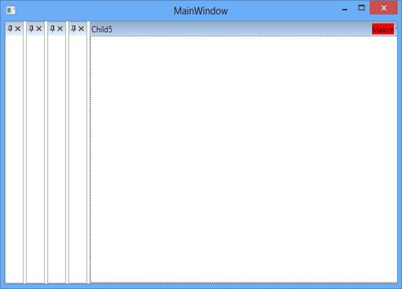

### TabItemTemplate

DockedElementTabbedHost have internal TabControl for Tabbed Windows in DockingManager and its tabitem template can be customized using `TabItemTemplate` with the TargetType as `TabItem`.



<Window.Resources>

</Window.Resources>

<Grid x:Name="Grid1">

<Syncfusion:DockingManager x:Name="DockingManager1" UseDocumentContainer="True" TabItemStyle="{StaticResource TabItemStyle1}">

<ContentControl Syncfusion:DockingManager.Header="Window1" x:Name="Content1" Syncfusion:DockingManager.State="Dock"/>

<ContentControl Syncfusion:DockingManager.Header="Window2" Syncfusion:DockingManager.State="Dock" x:Name="Content2" 
                Syncfusion:DockingManager.TargetNameInDockedMode="Content1" Syncfusion:DockingManager.SideInDockedMode="Tabbed"/>

</Syncfusion:DockingManager>

</Grid>

</Window>



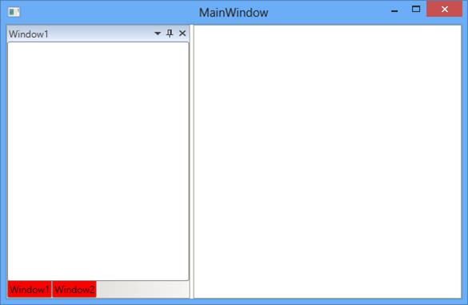

### DockedElementTabbedHostStyle

The DockedElementTabbedHost can be customized using the DockedElementTabbedHostStyle with the TargetType as DockedElementTabbedHost



<Syncfusion:DockingManager.DockedElementTabbedHostStyle>

</Syncfusion:DockingManager.DockedElementTabbedHostStyle>



### DockHeaderStyle

The header of the dock window can be customized using the property `DockHeaderStyle` with the TargetType as DockHeaderPresenter.


<syncfusion:DockingManager  x:Name="DockingManager1" UseDocumentContainer="True"   >

<syncfusion:DockingManager.DockHeaderStyle>

</syncfusion:DockingManager.DockHeaderStyle>

<ContentControl x:Name="Content1"  syncfusion:DockingManager.State="Dock" syncfusion:DockingManager.Header="Child1" />

<ContentControl x:Name="Content2" syncfusion:DockingManager.Header="Child2" />

</syncfusion:DockingManager>



### DockWindowContextMenuItemStyle

The context menu of DockingManager can be customized using the DockWindowContextMenuItemStyle by setting its Target Type as `CustomMenuItem`



<Syncfusion:DockingManager UseDocumentContainer="True" ContainerMode="TDI" UseNativeFloatWindow="True">

<Syncfusion:DockingManager.DockWindowContextMenuItemStyle>

</Syncfusion:DockingManager.DockWindowContextMenuItemStyle>

<Syncfusion:DockingManager.CustomMenuItems>

<Syncfusion:CustomMenuItemCollection>

<Syncfusion:CustomMenuItem Header="CustomItem1"/>

<Syncfusion:CustomMenuItem Header="CustomItem2"/>

</Syncfusion:CustomMenuItemCollection>

</Syncfusion:DockingManager.CustomMenuItems>

<ContentControl Syncfusion:DockingManager.Header="Child1" Syncfusion:DockingManager.State="Dock"/>

<ContentControl Syncfusion:DockingManager.Header="Child2" Syncfusion:DockingManager.State="Dock"/>

<ContentControl Syncfusion:DockingManager.Header="Child3" Syncfusion:DockingManager.State="Dock"/>

</Syncfusion:DockingManager>



## Float Window Style

The float window can be customized using its template and style.

### FloatWindowTemplate 

Template of FloatWindow can be customized using the `FloatWindowTemplate` with the TargetType as ContentControl.



<Syncfusion:DockingManager UseDocumentContainer="True" ContainerMode="TDI"  EnableDocumentTabHeaderEdit="True">

<Syncfusion:DockingManager.FloatWindowTemplate>

<ControlTemplate  TargetType="{x:Type ContentControl}">

<AdornerDecorator>

<DockPanel Focusable="False" LastChildFill="True" Opacity="{Binding Path=Opacity,
	       RelativeSource={RelativeSource AncestorType={x:Type Syncfusion:IWindow}}}">

<Border Name="FloatWindowOutBorder"  Focusable="False" BorderBrush="{TemplateBinding BorderBrush}" 
	    BorderThickness="{TemplateBinding BorderThickness}" Background="Red" >

<Grid Focusable="False">

<Grid.RowDefinitions>

<RowDefinition Name="TopRow"/>

<RowDefinition Height="*" />

<RowDefinition Name="BottomRow" Height="7" />

</Grid.RowDefinitions>

<Grid.ColumnDefinitions>

<ColumnDefinition Name="LeftCol" Width="7" />

<ColumnDefinition Width="*"/>

<ColumnDefinition Name="RightCol" Width="7" />

</Grid.ColumnDefinitions>

<Syncfusion:FloatWindowBorder BorderMode="LeftTop" Name="BorderLeftTop" Grid.Column="0" Grid.Row="0" />

<Syncfusion:FloatWindowBorder BorderMode="Header" Name="BorderHeader" Grid.Column="1" Grid.Row="0" />

<Syncfusion:FloatWindowBorder BorderMode="RightTop" Name="BorderRightTop" Grid.Column="2" Grid.Row="0" />

<Syncfusion:FloatWindowBorder BorderMode="Left" Name="BorderLeft" Grid.Column="0" Grid.Row="1" />

<ContentPresenter Name="ContentPresenter" Grid.Column="1" Grid.Row="1" ContentTemplate="{TemplateBinding ContentControl.ContentTemplate}"
	              Content="{TemplateBinding ContentControl.Content}" />

<Syncfusion:FloatWindowBorder BorderMode="Right" Name="BorderRight" Grid.Column="2" Grid.Row="1" />

<Syncfusion:FloatWindowBorder BorderMode="LeftBottom" Name="BorderLeftBottom" Grid.Column="0" Grid.Row="2" />

<Syncfusion:FloatWindowBorder BorderMode="Bottom" Name="BorderBottom" Grid.Column="1" Grid.Row="2" />

<Syncfusion:FloatWindowBorder BorderMode="RightBottom" Name="BorderRightBottom" Grid.Column="2" Grid.Row="2" />

</Grid>

</Border>

</DockPanel>

</AdornerDecorator>

</ControlTemplate>

</Syncfusion:DockingManager.FloatWindowTemplate>

<ContentControl Syncfusion:DockingManager.Header="Child1" Syncfusion:DockingManager.State="Float"/>

<ContentControl Syncfusion:DockingManager.Header="Child2" Syncfusion:DockingManager.State="Document"/>

<ContentControl Syncfusion:DockingManager.Header="Child3" Syncfusion:DockingManager.State="Document"/>

</Syncfusion:DockingManager>



### FloatWindowStyle

The style for the float window can be applied using the `FloatWindowStyle` property of the DockingManager by setting its TargetType as `AutoTemplatedContentControl`. It gets or sets the style for the floatwindow when it is rendered.



<syncfusion:DockingManager x:Name="DockingManager1">
	
	<syncfusion:DockingManager.FloatWindowStyle>
	
		
	
	</syncfusion:DockingManager.FloatWindowStyle>
	
	<ContentControl syncfusion:DockingManager.Header="Child" 
	                syncfusion:DockingManager.State="Float" syncfusion:DockingManager.SideInDockedMode="Left"/>
					
	<ContentControl syncfusion:DockingManager.Header="Child2"></ContentControl>
	
</syncfusion:DockingManager>



### NativeWindowStyle

The NativeFloatwindow of DockingManager can be customized using the `NativeWindowStyle` property of the DockingManager with the TargetType as NativeFloatWindow.



<Syncfusion:DockingManager UseDocumentContainer="True" ContainerMode="TDI" UseNativeFloatWindow="True">

<Syncfusion:DockingManager.NativeWindowStyle>

</Syncfusion:DockingManager.NativeWindowStyle>

<ContentControl Syncfusion:DockingManager.Header="Child1" Syncfusion:DockingManager.State="Float"/>

<ContentControl Syncfusion:DockingManager.Header="Child2" Syncfusion:DockingManager.State="Document"/>

<ContentControl Syncfusion:DockingManager.Header="Child3" Syncfusion:DockingManager.State="Document"/>

</Syncfusion:DockingManager>



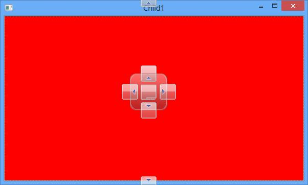

## Auto Hide Window Style

AutoHidden window is constructed by SidePanels and SideTabItems. To customize the AutoHidden window, the following  style and Templates are used as follows:

### SideTabItemTemplate

The template of the SideTabItem of the DockingManager can be customized using the `SideTabItemTemplate` with the TargetType as TabItem.



<ControlTemplate x:Key="SideTabItemTemplate" TargetType="{x:Type TabItem}">

<Border Name="Border" CornerRadius="5,5,0,0"
        BorderBrush="{StaticResource TabItemBorderBrush}" BorderThickness="1">

<Border.LayoutTransform>

<RotateTransform Angle="90" />

</Border.LayoutTransform>

<Grid>

<DockPanel LastChildFill="True" Background="Orange">

<Rectangle Fill="Transparent"  Height="Auto" Width="Auto" RadiusX="5" RadiusY="5" />

<Border Name="Icon" DockPanel.Dock="Left" Margin="1" Width="16"
        Background="{Binding Path=(TabItem.Content).(Syncfusion:DockingManager.Icon), 
		RelativeSource={RelativeSource TemplatedParent}}" />

<ContentPresenter x:Name="ContentSite" VerticalAlignment="Center" HorizontalAlignment="Center" 
	    ContentSource="Header" Margin="2,2,2,2" RecognizesAccessKey="True"
        ContentTemplate="{Binding Path=(Border.DataContext).(Syncfusion:DockingManager.HeaderTemplate), ElementName=Border}"
		ContentTemplateSelector="{StaticResource TabItemTrimmingTemplate}" TextBlock.Foreground="{StaticResource Default.TabForeground}"/>

</DockPanel>

</Grid>

</Border>

</ControlTemplate>



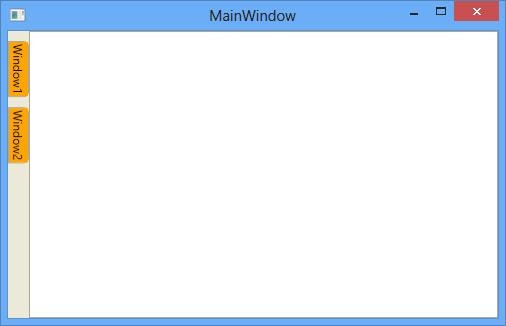

### SideItemStyle

The style for the sideTabItem can be changed using `SideItemStyle`, by settings its TargetType as TabItem



<syncfusion:DockingManager  x:Name="DockingManager1" UseDocumentContainer="True" ContainerMode="TDI" >

<syncfusion:DockingManager.SideItemStyle>

</syncfusion:DockingManager.SideItemStyle>

<ContentControl x:Name="content1" 

syncfusion:DockingManager.Header="Child1"

syncfusion:DockingManager.State="Dock"/>

<ContentControl x:Name="content2" syncfusion:DockingManager.Header="Child2"

syncfusion:DockingManager.State="AutoHidden"/>

<ContentControl x:Name="content3" syncfusion:DockingManager.Header="Child3"

syncfusion:DockingManager.State="Dock"></ContentControl>

</syncfusion:DockingManager>



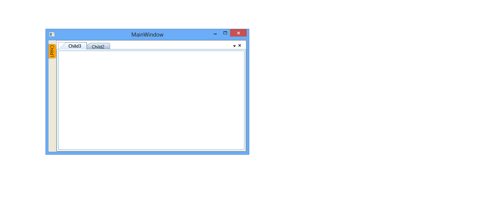

### SidePanelTemplate

SidePanel template in AutoHidden window can changed using `SidePanelTemplate` with the TargetType SidePanel.



<ControlTemplate x:Key="SidePanelTemplate" TargetType="{x:Type Syncfusion:SidePanel}" >
	
<Canvas KeyboardNavigation.TabNavigation="Local" ClipToBounds="False" >
	
<Border Name="PART_BorderName"  Height="{TemplateBinding ActualHeight}" Width="{TemplateBinding ActualWidth}"
        Margin="0" ClipToBounds="True" Background="Orange"Panel.ZIndex="1" KeyboardNavigation.TabIndex="1"
        BorderThickness="{Binding Path=SidePanelBorderThickness, RelativeSource={RelativeSource FindAncestor, 
		AncestorType={x:Type Syncfusion:DockingManager}}}" BorderBrush="{StaticResource TabItemBorderBrush}">

<Border.ContextMenu>
<ContextMenu Style="{StaticResource SideContextMenuStyle}" ItemsSource="{TemplateBinding TabChildren}"/>
</Border.ContextMenu>

<Syncfusion:DirectTabPanel Name="PART_PanelName" KeyboardNavigation.TabNavigation="Local" IsItemsHost="True"/>

</Border>

<Syncfusion:OpacityDockPanel LastChildFill="True" Opacity="{Binding Path=ContentOpacity, RelativeSource={RelativeSource TemplatedParent}}"/>
</ Canvas >
</ControlTemplate>



###  SidePanelStyle

The style for the sidepanel of the DockingManager can be customized using the `SidePanelStyle` property with the TargetType as SidePanel.



<syncfusion:DockingManager  x:Name="DockingManager1" UseDocumentContainer="True" ContainerMode="TDI">
	
<syncfusion:DockingManager.SidePanelStyle>
	

	  
</syncfusion:DockingManager.SidePanelStyle>

<ContentControl syncfusion:DockingManager.Header="Child1" syncfusion:DockingManager.State="AutoHidden"/> 
<ContentControl syncfusion:DockingManager.Header="Child2"syncfusion:DockingManager.State="Document"/>
<ContentControl syncfusion:DockingManager.Header="Child3"syncfusion:DockingManager.State="Document"/> 
	
</syncfusion:DockingManager>



## Drag Provider Style

DragProviders are those that appear while dragging a window. It allows you to drag the window to the left, right, top and bottom using the respective drag providers.

DragProviders are displayed for providing options to dock the floatwindow while dragging and this drag provider button templates can be changed by the following templates.

### BottomDragProvider

The BottomDragProvider is used to dock the children of the Docking in the bottom side and it’s template can be customized using the `BottomDragProviderTemplate` by setting its TargetType as ContentControl.



<syncfusion:DockingManager  x:Name="DockingManager1" UseDocumentContainer="True" EnableDocumentTabHeaderEdit="True" >

<syncfusion:DockingManager.BottomDragProvider>

<ControlTemplate TargetType="{x:Type ContentControl}">

<Image Name="Img" syncfusion:DockPreviewManagerVS2005.ProviderAction="GlobalLeft" Source="Images\synclogo.png" />

<ControlTemplate.Triggers>

<DataTrigger Binding="{Binding Path=IsSideButtonActive, 
	        RelativeSource={RelativeSource FindAncestor, AncestorType={x:Type syncfusion:DockPreviewMainButtonVS2005}}}" Value="true">

<Setter TargetName="Img" Property="Source" Value="Images\synclogo.png"/>

</DataTrigger>

</ControlTemplate.Triggers>

</ControlTemplate>

</syncfusion:DockingManager.BottomDragProvider>

<ContentControlsyncfusion:DockingManager.Header="Child1" syncfusion:DockingManager.State="Dock"/>

</syncfusion:DockingManager>



### LeftDragProvider

The LeftDragProvider is used to dock the dock window to the left side and it can be customized using the `LeftDragProvider` property that helps to customize the template for the Left DragProvider by setting its Target as ContentControl. The same has been explained below:


<syncfusion:DockingManager  x:Name="DockingManager1" UseDocumentContainer="True" EnableDocumentTabHeaderEdit="True" >

<syncfusion:DockingManager.LeftDragProvider>

<ControlTemplate TargetType="{x:Type ContentControl}">

<Image Name="Img" syncfusion:DockPreviewManagerVS2005.ProviderAction="GlobalLeft" Source="Images\synclogo.png" />

<ControlTemplate.Triggers>

<DataTrigger Binding="{Binding Path=IsSideButtonActive, 
	RelativeSource={RelativeSource FindAncestor, AncestorType={x:Type syncfusion:DockPreviewMainButtonVS2005}}}" Value="true">

<Setter TargetName="Img" Property="Source" Value="Images\synclogo.png"/>

</DataTrigger>

</ControlTemplate.Triggers>

</ControlTemplate>

</syncfusion:DockingManager.LeftDragProvider>

<ContentControl syncfusion:DockingManager.Header="Child1" syncfusion:DockingManager.State="Dock"/>

</syncfusion:DockingManager> 



### RightDragProvider

To dock the DockingManager to the right side, the RightDragProvider is used and it can be customized using the `RightDragProviderTemplate` with the TargetType as ContentControl.



<syncfusion:DockingManager  x:Name="DockingManager1" UseDocumentContainer="True" EnableDocumentTabHeaderEdit="True" >

<syncfusion:DockingManager.RightDragProvider>

<ControlTemplate TargetType="{x:Type ContentControl}">

<Image Name="Img" syncfusion:DockPreviewManagerVS2005.ProviderAction="GlobalLeft" Source="Images\synclogo.png" />

<ControlTemplate.Triggers>

<DataTrigger Binding="{Binding Path=IsSideButtonActive, 
	RelativeSource={RelativeSource FindAncestor, AncestorType={x:Type syncfusion:DockPreviewMainButtonVS2005}}}" Value="true">

<Setter TargetName="Img" Property="Source" Value="Images\synclogo.png"/>

</DataTrigger>

</ControlTemplate.Triggers>

</ControlTemplate>

</syncfusion:DockingManager.RightDragProvider>

<ContentControl syncfusion:DockingManager.Header="Child1" syncfusion:DockingManager.State="Dock"/>

</syncfusion:DockingManager>



### TopDragProvider

To dock the DockingManager at the top, the TopDragProvider is used and it can be customized using the `TopDragProviderTemplate` with the TargetType as ContentControl.



<syncfusion:DockingManager  x:Name="DockingManager1" UseDocumentContainer="True" EnableDocumentTabHeaderEdit="True" >

<syncfusion:DockingManager.LeftDragProvider>

<ControlTemplate TargetType="{x:Type ContentControl}">

<Image Name="Img" syncfusion:DockPreviewManagerVS2005.ProviderAction="GlobalLeft" Source="Images\synclogo.png" />

<ControlTemplate.Triggers>

<DataTrigger Binding="{Binding Path=IsSideButtonActive, 
	RelativeSource={RelativeSource FindAncestor, AncestorType={x:Type syncfusion:DockPreviewMainButtonVS2005}}}" Value="true">

<Setter TargetName="Img" Property="Source" Value="Images\synclogo.png"/>

</DataTrigger>

</ControlTemplate.Triggers>

</ControlTemplate>

</syncfusion:DockingManager.LeftDragProvider>

<ContentControl syncfusion:DockingManager.Header="Child1" syncfusion:DockingManager.State="Dock"/>

</syncfusion:DockingManager>



### CenterDragProvider

CenterDragProvider is used to dock the children of the DockingManager at the center Position and its template can be customized using the property CenterDragProvider.



<syncfusion:DockingManager  x:Name="DockingManager1" UseDocumentContainer="True">            
	
<syncfusion:DockingManager.CenterDragProvider>

<ControlTemplate TargetType="{x:Type ContentControl}">

<Image Name="Img" syncfusion:DockPreviewManagerVS2005.ProviderAction="GlobalLeft" Source="Images\synclogo.png" />

<ControlTemplate.Triggers>

<DataTrigger Binding="{Binding Path=IsSideButtonActive, 
	RelativeSource={RelativeSource FindAncestor, AncestorType={x:Type syncfusion:DockPreviewMainButtonVS2005}}}" Value="true">

<Setter TargetName="Img" Property="Source" Value="Images\synclogo.png"/>

</DataTrigger>

</ControlTemplate.Triggers>

</ControlTemplate>

</syncfusion:DockingManager.CenterDragProvider>

<ContentControl syncfusion:DockingManager.Header="Child1" syncfusion:DockingManager.State="Dock"/>

</syncfusion:DockingManager>



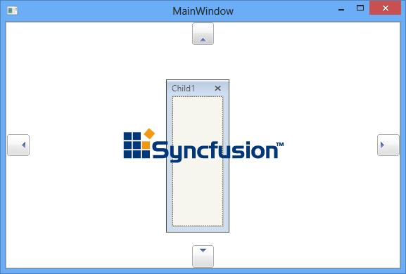

## DocumentTabControlStyle

Document state in DockingManager used the DocumentTabControl. To customize the Document in the DockingManager the `DocumentTabControlStyle` property is used by setting its TargetType as DocumentTabControl.



<syncfusion:DockingManager  x:Name="DockingManager1" UseDocumentContainer="True">

<syncfusion:DockingManager.DocumentTabControlStyle>

</syncfusion:DockingManager.DocumentTabControlStyle>

<ContentControl syncfusion:DockingManager.Header="Child1" syncfusion:DockingManager.State="Document"/>

<ContentControl syncfusion:DockingManager.Header="Child2" syncfusion:DockingManager.State="Document"/>

<ContentControl syncfusion:DockingManager.Header="Child3" syncfusion:DockingManager.State="Document"/>

</syncfusion:DockingManager>



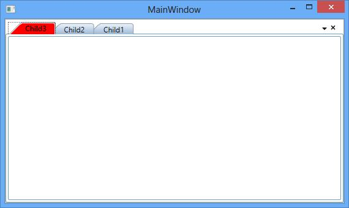

## DocumentTabItemStyle

Each Document TabItem in DockingManager constructed by the TabItemExt and its style can be customized using `DocumentTabItemStyle` with the TargetType as TabItemExt.



<syncfusion:DockingManager  x:Name="DockingManager1" UseDocumentContainer="True"   >

<syncfusion:DockingManager.DocumentTabItemStyle>

</syncfusion:DockingManager.DocumentTabItemStyle>

<ContentControl syncfusion:DockingManager.Header="Child1" syncfusion:DockingManager.State="Document"/>

<ContentControl syncfusion:DockingManager.Header="Child2" syncfusion:DockingManager.State="Document"/>

<ContentControl syncfusion:DockingManager.Header="Child3" syncfusion:DockingManager.State="Document"/> 
	
</syncfusion:DockingManager>



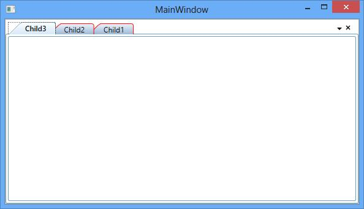

## DocumentMDIHeaderStyle

The header style for the Document MDI can be changed using the `DocumentMDIHeaderStyle` with the TargetType as DocumentHeader.



<syncfusion:DockingManager  x:Name="DockingManager1" UseDocumentContainer="True" ContainerMode="MDI">
	
<syncfusion:DockingManager.DocumentMDIHeaderStyle>
	

</syncfusion:DockingManager.DocumentMDIHeaderStyle>

<ContentControl syncfusion:DockingManager.Header="Child1" syncfusion:DockingManager.State="Document"/>
<ContentControl syncfusion:DockingManager.Header="Child2" syncfusion:DockingManager.State="Document"/>
<ContentControl syncfusion:DockingManager.Header="Child3" syncfusion:DockingManager.State="Document"/>
	
</syncfusion:DockingManager>



## TabControl style

Tabcontrol inside the DockWindow for Tabbed side Windows can be customized using `TabControlStyle` with the TargetType as TabControl in the DockingManager



<Syncfusion:DockingManager  x:Name="DockingManager1" UseDocumentContainer="True"   >

<Syncfusion:DockingManager.TabControlStyle>

</Syncfusion:DockingManager.TabControlStyle>

<ContentControl Syncfusion:DockingManager.State="Dock" Syncfusion:DockingManager.Header="Child1" />

<ContentControl Syncfusion:DockingManager.Header="Child2" Syncfusion:DockingManager.SideInDockedMode="Tabbed"
	              Syncfusion:DockingManager.TargetNameInDockedMode="Content1">
</ContentControl>

</Syncfusion:DockingManager>



### TabItemStyle

The style for the Tabbed children of DockingManager can be customized using the `TabItemStyle` property with the Target Type as TabItem.



<Syncfusion:DockingManager  x:Name="DockingManager1" UseDocumentContainer="True">   
	
<Syncfusion:DockingManager.TabItemStyle>

</Syncfusion:DockingManager.TabItemStyle>

<ContentControl Syncfusion:DockingManager.State="Dock" x:Name="Content1" Syncfusion:DockingManager.Header="Child1"/>

<ContentControl Syncfusion:DockingManager.Header="Child2"
	            Syncfusion:DockingManager.SideInDockedMode="Tabbed" Syncfusion:DockingManager.TargetNameInDockedMode="Content1"/>

</Syncfusion:DockingManager>



