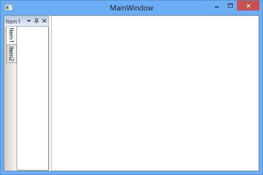

# Tabbed Window

Child window can be arranged as Tabbed windows by setting TargetName and side value as `Tabbed` using the property `SideInDockedMode`.

##  Tab alignments

The tabs of the Docked window are placed at the bottom, by default. To place the tabs of the docked window at different sides set the property `DockTabAlignment` with desired values such as Top, Bottom, Left and Right. 

* DockTabAlignment as `Bottom`

* Setting DockTabAlignment as `Left`.





<syncfusion:DockingManager x:Name="DockingManager1" DockTabAlignment="Left">

<ContentControl  syncfusion:DockingManager.Header="Item1" x:Name="Content1" />
	
<ContentControl syncfusion:DockingManager.Header="Item2" x:Name="Content2"
                syncfusion:DockingManager.SideInDockedMode="Tabbed"
				syncfusion:DockingManager.TargetNameInDockedMode="Content1"/> 

</syncfusion:DockingManager>





* Setting DockTabAlignment as `Right`




<syncfusion:DockingManager x:Name="DockingManager1" DockTabAlignment="Right">

<ContentControl syncfusion:DockingManager.Header="Item1"  x:Name="Content1"/>  

<ContentControl syncfusion:DockingManager.Header="Item2" x:Name="Content2"
                syncfusion:DockingManager.SideInDockedMode="Tabbed"
				syncfusion:DockingManager.TargetNameInDockedMode="Content1"/>
				
</syncfusion:DockingManager>





* Setting DockTabAlignment as `Top`





<syncfusion:DockingManager x:Name="DockingManager1" DockTabAlignment="Top">

<ContentControl  syncfusion:DockingManager.Header="Item1" x:Name="Content1"/> 

<ContentControl syncfusion:DockingManager.Header="Item2" x:Name="Content2"
                syncfusion:DockingManager.SideInDockedMode="Tabbed"
				syncfusion:DockingManager.TargetNameInDockedMode="Content1"/>  

</syncfusion:DockingManager>





## Closing a Tabbed window

Tabbed window provides two different closing behaviors. They are CloseActive and CloseAll modes of `CloseTabs` property.

`CloseActive` – Used to close the active element of Tabbed window.




<syncfusion:DockingManager x:Name="DockingManager1" CloseTabs="CloseActive">

<ContentControl syncfusion:DockingManager.Header="Item1" x:Name="Content1" />  

<ContentControl syncfusion:DockingManager.Header="Item2" x:Name="Content2"
                syncfusion:DockingManager.SideInDockedMode="Tabbed"
				syncfusion:DockingManager.TargetNameInDockedMode="Content1"/>  

<ContentControl syncfusion:DockingManager.Header="Item3" x:Name="Content3"
                syncfusion:DockingManager.SideInDockedMode="Tabbed"
				syncfusion:DockingManager.TargetNameInDockedMode="Content1"/>                         

</syncfusion:DockingManager>





 `CloseAll` – Used to close all the Tabbed window.




<syncfusion:DockingManager x:Name="DockingManager1" CloseTabs="CloseAll">

<ContentControl syncfusion:DockingManager.Header="Item1" x:Name="Content1"/>  

<ContentControl syncfusion:DockingManager.Header="Item2" x:Name="Content2"
                syncfusion:DockingManager.SideInDockedMode="Tabbed"
				syncfusion:DockingManager.TargetNameInDockedMode="Content1"/>  

<ContentControl syncfusion:DockingManager.Header="Item3" x:Name="Content3"
                syncfusion:DockingManager.SideInDockedMode="Tabbed"
				syncfusion:DockingManager.TargetNameInDockedMode="Content1"/>                         

</syncfusion:DockingManager>




