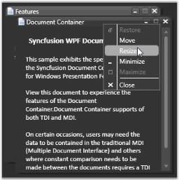

# Layout Related Features

This section illustrates the following Layout-related feature of Document Container control.

## Setting Visual Styles for Document Container

Document Container comes with the support of visual styles, which gives a great look and feel for the Document Container and enhances the overall appearance of the end user's applications. The visual style for the Document Container is set by using the VisualStyle property.

### Property table

<table>
<tr>
<th>
Property</th><th>
Description</th></tr>
<tr>
<td>
VisualStyle</td><td>
Sets the visual style for the DocumentContainer. The options provided are as follows.BlendOffice2003Office2007BlueOffice2007BlackOffice2007SilverShinyBlueShinyRedSyncOrangeVS2010MetroTransparent</td></tr>
</table>

Use the following code to set the skin for the Document Container.



<!-- Adding document container -->
<syncfusion:DocumentContainer Name="DocContainer" syncfusion:SkinStorage.VisualStyle="Office2007Blue" Mode="MDI">
  …....  …....</syncfusion:DocumentContainer>
  

 
// Setting the visual style as Office2007Blue SkinStorage.SetVisualStyle(DocContainer, "Office2007Blue"); 
 



Document Container with "Office2007Blue" Theme

Document Container with "Blend" Theme

Document Container with "Office2003" Theme

Document Container with "Metro" Theme

Document Container with "Transparent" Theme

