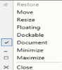
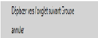
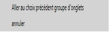

# Localization

The following table describes how a DocumentContainer property can be localized to a specific culture. You can simply provide the string values in the resource file for a specific culture and set the culture in the application.

<table>
<tr>
<td colspan = "5">
Property</td><td>
Description</td></tr>
<tr>
<td colspan = "5">
MDIRestoreMDIMoveMDIResizeMDIFloatingMDIDockableMDIDocumentMDIMinimizeMDIMaximizeMDIClose</td><td>
Sets the string for the context menu item in DocumentContainer.</td></tr>
<tr>
<td colspan = "6">

{:.image }

{:.image }
{{{ ''_ContextMenu(en-US)                                                      ContextMenu(fr-FR)_'' | markdownify }}}</td></tr>
<tr>
<td colspan = "4">
MoveToNextTabGroup </td><td colspan = "2">
Sets the string for MoveToNextTabGroup context menu item in DockingManager and DocumentContainer.</td></tr>
<tr>
<td colspan = "6">

{:.image }

{:.image }
{{{ ''_MoveToNextTabGroup(en-US)                                       MoveToNextTabGroup(fr-FR)_'' | markdownify }}}</td></tr>
<tr>
<td colspan = "3">
MoveToPreviousTabGroup</td><td colspan = "3">
Sets the string for MoveToPreviousTabGroup context menu item in DockingManager and DocumentContainer.</td></tr>
<tr>
<td colspan = "6">

{:.image }

{:.image }
{{{ ''_MoveToPreviousTabGroup(en-US)                           MoveToPreviousTabGroup(fr-FR)_'' | markdownify }}}</td></tr>
<tr>
<td colspan = "2">
NewTabgroupMenuItemCancel</td><td colspan = "4">
Sets the string for the Tab context menu item in DockingManager and DocumentContainer.</td></tr>
<tr>
<td colspan = "6">

{:.image }

{:.image }
{{{ ''_NewTabGroup(en-US)                                NewTabGroup(fr-FR)_'' | markdownify }}}</td></tr>
<tr>
<td>
TabCloseCloseAllButThisTabCloseAllFloatingDocumentDockableNewHorizontalTabGroupNewVerticalTabGroup</td><td colspan = "5">
Sets the string for the menu item in DocumentContainer and DockingManager.</td></tr>
<tr>
<td colspan = "6">

{:.image }

{:.image }
{{{ ''_MenuItem(en-US)                                                 MenuItem(fr-FR)_'' | markdownify }}}</td></tr>
</table>

