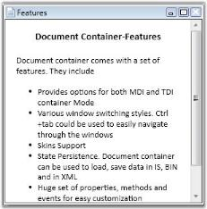

# Setting Header of the Document container

Using the Header property, user can set the header for the Document Container elements. Use the following code snippet, to set the Header for the Document Container element.

[XAML]

<!-- Adding Document Container -->

<syncfusion:DocumentContainer Name="DocContainer"  Mode="MDI">

<FlowDocumentScrollViewer syncfusion:DocumentContainer.Header="Features">

</FlowDocumentScrollViewer>

…....

…....

</syncfusion:DocumentContainer>

{{ '' | markdownify }}
{:.image }

