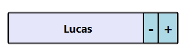

# Appearance and Styling in WPF SfDomainUpdown

## Spin animation

Items will spin up or down with a smooth transition. The transition can be disabled using the `EnableSpinAnimation` property. The default value of `EnableSpinAnimation` is `True`.




<syncfusion:SfDomainUpDown x:Name="domain"
                         HorizontalAlignment="Center"
                         VerticalAlignment="Center"
                         Width="200" EnableSpinAnimation="True"/>




## Accent brush

The `AccentBrush` property is used to decorate the hot spots of the `SfDomainUpDown` control with a solid color. The default value is the system accent color.




<Window x:Class="DomainUpDownSample.MainWindow"
        xmlns="http://schemas.microsoft.com/winfx/2006/xaml/presentation"
        xmlns:x="http://schemas.microsoft.com/winfx/2006/xaml"
        xmlns:editors="clr-namespace:Syncfusion.Windows.Controls.Input;assembly=Syncfusion.SfInput.WPF">
    <Grid>
        <editors:SfDomainUpDown x:Name="domainUpDown"
                               HorizontalAlignment="Center"
                               VerticalAlignment="Center"
                               Width="200"
                               AccentBrush="Black"
                               Value="James" />
    </Grid>
</Window>




## Customize Up, Down button Style

You can customize the appearance of the up/down buttons in the [SfDomainUpDown](https://help.syncfusion.com/cr/wpf/Syncfusion.Windows.Controls.Input.SfDomainUpDown.html) control by using the [UpDownStyle](https://help.syncfusion.com/cr/wpf/Syncfusion.Windows.Controls.Input.SfDomainUpDown.html#Syncfusion_Windows_Controls_Input_SfDomainUpDown_UpDownStyle) property.

This property allows you to apply a custom style and template to the internal `SfUpDown` control, which hosts the up/down buttons.




<Window x:Class="DomainUpDownSample.MainWindow"
        xmlns="http://schemas.microsoft.com/winfx/2006/xaml/presentation"
        xmlns:x="http://schemas.microsoft.com/winfx/2006/xaml"
        xmlns:syncfusion="http://schemas.syncfusion.com/wpf"
        xmlns:editors="clr-namespace:Syncfusion.Windows.Controls;assembly=Syncfusion.SfInput.WPF">
<Window.DataContext>
    <local:ViewModel />
</Window.DataContext>
<Window.Resources>

    <!-- Style for Up/Down Buttons-->
    

    <!-- Customized SfDomainUpDown Style -->
    
</Window.Resources>
<Grid>
<syncfusion:SfDomainUpDown x:Name="DomainUpDown" Height="44" Width="231" ItemsSource="{Binding Employees}">
    <syncfusion:SfDomainUpDown.ContentTemplate>
        <DataTemplate>
            <StackPanel Orientation="Horizontal" HorizontalAlignment="Center" VerticalAlignment="Center">
                <TextBlock Text="{Binding Name}" VerticalAlignment="Center" Margin="5"/>
            </StackPanel>
        </DataTemplate>
    </syncfusion:SfDomainUpDown.ContentTemplate>
</syncfusion:SfDomainUpDown>
</Grid>
</Window>




## Theme

SfDomainUpDown supports various built-in themes. Refer to the below links to apply themes for the SfDomainUpDown,

  * [Apply theme using SfSkinManager](https://help.syncfusion.com/wpf/themes/skin-manager)
    
  * [Create a custom theme using ThemeStudio](https://help.syncfusion.com/wpf/themes/theme-studio#creating-custom-theme)

