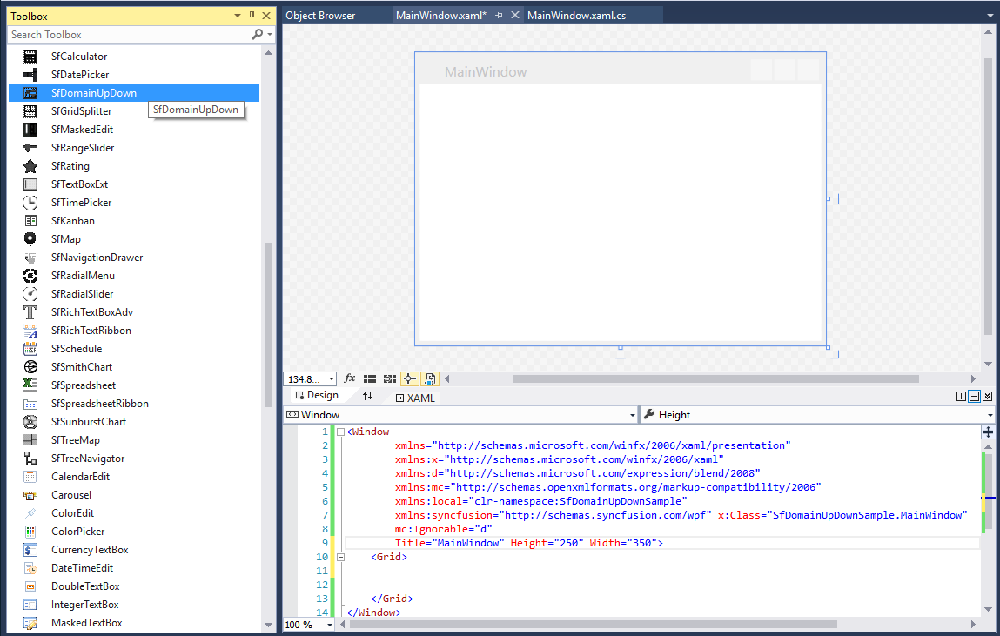

# Getting Started

## Assembly deployment

Refer to the [control dependencies](https://help.syncfusion.com/wpf/control-dependencies#sfdomainupdown) section to get the list of assemblies or NuGet package needs to be added as a reference to use the control in any application.

You can find more details about installing the NuGet package in a WPF application in the following link: 

[How to install nuget packages](https://help.syncfusion.com/wpf/nuget-packages)

## Create a simple application with SfDomainUpDown

You can create a WPF application with SfDomainUpDown control using the following steps:

## Create a project

Create a new WPF project in Visual Studio to display the SfDomainUpDown control with functionalities.

## Add control through designer

The SfDomainUpDown control can be added to an application by dragging it from the toolbox to a designer view. The following required assembly references are added automatically:

* Syncfusion.SfInput.WPF
* Syncfusion.SfShared.WPF

## Adding control manually in XAML

Add control manually in XAML

To add the control manually in XAML, follow the given steps:

1.	Add the following required assembly references to the project.
    * Syncfusion.SfInput.WPF
    * Syncfusion.SfShared.WPF
2.	Import Syncfusion WPF schema **http://schemas.syncfusion.com/wpf** in the XAML page.
3.	Declare the SfDomainUpDown control in the XAML page.



<Window xmlns="http://schemas.microsoft.com/winfx/2006/xaml/presentation"
        xmlns:x="http://schemas.microsoft.com/winfx/2006/xaml"
        xmlns:syncfusion="http://schemas.syncfusion.com/wpf" 
        x:Class="SfDomainUpDownSample.MainWindow"
        Title="SfDomainUpDown Sample" Height="350" Width="525">
    <Grid>
        <!-- Adding SfDomainUpDown control -->
        <syncfusion:SfDomainUpDown x:Name="sfDomainUpDown" HorizontalAlignment="Center"  VerticalAlignment="Center" Width="200"/>
    </Grid>
</Window>



## Add control manually in C\#

In order to add control manually in C#, do the below steps,

To add the control manually in C#, follow the given steps:

1.	Add the following required assembly references to the project.
    * Syncfusion.SfInput.WPF
    * Syncfusion.SfShared.WPF
2.	Import the SfDomainUpDown namespace **using Syncfusion.Windows.Controls.Input;**.
3.	Create a SfDomainUpDown instance, and add it to the window.



using Syncfusion.Windows.Controls.Input;
namespace SfDomainUpDownSample
{
    /// 

    /// Interaction logic for MainWindow.xaml
    /// 

    public partial class MainWindow : Window
    {
        public MainWindow()
        {
            InitializeComponent();
            //Creating an instance of SfDomainUpDown control
            SfDomainUpDown sfDomainUpDown = new SfDomainUpDown();
            //Adding SfDomainUpDown as window content
            this.Content = sfDomainUpDown;
        }
    }
}



## Bind data

You can populate the PinnableListBox control using the [ItemsSource](https://docs.microsoft.com/en-us/dotnet/api/system.windows.controls.itemscontrol.itemssourceproperty?view=netframework-4.7.2) property.

* **Model.cs**



public class Employee
{
	public string Name { get; set; }
	public string Email { get; set; }
}



* **ViewModel.cs**



public class ViewModel
{
	private List<Employee> employees;
	public List<Employee> Employees
	{
		get { return employees; }
		set { employees = value; }
	}
	public ViewModel()
	{
		Employees = new List<Employee>();
		populateItem();
	}
	private void populateItem()
	{
		Employees.Add(new Employee { Name = "Lucas", Email = "lucas@syncfusion.com" });
		Employees.Add(new Employee { Name = "James", Email = "james@syncfusion.com" });
		Employees.Add(new Employee { Name = "Jacob", Email = "jacob@syncfusion.com" });
	}
}



* **MainWindow.Xaml**



<syncfusion:SfDomainUpDown x:Name="domainUpDown" HorizontalAlignment="Center" VerticalAlignment="Center" Width="200" ItemsSource="{Binding Employees}"/>



## Spin button alignment

The spin button’s position in the DomainUpDown control can be changed using the [SpinButtonsAlignment](https://help.syncfusion.com/cr/wpf/Syncfusion.Windows.Controls.Input.SfDomainUpDown.html#Syncfusion_Windows_Controls_Input_SfDomainUpDown_SpinButtonsAlignment) property.



<syncfusion:SfDomainUpDown x:Name="domainUpDown" HorizontalAlignment="Center" VerticalAlignment="Center" Width="200" SpinButtonsAlignment="Right" ItemsSource="{Binding Employees}"/>



1. Right

2. Left

3. Both

