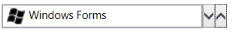

# Populating Data in WPF SfDomainUpdown

The `DomainUpDown` control can be populated with a predefined list of items. The following example shows how to populate the control with a list of employees.

For example, in the following code, the DomainUpDown populates a list of employees:




public class Employee
{
    public string Name { get; set; }
    public string Email { get; set; }
}




Create a collection property:




// Required usings:
// using System.Collections.Generic;

private List<Employee> employees;
public List<Employee> Employees
{
    get { return employees; }
    set { employees = value; }
}




Populate the collection with items:




Employees = new List<Employee>();
Employees.Add(new Employee{Name = "Lucas", Email = "lucas@syncfusion.com"});
Employees.Add(new Employee { Name = "James", Email = "james@syncfusion.com" });
Employees.Add(new Employee { Name = "Jacob", Email = "jacob@syncfusion.com" });




## ItemsSource

Bind the `Employees` collection to the `ItemsSource` property of the `DomainUpDown` control. Set the `DataContext` to an instance of your view model so the binding resolves.




<Window x:Class="DomainUpDownSample.MainWindow"
        xmlns="http://schemas.microsoft.com/winfx/2006/xaml/presentation"
        xmlns:x="http://schemas.microsoft.com/winfx/2006/xaml"
        xmlns:editors="clr-namespace:Syncfusion.Windows.Controls.Input;assembly=Syncfusion.SfInput.WPF">
    <Window.DataContext>
        <local:ViewModel />
    </Window.DataContext>
    <Grid>
        <editors:SfDomainUpDown x:Name="domainUpDown"
                               HorizontalAlignment="Center"
                               VerticalAlignment="Center"
                               Width="200"
                               ItemsSource="{Binding Employees}" />
    </Grid>
</Window>




N> When the `ContentTemplate` property of the `DomainUpDown` control is not set, items are displayed by calling `ToString()` on each data object.

## ContentTemplate

`ContentTemplate` lets you decorate the content with visual elements. In the example below, the control is set to display the `Name` property of each `Employee` alongside an image.




<editors:SfDomainUpDown x:Name="domainUpDown"
                       HorizontalAlignment="Center"
                       VerticalAlignment="Center"
                       Width="200"
                       ItemsSource="{Binding Employees}">
    <editors:SfDomainUpDown.ContentTemplate>
        <DataTemplate>
            <StackPanel Orientation="Horizontal">
                <Image Height="24" Width="24" Source="/Resources/Image.png"/>
                <TextBlock Text="{Binding Name}"/>
            </StackPanel>
        </DataTemplate>
    </editors:SfDomainUpDown.ContentTemplate>
</editors:SfDomainUpDown>




