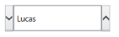

# Spin Button Alignment in WPF Domain Updown (SfDomainUpDown)

The spin button’s position in the DomainUpDown control can be changed using SpinButtonsAlignment. It contains three modes for positioning spin buttons:

1. Right
2. Left
3. Both

## Right

Spin buttons will be aligned on the right side of the control.




<editors:SfDomainUpDown x:Name="domainUpDown"
                       HorizontalAlignment="Center"
                       VerticalAlignment="Center"
                       Width="200" 
                      SpinButtonsAlignment="Right"
                      ItemsSource="{Binding Employees}">
 </editors:SfDomainUpDown>




## Left

Spin buttons will be aligned on the left side of the control.




<editors:SfDomainUpDown x:Name="domainUpDown"
                       HorizontalAlignment="Center"
                       VerticalAlignment="Center"
                       Width="200" 
                      SpinButtonsAlignment="Left"
                      ItemsSource="{Binding Employees}">        </editors:SfDomainUpDown>




## Both

The spin button’s decrement button will be aligned on the left side of the control and the increment button is aligned on the right side of the control.




<editors:SfDomainUpDown x:Name="domainUpDown"
                       HorizontalAlignment="Center"
                       VerticalAlignment="Center"
                       Width="200" 
                      SpinButtonsAlignment="Both"
                      ItemsSource="{Binding Employees}">        
</editors:SfDomainUpDown>          




