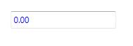
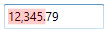

# Appearance in WPF DoubleTextBox

This section deals with the appearance of `DoubleTextBox` control and contains the following topics.

## Setting the Foreground

The [DoubleTextBox](https://www.syncfusion.com/wpf-ui-controls/double-textbox) control [Foreground](https://docs.microsoft.com/en-us/dotnet/api/system.windows.controls.control.foreground?view=netframework-4.8) can be modified based on the value of the control. The following are the foreground for `DoubleTextBox` control.

### Foreground for Positive Value

We can change a positive color for the value of `DoubleTextBox` by setting the [PositiveForeground](https://help.syncfusion.com/cr/wpf/Syncfusion.Windows.Shared.EditorBase.html#Syncfusion_Windows_Shared_EditorBase_PositiveForeground) property and it will be applied when the [Value](https://help.syncfusion.com/cr/wpf/Syncfusion.Windows.Shared.DoubleTextBox.html#Syncfusion_Windows_Shared_DoubleTextBox_Value) is positive. The default color of `PositiveForeground` is `Black`.




<syncfusion:DoubleTextBox x:Name="doubleTextBox" Value="10" Width="100" Height="25" PositiveForeground="Blue" />




DoubleTextBox doubleTextBox = new DoubleTextBox();
doubleTextBox.Width = 100;
doubleTextBox.Height = 25;
doubleTextBox.PositiveForeground = Brushes.Blue;




### Foreground for Negative Value

We can change a negative color for the value of `DoubleTextBox` by setting the [NegativeForeground](https://help.syncfusion.com/cr/wpf/Syncfusion.Windows.Shared.EditorBase.html#Syncfusion_Windows_Shared_EditorBase_NegativeForeground) property and it will be applied when the [ApplyNegativeForeground](https://help.syncfusion.com/cr/wpf/Syncfusion.Windows.Shared.EditorBase.html#Syncfusion_Windows_Shared_EditorBase_ApplyNegativeForeground) property is `true` and the `Value` is negative. The default color of `NegativeForeground` is `Red`.




<syncfusion:DoubleTextBox x:Name="doubleTextBox" Value="10" Width="100" Height="25"
                          NegativeForeground="SpringGreen" ApplyNegativeForeground="True" />




DoubleTextBox doubleTextBox = new DoubleTextBox();
doubleTextBox.Width = 100;
doubleTextBox.Height = 25;
doubleTextBox.ApplyNegativeForeground = true;   
doubleTextBox.NegativeForeground = Brushes.SpringGreen;




### Foreground for Zero Value

We can change a zero color for the value of `DoubleTextBox` by setting the [ZeroColor](https://help.syncfusion.com/cr/wpf/Syncfusion.Windows.Shared.EditorBase.html#Syncfusion_Windows_Shared_EditorBase_ZeroColor) property and it will be applied when the [ApplyZeroColor](https://help.syncfusion.com/cr/wpf/Syncfusion.Windows.Shared.EditorBase.html#Syncfusion_Windows_Shared_EditorBase_ApplyZeroColor) property is `true` and the `Value` is zero.
The default color of `ZeroColor` is `Green`. 




<syncfusion:DoubleTextBox x:Name="doubleTextBox" Value="0" Width="100" Height="25"
                          ApplyZeroColor="True" ZeroColor="DarkGoldenrod"/>




DoubleTextBox doubleTextBox = new DoubleTextBox();
doubleTextBox.Value = 0;
doubleTextBox.Width = 100;
doubleTextBox.Height = 25;
doubleTextBox.ApplyZeroColor = true;
doubleTextBox.ZeroColor = Brushes.DarkGoldenrod;




## Setting the Background

`DoubleTextBox` allows different brushes to fill the control. The [Background](https://docs.microsoft.com/en-us/dotnet/api/system.windows.controls.control.background?view=netframework-4.8) property can be used to modify the control background color. The default color of `Background` is `White`.




<syncfusion:DoubleTextBox x:Name="doubleTextBox" Width="100"
                          Height="25" Value ="80" Background="Cyan"/>




DoubleTextBox doubleTextBox = new DoubleTextBox();
doubleTextBox.Width = 100;
doubleTextBox.Height = 25;
doubleTextBox.Background = Brushes.Cyan;




## Setting the Corner Radius

Corner Radius indicates the degree to which the corners of the border can be rounded. To create curved borders for the `DoubleTextBox`, use [CornerRadius](https://help.syncfusion.com/cr/wpf/Syncfusion.Windows.Shared.EditorBase.html#Syncfusion_Windows_Shared_EditorBase_CornerRadius) property. The default value of `CornerRadius` property is 1.




<syncfusion:DoubleTextBox x:Name="DoubleTextBox1" Width="100" Height="25" CornerRadius="5"/>




DoubleTextBox doubleTextBox = new DoubleTextBox();
doubleTextBox.Width = 100;
doubleTextBox.Height = 25;
doubleTextBox.CornerRadius = new CornerRadius(5);  




## Apply Background for Selection

`DoubleTextBox` allows different brushes to highlight the selected text by setting the [SelectionBrush](https://docs.microsoft.com/en-us/dotnet/api/system.windows.controls.primitives.textboxbase.selectionbrush?view=netframework-4.8) and [SelectionOpacity](https://docs.microsoft.com/en-us/dotnet/api/system.windows.controls.primitives.textboxbase.selectionopacity?view=netframework-4.8) properties. The `SelectionOpacity` property specifies the opacity of the `SelectionBrush`.




<syncfusion:DoubleTextBox x:Name="doubleTextBox" Width="100" Height="25" SelectionBrush="Red" SelectionOpacity="0.5"/>




DoubleTextBox doubleTextBox = new DoubleTextBox();
doubleTextBox.Width = 100;
doubleTextBox.Height = 25;
doubleTextBox.SelectionBrush = Brushes.Red;
doubleTextBox.SelectionOpacity = 0.3;




## Align Value

`DoubleTextBox` allows to display the value from right or center or left side by setting the [TextAlignment](https://docs.microsoft.com/en-us/dotnet/api/system.windows.controls.textblock.textalignment?view=netframework-4.8) property to `Right` or `Left` or `Center`. The Default value of `TextAlignment` is `Left`.




<syncfusion:DoubleTextBox x:Name="doubleTextBox" Width="100" Height="25" TextAlignment="Center"/>




DoubleTextBox doubleTextBox = new DoubleTextBox();
doubleTextBox.Width = 100;
doubleTextBox.Height = 25;
doubleTextBox.TextAlignment = TextAlignment.Center;




## Setting ToolTip

`DoubleTextBox` provides support for ToolTip to display certain information when the mouse hovers on the `DoubleTextBox`. You can customize the tooltip information by setting the [ToolTip](https://docs.microsoft.com/en-us/dotnet/api/system.windows.controls.tooltip?view=netframework-4.8) property.




<syncfusion:DoubleTextBox x:Name="doubleTextBox" Width="100" Height="25" ToolTip="Enter Double Value"/>




DoubleTextBox doubleTextBox = new DoubleTextBox();
doubleTextBox.Width = 100;
doubleTextBox.Height = 25;
doubleTextBox.ToolTip = "Enter Double value";




## Theme

DoubleTextBox supports various built-in themes. Refer to the below links to apply themes for the DoubleTextBox,

  * [Apply theme using SfSkinManager](https://help.syncfusion.com/wpf/themes/skin-manager)
	
  * [Create a custom theme using ThemeStudio](https://help.syncfusion.com/wpf/themes/theme-studio#creating-custom-theme)

