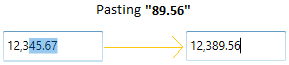

# Changing Double Value in WPF DoubleTextBox

The [DoubleTextBox](https://www.syncfusion.com/wpf-ui-controls/double-textbox) allows the user to change the value using the [Value](https://help.syncfusion.com/cr/wpf/Syncfusion.Windows.Shared.DoubleTextBox.html#Syncfusion_Windows_Shared_DoubleTextBox_Value) property.




<syncfusion:DoubleTextBox x:Name="doubleTextBox" Height="25"
                          Width="150" Value="10"/>

                       


DoubleTextBox doubleTextBox = new DoubleTextBox();
doubleTextBox.Width = 150;
doubleTextBox.Height = 25;
doubleTextBox.Value = 10;




Data binding is the process of establishing a connection between the application UI and business logic. Data binding can be unidirectional (source -> target or target <- source) or bidirectional (source <-> target). By assigning a value to the `Value` property by binding, you can change the `DoubleTextBox` value.

The following code snippets illustrate the value binding from one `DoubleTextBox` to another.




<syncfusion:DoubleTextBox x:Name="doubleTextBox1" Value="{Binding MyValue,UpdateSourceTrigger=PropertyChanged}" Height="25" Width="100"/>
<syncfusion:DoubleTextBox x:Name="doubleTextBox2" Value="{Binding MyValue,UpdateSourceTrigger=PropertyChanged}" Width="100" Height="25"  />




ViewModel.cs




class ViewModel : NotificationObject
{
    private double myValue;
    public double MyValue
    {
        get
        {
            return myValue;
        }
        set
        {
            myValue = value;
            RaisePropertyChanged("MyValue");
        }
    }
}




## Change double value by pasting the clipboard's text

By default, `DoubleTextBox` simply replaces the whole value by copied value with the current number format. If you want to replace or insert the copied value on specific place, use the [PasteMode](https://help.syncfusion.com/cr/wpf/Syncfusion.Windows.Shared.EditorBase.html#Syncfusion_Windows_Shared_EditorBase_PasteMode) property value as `Advanced`. The default value of `PasteMode` property is `Default`. 

The following table explains the pasting behaviour in `Advanced` paste mode,

<table>
<tr>
<th> S.No </th>
<th> Action </th>
<th> Pasting behaviour in Advanced paste mode</th>
</tr>
<tr>
<td>1</td>
<td>When the whole value is selected</td>
<td>It simply replaces the whole value by copied value with the current number format.</td>
</tr>
<tr>
<td>2</td>
<td>When the cursor is at some position and the copied value does not contain a number decimal separator</td>
<td>It inserts the copied value into the current cursor position.</td>
</tr>
<tr>
<td>3</td>
<td>When the cursor is at some position and the copied value contains a number decimal separator</td>
<td>It won’t perform pasting operation.</td>
</tr>
<tr>
<td>4</td>
<td>When the cursor is at some position and the control value is 0 or null</td>
<td>It simply replaces the whole value by copied value with the current number format.</td>
</tr>
<tr>
<td>5</td>
<td>When a part of the number is selected</td>
<td>If the selected value contains a number decimal separator, then copied value must contain number decimal separator. Otherwise, it won’t perform pasting operation. 

If the selected text does not contain a number decimal separator, then copied value must not contain number decimal separator. Otherwise, it won’t perform pasting operation.</td>
</tr>
</table>




<syncfusion:DoubleTextBox PasteMode="Advanced" 
                           Value="12345.67"
                           Name="doubleTextBox"/>

                       


DoubleTextBox doubleTextBox = new DoubleTextBox();
doubleTextBox.PasteMode = PasteMode.Advanced;
doubleTextBox.Value = 12345.67;




## Changing double value by SpinButton

The `DoubleTextBox` control supports SpinButton to change the value by using [ShowSpinButton] property. The current value can be incremented by clicking on UpButton and decremented by clicking on DownButton after enabling the [ShowSpinButton] property.




<syncfusion:DoubleTextBox Height="30" Width="150" ShowSpinButton="True" />




DoubleTextBox doubleTextBox = new DoubleTextBox();
doubleTextBox.ShowSpinButton = true;




## Value Changed Event

The `DoubleTextbox` control can notify changes in value through the [ValueChanged](https://help.syncfusion.com/cr/wpf/Syncfusion.Windows.Shared.DoubleTextBox.html) event. In `ValueChanged` event, you can get old value and new value from the `OldValue` and  `NewValue` properties.




<syncfusion:DoubleTextBox ValueChanged="DoubleTextBox_ValueChanged"/>


 

DoubleTextBox doubleTextBox = new DoubleTextBox();
doubleTextBox.ValueChanged += new PropertyChangedCallback(DoubleTextBox_ValueChanged);




You can handle the event as follows:




private void DoubleTextBox_ValueChanged(DependencyObject d, DependencyPropertyChangedEventArgs e)
{
    // Get old and new value
    var newValue = e.NewValue;
    var oldValue = e.OldValue;
}




## Setting the Null value

 By default, the `DoubleTextBox` control will display zero value when the `Value` is set to `null`. You can use the [NullValue](https://help.syncfusion.com/cr/wpf/Syncfusion.Windows.Shared.DoubleTextbox.html#Syncfusion_Windows_Shared_DoubleTextBox_NullValue) and [UseNullOption](https://help.syncfusion.com/cr/wpf/Syncfusion.Windows.Shared.EditorBase.html#Syncfusion_Windows_Shared_EditorBase_UseNullOption) properties to show the null or any other value instead of zero.
 
 The default value of the `NullValue` property is `null`, you can reset this to any other double value. It will display only on setting the `UseNullOption` property is set to `true`.
 
**NullValue = Null**




<syncfusion:DoubleTextBox x:Name="doubleTextBox" Height="25"
                          Width="100" UseNullOption="True"  NullValue="{x:Null}"/>




DoubleTextBox doubleTextBox = new DoubleTextBox();
doubleTextBox.Width = 100;
doubleTextBox.Height = 25;
doubleTextBox.NullValue = null;
doubleTextBox.UseNullOption = true;




**NullValue = 10**




<syncfusion:DoubleTextBox x:Name="doubleTextBox" Height="25"
                          Width="100" UseNullOption="True" NullValue="10"/>




DoubleTextBox doubleTextBox = new DoubleTextBox();
doubleTextBox.Width = 100;
doubleTextBox.Height = 25;
doubleTextBox.NullValue = 10;
doubleTextBox.UseNullOption = true;




## Setting Watermark Text

We can display certain information within the control by using the [WaterMarkText](https://help.syncfusion.com/cr/wpf/Syncfusion.Windows.Shared.EditorBase.html#Syncfusion_Windows_Shared_EditorBase_WatermarkText) property. `WaterMarkText` is shown when the [WatermarkTextIsVisible](https://help.syncfusion.com/cr/wpf/Syncfusion.Windows.Shared.EditorBase.html#Syncfusion_Windows_Shared_EditorBase_WatermarkTextIsVisible) property is `true` and the value is `null` or empty, the control is not in focus and the `UseNullOption` property is `true`.

### Setting the WatermarkText Foreground

The `DoubleTextBox` allows you to set the desired brush as a foreground for `WaterMarkText` using [WaterMarkTextForeground](https://help.syncfusion.com/cr/wpf/Syncfusion.Windows.Shared.EditorBase.html#Syncfusion_Windows_Shared_EditorBase_WatermarkTextForeground) property. The default color of `WaterMarkTextForeground` is `Black`.




<syncfusion:DoubleTextBox x:Name="doubleTextBox" Width="100"
                          Height="25" UseNullOption="True" WatermarkText="Type here"
                          WatermarkTextIsVisible="True" WatermarkTextForeground="Red"/>




DoubleTextBox doubleTextBox = new DoubleTextBox();
doubleTextBox.Width = 100;
doubleTextBox.Height = 25;
doubleTextBox.UseNullOption = true;
doubleTextBox.WatermarkText = "Type Here";
doubleTextBox.WatermarkTextIsVisible = true;
doubleTextBox.WatermarkTextForeground = Brushes.Red;




### Setting Watermark Template

You can customize the Visual appearance of the `WatermarkText` by using the [WatermarkTemplate](https://help.syncfusion.com/cr/wpf/Syncfusion.Windows.Shared.EditorBase.html#Syncfusion_Windows_Shared_EditorBase_WatermarkTemplate) property.



<syncfusion:DoubleTextBox x:Name="doubleTextBox" Width="100" Height="25"
                          WatermarkText="Type Here" CornerRadius="3" 
                          WatermarkTextIsVisible="True" WatermarkOpacity="0.5" 
                          UseNullOption="True">
    <syncfusion:DoubleTextBox.WatermarkTemplate >
        <DataTemplate>
            <Border Background="Red">
                <TextBlock Text="{Binding}" VerticalAlignment="Center" Margin="5,0,0,0"/>
            </Border>
        </DataTemplate>
    </syncfusion:DoubleTextBox.WatermarkTemplate>
</syncfusion:DoubleTextBox>



N> The `UseNullOption` property must be enabled if you want to see `NullValue` or `WaterMarkText` in `DoubleTextBox` control. 

N> If both `NullValue` and `WaterMarkText` are specified, you will only see `NullValue` but not `WaterMarkText`.
