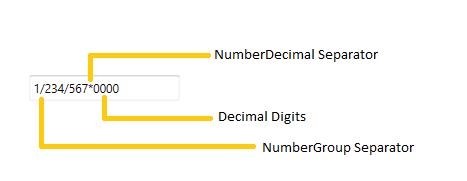

# Culture and Formatting in WPF Double TextBox

Value of `DoubleTextBox` can be formatted in following ways:

* Culture
* NumberFormatInfo
* Dedicated properties (NumberGroupSeparator, NumberGroupSizes, NumberDecimalDigits, NumberDecimalSeparator)

## Culture based formatting

The [DoubleTextBox](https://www.syncfusion.com/wpf-ui-controls/double-textbox) provides support for globalization by using the [Culture](https://help.syncfusion.com/cr/wpf/Syncfusion.Windows.Shared.EditorBase.html#Syncfusion_Windows_Shared_EditorBase_Culture) property. The `Culture` property is used to format the decimal separator and group separator of the `DoubleTextBox` value based on the respective culture.


 

<syncfusion:DoubleTextBox x:Name="doubleTextBox" Height="25" Width="150" Culture="bs-Latn" Value="1234567"/>


 

DoubleTextBox doubleTextBox = new DoubleTextBox();
doubleTextBox.Width = 150;
doubleTextBox.Height = 25;
doubleTextBox.Value = 1234567;

//Setting Latin culture for double textbox.
doubleTextBox.Culture = new System.Globalization.CultureInfo("bs-Latn");




By default the US culture uses “,” as the `NumberGroupSeparator` and "." as the `NumberDecimalSeparator` where as the Latin culture uses “.” as the `NumberGroupSeparator` and "," as the `NumberDecimalSeparator`. 

**Default Culture**

**Latin Culture**

## NumberFormatInfo based formatting

The number formatting of `DoubleTextBox` can be customized by setting [NumberFormat](https://help.syncfusion.com/cr/wpf/Syncfusion.Windows.Shared.EditorBase.html#Syncfusion_Windows_Shared_EditorBase_NumberFormat) property.




<syncfusion:DoubleTextBox x:Name="doubleTextBox" Height="25"
                          Width="200" Value="1234567"
                          GroupSeperatorEnabled = "True">
    <syncfusion:DoubleTextBox.NumberFormat>
        <numberformat:NumberFormatInfo NumberGroupSeparator="/"
                                    NumberDecimalDigits="4" 
                                    NumberDecimalSeparator="*"/>
</syncfusion:DoubleTextBox.NumberFormat>
</syncfusion:DoubleTextBox>





DoubleTextBox doubleTextBox = new DoubleTextBox();
doubleTextBox.Width = 200;
doubleTextBox.Height = 25;
doubleTextBox.Value = 1234567;
doubleTextBox.GroupSeperatorEnabled = true;
doubleTextBox.NumberFormat = new NumberFormatInfo()
{
    NumberGroupSeparator = "/",
    NumberDecimalDigits = 4,
    NumberDecimalSeparator = "*"
};




The following code illustrate how to set number group size by using the `NumberFormat` property.




DoubleTextBox doubleTextBox = new DoubleTextBox();
doubleTextBox.Width = 200;
doubleTextBox.Height = 25;
doubleTextBox.Value = 123456789;
doubleTextBox.NumberFormat = new System.Globalization.NumberFormatInfo()
{
    NumberDecimalDigits =4,
    NumberGroupSeparator = "/",
    NumberDecimalSeparator = "*",
    
    // Adding the Number group size via NumberFormat property.
    NumberGroupSizes = new int[] { 2, 3, 4 }
};



## Formatting with dedicated properties

The number formatting of `DoubleTextBox` can also be customized by setting [NumberGroupSeparator](https://help.syncfusion.com/cr/wpf/Syncfusion.Windows.Shared.DoubleTextBox.html#Syncfusion_Windows_Shared_DoubleTextBox_NumberGroupSeparator), [NumberGroupSizes](https://help.syncfusion.com/cr/wpf/Syncfusion.Windows.Shared.DoubleTextBox.html#Syncfusion_Windows_Shared_DoubleTextBox_NumberGroupSizes), [NumberDecimalDigits](https://help.syncfusion.com/cr/wpf/Syncfusion.Windows.Shared.DoubleTextBox.html#Syncfusion_Windows_Shared_DoubleTextBox_NumberDecimalDigits), and [NumberDecimalSeparator](https://help.syncfusion.com/cr/wpf/Syncfusion.Windows.Shared.DoubleTextBox.html#Syncfusion_Windows_Shared_DoubleTextBox_NumberDecimalSeparator) properties. You can show the group separator by enable the [GroupSeperatorEnabled](https://help.syncfusion.com/cr/wpf/Syncfusion.Windows.Shared.DoubleTextBox.html#Syncfusion_Windows_Shared_DoubleTextBox_GroupSeperatorEnabled) property to `true`.

The following code illustrate how to format using the `NumberDecimalSeparator`, `NumberDecimalDigits`, `NumberGroupSeparator`, `NumberGroupSizes` property of the `DoubleTextBox`.




DoubleTextBox doubleTextBox = new DoubleTextBox();
doubleTextBox.Width = 150;
doubleTextBox.Height = 25;
doubleTextBox.Value = 123456789;
doubleTextBox.NumberGroupSeparator = "/";
doubleTextBox.NumberDecimalSeparator = "*";
doubleTextBox.NumberDecimalDigits = 3;

// Adding the Number group size via NumberGroupSizes property.
doubleTextBox.NumberGroupSizes = new Int32Collection() { 4, 3, 2};




N> When you use both the `NumberFormat` and the dedicated properties (`NumberGroupSeparator`, `NumberGroupSizes`, `NumberDecimalDigits`, and `NumberDecimalSeparator`) to format the value of `DoubleTextbox`, the `NumberGroupSeparator`, `NumberGroupSizes`, `NumberDecimalDigits`, and `NumberDecimalSeparator` properties have higher priority.

N> When you use both `NumberFormat` and  `Culture`, the `NumberFormat` will have a higher priority.
