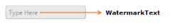

# WPF Double TextBox Overview

The [DoubleTextBox](https://www.syncfusion.com/wpf-controls/double-textbox) control restricts input to double values with support for data binding, watermark, null value, and culture. It provides various customization options to improve its appearance and suit an application.

## Control structure

## Features

The core features of the `DoubleTextBox` are as follows:

* Provides the ability to control the range of input values by using the [MinValue](https://help.syncfusion.com/cr/wpf/Syncfusion.Windows.Shared.DoubleTextBox.html#Syncfusion_Windows_Shared_DoubleTextBox_MinValue) and [MaxValue](https://help.syncfusion.com/cr/wpf/Syncfusion.Windows.Shared.DoubleTextBox.html#Syncfusion_Windows_Shared_DoubleTextBox_MaxValue) properties. See [Min Max Value Restriction in Getting Started](Getting-Started.md#min-max-value-restriction).
* Provides different foreground brushes for positive, negative, and zero values. See [Appearance and Styling](Appearance-and-Styling.md).
* Provides [data binding support](Getting-Started.md#binding-value).
* Provides built-in Visual Styles and themes. See [Theme](Getting-Started.md#theme).
* Provides [Watermark support](Changing-Double-Value.md#setting-watermark-text).
* Provides [Number Format support](Culture-and-Number-Formats.md).
* Provides [Null Value support](Changing-Double-Value.md#setting-the-null-value).
* Provides [culture support](Culture-and-Number-Formats.md#culture-based-formatting).
* Provides [Range Adorner support](Range-Adorner.md).
* Provides [Restriction or Validation](Restriction-or-Validation.md).
* Provides [Step Interval support](Step-Interval.md).
