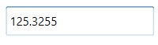

# Restriction or Validation in WPF Double TextBox

This section explains how to validate or restrict the `WPF Double TextBox` control value.

## Restrict the value within minimum and maximum value

The [Value](https://help.syncfusion.com/cr/wpf/Syncfusion.Windows.Shared.DoubleTextBox.html#Syncfusion_Windows_Shared_DoubleTextBox_Value) of the [WPF Double TextBox](https://www.syncfusion.com/wpf-controls/double-textbox) can be restricted within the maximum and minimum limits. Once the value has reached the maximum or minimum value, the value does not exceed the limit. You can change the maximum and minimum limits by using the [MinValue](https://help.syncfusion.com/cr/wpf/Syncfusion.Windows.Shared.DoubleTextBox.html#Syncfusion_Windows_Shared_DoubleTextBox_MinValue) and [MaxValue](https://help.syncfusion.com/cr/wpf/Syncfusion.Windows.Shared.DoubleTextBox.html#Syncfusion_Windows_Shared_DoubleTextBox_MaxValue) properties.

You can choose when to validate the maximum and minimum limits while changing the values by using the [MinValidation](https://help.syncfusion.com/cr/wpf/Syncfusion.Windows.Shared.EditorBase.html#Syncfusion_Windows_Shared_EditorBase_MinValidation) and [MaxValidation](https://help.syncfusion.com/cr/wpf/Syncfusion.Windows.Shared.EditorBase.html#Syncfusion_Windows_Shared_EditorBase_MaxValidation) properties.

* `OnKeyPress` — When `MaxValidation` or `MinValidation` is set to `OnKeyPress`, the value in the `WPF Double TextBox` is validated shortly after pressing a key. As a result, invalid input is not allowed, and the value does not exceed the maximum and minimum limits.

* `OnLostFocus` - When `MaxValidation` or `MinValidation` is set to `OnLostFocus`, the value in the `WPF Double TextBox` is validated when the control loses keyboard focus. The control will accept any value while editing, and validation only takes place after focus is lost. After validation, when the value of the `WPF Double TextBox` is greater than the `MaxValue` or less than the `MinValue`, the value will be automatically set to `MaxValue` or `MinValue`.

* [MaxValueOnExceedMaxDigit](https://help.syncfusion.com/cr/wpf/Syncfusion.Windows.Shared.EditorBase.html#Syncfusion_Windows_Shared_EditorBase_MaxValueOnExceedMaxDigit) - When you give input greater than the specified maximum limit, `MaxValueOnExceedMaxDigit` decides whether to retain the old value or reset to the specified maximum limit. For example, if `MaxValue` is set to 100 and you are trying to input 200, the `Value` will change to 100 when `MaxValueOnExceedMaxDigit` is `true`. When `MaxValueOnExceedMaxDigit` is `false`, 20 will be retained and the last entered 0 will be ignored.

  N> `MaxValueOnExceedMaxDigit` is only effective when the `MaxValidation` is set to `OnKeyPress`.

* [MinValueOnExceedMinDigit](https://help.syncfusion.com/cr/wpf/Syncfusion.Windows.Shared.EditorBase.html#Syncfusion_Windows_Shared_EditorBase_MinValueOnExceedMinDigit) - When you give input less than the specified minimum limit, `MinValueOnExceedMinDigit` decides whether to retain the old value or reset to the specified minimum limit. For example, if `MinValue` is set to 200 and the `Value` is 205, and you try to change the value to 20, the `Value` will change to 200 when `MinValueOnExceedMinDigit` is `true`. When `MinValueOnExceedMinDigit` is `false`, the old value 205 will be retained.

  N> `MinValueOnExceedMinDigit` is only effective when the `MinValidation` is set to `OnKeyPress`.




<syncfusion:DoubleTextBox x:Name="doubleTextBox" Width="150" MaxValue="100" MinValue="10"
                          MinValueOnExceedMinDigit="True" MaxValueOnExceedMaxDigit="True"
                          MinValidation="OnKeyPress" MaxValidation="OnLostFocus"/>




using Syncfusion.Windows.Shared;

DoubleTextBox doubleTextBox = new DoubleTextBox();
doubleTextBox.Width = 150;
doubleTextBox.Height = 25;
doubleTextBox.MinValue = 10;
doubleTextBox.MaxValue = 100;
doubleTextBox.MinValidation = MinValidation.OnKeyPress;
doubleTextBox.MaxValidation = MaxValidation.OnLostFocus;
doubleTextBox.MinValueOnExceedMinDigit = true;
doubleTextBox.MaxValueOnExceedMaxDigit = true;




`MinValidation` is set to OnKeyPress, it cannot let to enter a value less than the `MinValue`. If try to enter a value less than the `MinValue`, then the `MinValue` will set to the `Value` property because `MinValueOnExceedMinDigit` is set to `true`.

`MaxValidation` is set to OnLostFocus, so the `MaxValidation` will be performed only in the lost focus.

## Restrict number of decimal digits

You can format the decimal digits in the [WPF Double TextBox](https://www.syncfusion.com/wpf-controls/double-textbox) control using the [NumberDecimalDigits](https://help.syncfusion.com/cr/wpf/Syncfusion.Windows.Shared.DoubleTextBox.html#Syncfusion_Windows_Shared_DoubleTextBox_NumberDecimalDigits) property. You can restrict the decimal digits of the text within maximum and minimum limits using the [MinimumNumberDecimalDigits](https://help.syncfusion.com/cr/wpf/Syncfusion.Windows.Shared.DoubleTextBox.html#Syncfusion_Windows_Shared_DoubleTextBox_MinimumNumberDecimalDigits) and [MaximumNumberDecimalDigits](https://help.syncfusion.com/cr/wpf/Syncfusion.Windows.Shared.DoubleTextBox.html#Syncfusion_Windows_Shared_DoubleTextBox_MaximumNumberDecimalDigits) properties. The default value of `MinimumNumberDecimalDigits` and `MaximumNumberDecimalDigits` is **-1**, which means the value is unbounded.

N> If the value of `MinimumNumberDecimalDigits` is greater than the value of `MaximumNumberDecimalDigits`, the text of `DoubleTextBox` will be updated based on the value of `MinimumNumberDecimalDigits`.




<syncfusion:DoubleTextBox Value="125.32545" HorizontalAlignment="Center" VerticalAlignment="Center"
                            MaximumNumberDecimalDigits="4"
                            MinimumNumberDecimalDigits="1" />




using Syncfusion.Windows.Shared;

DoubleTextBox doubleTextBox = new DoubleTextBox();
doubleTextBox.Value = 125.32545;
doubleTextBox.MaximumNumberDecimalDigits = 4;
doubleTextBox.MinimumNumberDecimalDigits = 1;




When value of `MinimumNumberDecimalDigits`, `MaximumNumberDecimalDigits` and `NumberDecimalDigits` properties are specified, `NumberDecimalDigits` property takes high precedence and updates the text of `WPF Double TextBox` property. 




<syncfusion:DoubleTextBox Value="125.32545" HorizontalAlignment="Center" VerticalAlignment="Center"
                            MaximumNumberDecimalDigits="4"
                            MinimumNumberDecimalDigits="1"
                            NumberDecimalDigits="3"
                            />




using Syncfusion.Windows.Shared;

DoubleTextBox doubleTextBox = new DoubleTextBox();
doubleTextBox.Value = 125.32545;
doubleTextBox.MaximumNumberDecimalDigits = 4;
doubleTextBox.MinimumNumberDecimalDigits = 1;
doubleTextBox.NumberDecimalDigits = 3;




## Read-only mode

The `WPF Double TextBox` does not allow user input or edits when the [IsReadOnly](https://learn.microsoft.com/en-us/dotnet/api/system.windows.controls.primitives.textboxbase.isreadonly?view=netframework-4.8#System_Windows_Controls_Primitives_TextBoxBase_IsReadOnly) property is set to `true`. The user can still select text and display the cursor in the `WPF Double TextBox` by setting the [IsReadOnlyCaretVisible](https://learn.microsoft.com/en-us/dotnet/api/system.windows.controls.primitives.textboxbase.isreadonlycaretvisible?view=netframework-4.8) property to `true`. The default value of `IsReadOnly` is `false` and the default value of `IsReadOnlyCaretVisible` is `false`. The `Value` can still be changed programmatically in read-only mode.




<syncfusion:DoubleTextBox x:Name="doubleTextBox" IsReadOnly="True" Value="10" IsReadOnlyCaretVisible="True"/>


using Syncfusion.Windows.Shared;



DoubleTextBox doubleTextBox = new DoubleTextBox();
doubleTextBox.Value = 10;
doubleTextBox.IsReadOnly = true;
doubleTextBox.IsReadOnlyCaretVisible = true;




