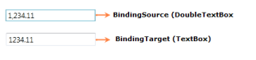

# Binding Support

Data binding is the process of establishing a connection between the application UI and business logic. Data binding can be unidirectional (source -> target or target <- source) or bidirectional (source <-> target). You can bind the data to the DoubleTextBox through the [Value](https://help.syncfusion.com/cr/wpf/Syncfusion.Shared.Wpf~Syncfusion.Windows.Shared.DoubleTextBox~Value.html) property.

The following example shows a simple binding between the value of the DoubleTextBox and another DoubleTextBox value that reflects the typed value:



<StackPanel>

<syncfusion:DoubleTextBox x:Name="doubleTextBox1" Width="150" Margin="10"/>

<syncfusion:DoubleTextBox x:Name="doubleTextBox2" Width="150" Margin="10" 

Value="{Binding ElementName=doubleTextBox1,Path=Value,Mode=TwoWay}"/>

</StackPanel>



The Data Context property provides its value to child elements. So you can set the Data Context on a superior layout container and its value is provided to all child elements. This is very useful if you want to build a form that is bound to multiple properties of the same data object. If you don't explicitly define a source of binding, it takes the data context by default.



<StackPanel DataContext="{StaticResource myCustomer}">

<TextBox Text="{Binding FirstName}"/>

<TextBox Text ="{Binding LastName}"/>

<syncfusion:DoubleTextBox Value="{Binding Phone}"/>

<syncfusion:DoubleTextBox Value="{Binding Income}"/>

</StackPanel>


If you want to bind values other than double values, you need to use the Value Converter. The following example shows a simple binding between the value of the DoubleTextBox and the Textbox text that reflects the typed value:



<StackPanel>

<StackPanel.Resources>

<c:StringToDoubleConverter x:Key="stringToDoubleConverter"/>

</StackPanel.Resources>

<syncfusion:DoubleTextBox x:Name="doubleTextBox" Width="150" Margin="10"/>

<TextBox x:Name="textBox" Width="150" Margin="10" Text="{Binding 

ElementName=doubleTextBox,Path=Value,Mode=TwoWay,

Converter={StaticResource stringToDoubleConverter}}"/>    

</StackPanel>



