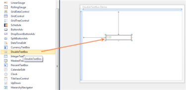
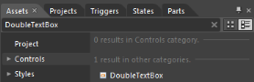

# Getting Started

## Control Structure

## DoubleTextBox Members

DoubleTextBox exposes the following members:

### Properties

Property Table

<table>
<tr>
<th>
Name</th><th>
Type</th><th>
Value it Accepts</th><th>
Description</th><th>
Default Value</th><th>
Reference Link</th></tr>
<tr>
<td>
ApplyNegativeForeground</td><td>
Dependency Property</td><td>
Bool</td><td>
Gets or sets the value that determines whether to apply the NegativeForeground in the DoubleTextBox.</td><td>
True</td><td>
ApplyNegativeForeground</td></tr>
<tr>
<td>
ApplyZeroColor</td><td>
Dependency Property</td><td>
Bool</td><td>
Gets or sets the value that determines whether to apply the ZeroColor in the DoubleTextBox</td><td>
True</td><td>
ApplyZeroColor</td></tr>
<tr>
<td>
CornerRadius</td><td>
Dependency Property</td><td>
CornerRadius</td><td>
Gets or sets a value that represents the degree to which the corners of the DoubleTextBox are rounded.</td><td>
No default value.</td><td>
CornerRadius</td></tr>
<tr>
<td>
Culture</td><td>
Dependency Property</td><td>
CultureInfo</td><td>
Gets or sets the Culture information associated with the DoubleTextBox.</td><td>
-</td><td>
Culture</td></tr>
<tr>
<td>
EnterToMoveNext</td><td>
Dependency Property</td><td>
Bool</td><td>
If this is set to true then the Enter key is used to change the focus from one field to another.</td><td>
true</td><td>
EnterToMoveNext</td></tr>
<tr>
<td>
IsReadOnly</td><td>
Dependency Property</td><td>
Bool</td><td>
Gets or sets the value that determines if the user can change the value in the DoubleTextBox.</td><td>
true</td><td>
IsReadOnly</td></tr>
<tr>
<td>
IsScrollingOnCircle</td><td>
Dependency Property</td><td>
Bool</td><td>
The spin behavior in the DoubleTextBox can be enabled or disabled by setting the IsScrollingOnCircle property.</td><td>
True</td><td>
</td></tr>
<tr>
<td>
NegativeForeground</td><td>
Dependency Property</td><td>
Brush</td><td>
Gets or sets the NegativeForground property.</td><td>
Red</td><td>
NegativeForeground</td></tr>
<tr>
<td>
NullValue</td><td>
Dependency Property</td><td>
Double?</td><td>
Gets or sets the NullValue property. </td><td>
Null</td><td>
NullValue</td></tr>
<tr>
<td>
NumberFormat</td><td>
Dependency Property</td><td>
NumberFormatInfo</td><td>
A NumberFormat that defines the culturally appropriate format of displaying numbers, currency, and percentage.</td><td>
</td><td>
NumberFormat</td></tr>
<tr>
<td>
MaxValue</td><td>
Dependency Property </td><td>
Double</td><td>
Gets or sets the maximum value for the DoubleTextBox.</td><td>
1.7976931348623157E+308</td><td>
MaxValue</td></tr>
<tr>
<td>
MaxValidation</td><td>
Dependency Property</td><td>
Enum of type MaxValidation</td><td>
Represents the Maximum value Validation constraint for the DoubleTextBox.</td><td>
MaxValidation.OnKeyPress</td><td>
MaxValidation</td></tr>
<tr>
<td>
MaxValueOnExceedMaxDigit</td><td>
Dependency Property</td><td>
Bool</td><td>
Represents the behavior when the value exceeds the MaxValue.</td><td>
True</td><td>
MaxValueOnExceedMaxDigit</td></tr>
<tr>
<td>
MinValue</td><td>
Dependency Property</td><td>
Double</td><td>
Gets or sets the minimum allowed value for the DoubleTextBox.</td><td>
negative 1.7976931348623157E+308.</td><td>
MinValue</td></tr>
<tr>
<td>
MinValueOnExceedMinDigit</td><td>
Dependency Property</td><td>
Bool</td><td>
Represents the behavior when the Value exceeds the MinValue.</td><td>
True</td><td>
MinValueOnExceedMinDigit</td></tr>
<tr>
<td>
MinValidation</td><td>
Dependency Property</td><td>
Enum of type MinValidation</td><td>
Represents the Minimum value Validation constraint for the DoubleTextBox.</td><td>
MinValidation.OnKeyPress</td><td>
MinValidation</td></tr>
<tr>
<td>
NumberDecimalDigits</td><td>
Dependency Property</td><td>
Int</td><td>
Gets or sets the number of decimal places to use in the Value.</td><td>
2</td><td>
NumberDecimalDigits</td></tr>
<tr>
<td>
NumberDecimalSeparator</td><td>
Dependency Property</td><td>
string</td><td>
Gets or sets the string to use as the decimal separator in the Value.</td><td>
.</td><td>
NumberDecimalSeparator</td></tr>
<tr>
<td>
NumberGroupSeparator</td><td>
Dependency Property</td><td>
String</td><td>
Gets or sets the string that separates groups of digits in the value.</td><td>
,</td><td>
NumberGroupSeparator</td></tr>
<tr>
<td>
NumberGroupSizes</td><td>
Dependency Property </td><td>
Int32Collection</td><td>
Gets or sets the number of digits in each group to the left of the decimal in the value.</td><td>
</td><td>
NumberGroupSizes</td></tr>
<tr>
<td>
PositiveForeground</td><td>
Dependency Property</td><td>
Brush</td><td>
Gets or sets the Foreground for the DoubleTextBox.</td><td>
Black</td><td>
</td></tr>
<tr>
<td>
SelectedText</td><td>
Dependency Property</td><td>
String</td><td>
Gets or sets the current selection in the DoubleTextBox.</td><td>
Empty String.</td><td>
</td></tr>
<tr>
<td>
SelectionStart</td><td>
Dependency Property</td><td>
Int</td><td>
Gets or sets a character index for the beginning of the current selection.</td><td>
-</td><td>
</td></tr>
<tr>
<td>
SelectionLength</td><td>
Dependency Property</td><td>
Int</td><td>
Gets or sets a value indicating the number of characters in the current selection in the DoubleTextBox.</td><td>
0</td><td>
</td></tr>
<tr>
<td>
TextSelectionOnFocus</td><td>
Dependency Property</td><td>
Bool</td><td>
If this property is set to true, then it will select all the text in the CurrencyTextBox when it gets focused.</td><td>
True</td><td>
</td></tr>
<tr>
<td>
UseNullOption</td><td>
Dependency Property</td><td>
Bool</td><td>
Disable or enable the NullValue support in the DoubleTextBox.</td><td>
False</td><td>
UseNullOption</td></tr>
<tr>
<td>
Value</td><td>
Dependency Property </td><td>
Double?</td><td>
Gets or sets the value for the DoubleTextBox.</td><td>
0</td><td>
Value</td></tr>
<tr>
<td>
WatermarkOpacity</td><td>
Dependency Property</td><td>
Double</td><td>
Gets or sets the opacity of the WatermarkText in the DoubleTextBox.</td><td>
0.5</td><td>
WatermarkOpacity</td></tr>
<tr>
<td>
WatermarkTemplate</td><td>
Dependency Property</td><td>
DateTemplate</td><td>
Gets or sets the DataTemplate for the WatermarkText.</td><td>
</td><td>
WatermarkTemplate</td></tr>
<tr>
<td>
WatermarkText</td><td>
Dependency Property</td><td>
String</td><td>
Gets or sets the WatermarkTextProperty.</td><td>
Empty String</td><td>
WatermarkText</td></tr>
<tr>
<td>
WatermarkTextForeground</td><td>
Dependency Property</td><td>
Brush</td><td>
Gets or sets the Foreground for the WatermarkText.</td><td>
</td><td>
WatermarkTextForeground</td></tr>
<tr>
<td>
WatermarkTextIsVisible</td><td>
Dependency Property</td><td>
Bool</td><td>
Gets or sets the value that determines the visibility of the WatermarkText in the DoubleTextBox.</td><td>
False</td><td>
WatermarkTextIsVisible</td></tr>
<tr>
<td>
ZeroColor</td><td>
Dependency Property</td><td>
Brush</td><td>
Gets or sets the ZeroColor property.</td><td>
Green</td><td>
ZeroColor</td></tr>
</table>

### Methods

Methods table

<table>
<tr>
<th>
Name</th><th>
Description</th><th>
Return Type</th><th>
Overloads</th></tr>
<tr>
<td>
Copy()</td><td>
Copies the current selection of the DoubleTextBox to the Clipboard.</td><td>
Void</td><td>
-</td></tr>
<tr>
<td>
Select()</td><td>
Selects a range of text in the DoubleTextBox.</td><td>
Void</td><td>
(+2) Overloads.Parameters:start (Int32):First character in the selection.Length:The length of the selection, in characters.</td></tr>
<tr>
<td>
SelectAll()</td><td>
Selects all the content of the DoubleTextBox.</td><td>
Void</td><td>
</td></tr>
</table>

### Events

Events table

<table>
<tr>
<th>
Name</th><th>
Event Type</th><th>
Event Args Parameter</th><th>
Description</th><th>
Reference Link</th></tr>
<tr>
<td>
ValueChanged</td><td>
PropertyChangedCallback</td><td>
DependencyPropertyChangedEventArgs</td><td>
Occurs after the value of the DoubleTextBox has changed.</td><td>
ValueChanged</td></tr>
<tr>
<td>
TextChanged</td><td>
TextChangedEventHandler</td><td>
TextChangedEventArgs</td><td>
Occurs when the text changes in the DoubleTextBox.</td><td>
TextChanged</td></tr>
<tr>
<td>
CultureChanged</td><td>
PropertyChangedCallback</td><td>
DependencyPropertyChangedEventArgs</td><td>
Occurs after the Culture of the DoubleTextBox has changed.</td><td>
CultureChanged</td></tr>
<tr>
<td>
MaxValueChanged</td><td>
PropertyChangedCallback</td><td>
DependencyPropertyChangedEventArgs</td><td>
Occurs after the MaxValue of the DoubleTextBox has changed.</td><td>
MaxValueChanged</td></tr>
<tr>
<td>
MinValueChanged</td><td>
PropertyChangedCallback</td><td>
DependencyPropertyChangedEventArgs</td><td>
Occurs after the MinValue of the DoubleTextBox has changed.</td><td>
MinValueChanged</td></tr>
<tr>
<td>
SelectionChanged</td><td>
RoutedEventHandler</td><td>
RoutedEventArgs</td><td>
Occurs when the text selection has changed.</td><td>
SelectionChanged</td></tr>
</table>

## Creating a DoubleTextBox Control

DoubleTextBox can be added to the application by using Visual Studio and Microsoft Expression Blend.

### Creating a DoubleTextBox by using C#

The steps to create a DoubleTextBox by using VisualStudio in C# are as follows:

1. Open Visual Studio.
2. On the File menu, select New -> Project. This opens the New Project Dialog box.

   

3. In the Project Dialog window, select WPF Application, in the name field, type the name of the project, and then click OK.

   

4. Add the following reference with the sample project:
1. Syncfusion.Shared.WPF.dll

   

5. Click the  C#  file, to open the  C# file and add the DoubleTextBox to the application. 



public partial class MainWindow : Window

    {

        public MainWindow()

        {

            InitializeComponent();

            //Adding DoubleTextBox to Application

            Syncfusion.Windows.Shared.DoubleTextBox doubleTextBox = new

                          Syncfusion.Windows.Shared.DoubleTextBox();

            doubleTextBox.Height = 25;

            doubleTextBox.Width = 100;

            this.LayoutRoot.Children.Add(doubleTextBox);

        }

            }



Note:If you do not set any value to the DoubleTextbox then the default value will be as follows:

If the UseNullOption is set to true then,

Value of the NullValue property will be the default value.

Otherwise

Zero will be the default value (based on the MinValue and MaxValue the default value will change).

See Also

Creating a DoubleTextBox by using XAML

Creating a DoubleTextBox by using Expression Blend

### Creating a DoubleTextBox by using XAML

The steps to create a DoubleTextBox by using Visual Studio in XAML are as follows:

1. Create a new application in Visual Studio.
2. In the Visual Studio Toolbox, click the Syncfusion WPF Toolbox tab and select DoubleTextBox.
3. Drag and drop the DoubleTextBox to Design View, to add the DoubleTextBox to the application.

   

4. On the Properties window, customize the properties of the DoubleTextBox.



<Window x:Class="WpfApp.MainWindow"

        xmlns="http://schemas.microsoft.com/winfx/2006/xaml/presentation"

        xmlns:x="http://schemas.microsoft.com/winfx/2006/xaml"

        Title="DoubleTextBox Demo" Height="367" Width="492" xmlns:syncfusion="http://schemas.syncfusion.com/wpf">

    <Grid x:Name="LayoutRoot">

        <syncfusion:DoubleTextBox Height="23" HorizontalAlignment="Left" Margin="110,114,0,0" Name="doubleTextBox1" VerticalAlignment="Top" Width="120" />

    </Grid>

</Window>



See Also

Creating a DoubleTextBox by using C# 

Creating a DoubleTextBox by using Expression Blend

### Creating a DoubleTextBox by using Expression Blend

The steps to create a DoubleTextBox in the application by using Expression Blend are as follows.

1. Open Expression Blend.
2. On the File menu, select New Project. This opens the New Project dialog box.

   

3. In the Project types panel, select WPF Application and then click OK.

   

4. Add the following reference with the sample project:
5. Syncfusion.Shared.WPF.dll
6. On the Window menu, select Assets. This opens the Assets Library dialog box.
7. In the Search box, type DoubleTextBox. This displays the search results.

   

8. Drag the DoubleTextBox control to Design View.

   



<Window x:Class="WpfApp.MainWindow"

        xmlns="http://schemas.microsoft.com/winfx/2006/xaml/presentation"

        xmlns:x="http://schemas.microsoft.com/winfx/2006/xaml"

        Title="DoubleTextBox Demo" Height="367" Width="492" xmlns:syncfusion="http://schemas.syncfusion.com/wpf">

    <Grid x:Name="LayoutRoot">

        <syncfusion:DoubleTextBox Height="23" HorizontalAlignment="Left" Margin="110,114,0,0" Name="doubleTextBox1" VerticalAlignment="Top" Width="120" />

    </Grid>

</Window>



See Also

Creating a DoubleTextBox by using C# 

Creating a DoubleTextBox by using XAML

Blendability

## Setting Value

You have to use the Value property to set the value for the DoubleTextBox.

Note: Do not use the Text property to set the value for the DoubleTextBox. Use only the Value property.

 
<syncfusion:DoubleTextBox x:Name="doubleTextBox" Height="25" Width="100" Value="100"/>
  
 
doubleTextBox.Value = 100;
  

See Also

Maximum and Minimum Value

NullValue Support

## Setting Minimum and Maximum Value

You can set the Minimum and Maximum value by using the MinVal and MaxVal properties of the DoubleTextBox.

 
<syncfusion:DoubleTextBox x:Name="doubleTextBox" Height="25" Width="100" Value="100"  MinValue="-999.99" MaxValue="999.99"/>
  
 
doubleTextBox.MinValue = -999.99;
doubleTextBox.MaxValue = 999.99;
  </td></tr>
</table>

See Also

Culture and Number Formats

Binding Support

## Setting Watermark

You can set the Watermark for the DoubleTextBox by using the WatermarkText property. To enable Watermark, you have to set the WatermarkTextIsVisible property to true.

Note: WatermarkText is visible only when the value is null.


 <syncfusion:DoubleTextBox x:Name="doubleTextBox" Height="25" Width="100" Value="{x:Null}" MinValue="-999" MaxValue="999" UseNullOption="True"  WatermarkText="Type Here" WatermarkTextIsVisible="True"/> 
  
 
doubleTextBox.UseNullOption = true;doubleTextBox.NullValue = null;
doubleTextBox.WatermarkText = "Type Here";
doubleTextBox.WatermarkTextIsVisible = true;
  

See Also

WatermarkTemplate

