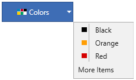
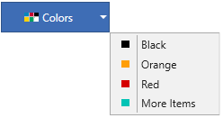

# Custom dropdown items in WPF Dropdown Button (DropdownButtonAdv)

## Adding custom dropdown menu items

The dropdown menu group has option to load custom items apart from actual dropdown menu items. One can populate the custom items using the [MoreItems](https://help.syncfusion.com/cr/wpf/Syncfusion.Shared.Wpf~Syncfusion.Windows.Tools.Controls.DropDownMenuGroup~MoreItems.html) property.

N> The **MoreItems** property has return type `ObservableCollection<UIElement>`, so it can accept any UIElement as its child items.




    <syncfusion:DropDownButtonAdv Label="Colors" x:Name="dropdownbutton" SizeMode="Normal" SmallIcon="images\colors.png">
        <syncfusion:DropDownMenuGroup IconBarEnabled="True" IsMoreItemsIconTrayEnabled="False">
            <syncfusion:DropDownMenuGroup.MoreItems>
                <Label Content="More Items"/>
            </syncfusion:DropDownMenuGroup.MoreItems>
            </syncfusion:DropDownMenuGroup.MoreItems>
            <syncfusion:DropDownMenuItem HorizontalAlignment="Left" Header="Black">
                syncfusion:DropDownMenuItem.Icon>
                    <Image Source="images\black.png"/>
                </syncfusion:DropDownMenuItem.Icon>
            </syncfusion:DropDownMenuItem>
            <syncfusion:DropDownMenuItem HorizontalAlignment="Left" Header="Orange">
                <syncfusion:DropDownMenuItem.Icon   >
                    <Image Source="images\orange.png"/>
                </syncfusion:DropDownMenuItem.Icon>
            </syncfusion:DropDownMenuItem>
            <syncfusion:DropDownMenuItem HorizontalAlignment="Left" Header="Red">
                <syncfusion:DropDownMenuItem.Icon>
                    <Image Source="images\red.png"/>
                </syncfusion:DropDownMenuItem.Icon>
            </syncfusion:DropDownMenuItem>
        </syncfusion:DropDownMenuGroup>
    </syncfusion:DropDownButtonAdv>

 
 
    DropDownButtonAdv dropdownbutton = new DropDownButtonAdv();
    DropDownMenuGroup menu = new DropDownMenuGroup();
    DropDownMenuItem Item1 = new DropDownMenuItem{ Header="Black", Icon=new BitmapImage(new Uri("images\black.png")), HorizontalAlignment="Left"};
    DropDownMenuItem Item2 = new DropDownMenuItem{ Header ="Orange", Icon=new BitmapImage(new Uri("images\orange.png")), HorizontalAlignment="Left"};
    DropDownMenuItem Item3 = new DropDownMenuItem{ Header ="Red", Icon=new BitmapImage(new Uri("images\red.png")), HorizontalAlignment="Left"};
    Label Item4 = new Label() { Content ="More Items" };
    menu.Items.Add(Item1);
    menu.Items.Add(Item2);
    menu.Items.Add(Item3);
    menu.MoreItems.Add(Item4);
    menu.IconBarEnabled = true;
    menu.IsMoreItemsIconTrayEnabled = false;
    dropdownbutton.Content = menu;
    dropdownbutton.Label = "Colors";
    dropdownbutton.SizeMode = SizeMode.Normal;
    dropdownbutton.SmallIcon = new BitmapImage(new Uri("images\colors.png"));




## Setting custom menu items icon bar visibility

The custom menu item icon bar option helps to enable/disable the vertical bar next to the Dropdown menu item icon by setting the [IsMoreItemsIconTrayEnabled](https://help.syncfusion.com/cr/wpf/Syncfusion.Shared.Wpf~Syncfusion.Windows.Tools.Controls.DropDownMenuGroup~IsMoreItemsIconTrayEnabled.html) property either to **true** or **false**.




    <syncfusion:DropDownButtonAdv Label="Colors" x:Name="dropdownbutton" SizeMode="Normal" SmallIcon="images\colors.png">
        <syncfusion:DropDownMenuGroup IconBarEnabled="True" IsMoreItemsIconTrayEnabled="False">
            <syncfusion:DropDownMenuGroup.MoreItems>
                <syncfusion:DropDownMenuItem HorizontalAlignment="Left" Header="More Items">
                    <syncfusion:DropDownMenuItem.Icon>
                        <Image Source="images\skyblue.png"/>
                    </syncfusion:DropDownMenuItem.Icon>
             </syncfusion:DropDownMenuItem>
            <syncfusion:DropDownMenuItem HorizontalAlignment="Left" Header="Black">
                syncfusion:DropDownMenuItem.Icon>
                    <Image Source="images\black.png"/>
                </syncfusion:DropDownMenuItem.Icon>
            </syncfusion:DropDownMenuItem>
            <syncfusion:DropDownMenuItem HorizontalAlignment="Left" Header="Orange">
                <syncfusion:DropDownMenuItem.Icon   >
                    <Image Source="images\orange.png"/>
                </syncfusion:DropDownMenuItem.Icon>
            </syncfusion:DropDownMenuItem>
            <syncfusion:DropDownMenuItem HorizontalAlignment="Left" Header="Red">
                <syncfusion:DropDownMenuItem.Icon>
                    <Image Source="images\red.png"/>
                </syncfusion:DropDownMenuItem.Icon>
            </syncfusion:DropDownMenuItem>
        </syncfusion:DropDownMenuGroup>
    </syncfusion:DropDownButtonAdv>


 
    DropDownButtonAdv dropdownbutton = new DropDownButtonAdv();
    DropDownMenuGroup menu = new DropDownMenuGroup();
    DropDownMenuItem Item1 = new DropDownMenuItem{ Header="Black", Icon=new BitmapImage(new Uri("images\black.png")), HorizontalAlignment="Left"};
    DropDownMenuItem Item2 = new DropDownMenuItem{ Header ="Orange", Icon=new BitmapImage(new Uri("images\orange.png")), HorizontalAlignment="Left"};
    DropDownMenuItem Item3 = new DropDownMenuItem{ Header ="Red", Icon=new BitmapImage(new Uri("images\red.png")), HorizontalAlignment="Left"};
    DropDownMenuItem Item4 = new DropDownMenuItem{ Header ="More Items", Icon=new BitmapImage(new Uri("images\skyblue.png")), HorizontalAlignment="Left"};
    menu.Items.Add(Item1);
    menu.Items.Add(Item2);
    menu.Items.Add(Item3);
    menu.MoreItems.Add(Item4);
    menu.IconBarEnabled = true;
    menu.IsMoreItemsIconTrayEnabled = true;
    dropdownbutton.Content = menu;
    dropdownbutton.Label = "Country";
    dropdownbutton.SizeMode = SizeMode.Normal;
    dropdownbutton.SmallIcon = new BitmapImage(new Uri("images\colors.png"));




