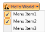
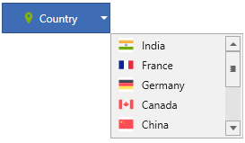
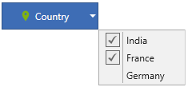

# Customization of dropdown menu items in WPF Dropdown Button 

## Setting icon for dropdown menu items

The icon option helps to provide pictorial representation of the dropdown menu item. One can apply the icon by setting the [Icon](https://help.syncfusion.com/cr/wpf/Syncfusion.Shared.Wpf~Syncfusion.Windows.Tools.Controls.DropDownMenuItem~Icon.html) property value to an image source.




    <syncfusion:DropDownButtonAdv Label="Country" x:Name="dropdownbutton" DropDirection="BottomRight" SizeMode="Normal" SmallIcon="Images\country.png">
        <syncfusion:DropDownMenuGroup>
            <syncfusion:DropDownMenuItem HorizontalAlignment="Left" Header="India">
                <syncfusion:DropDownMenuItem.Icon>
                    <Image Source="Images\india.png"/>
                </syncfusion:DropDownMenuItem.Icon>
            </syncfusion:DropDownMenuItem>
            <syncfusion:DropDownMenuItem HorizontalAlignment="Left" Header="France"/>
            <syncfusion:DropDownMenuItem HorizontalAlignment="Left" Header="Germany"/>
        </syncfusion:DropDownMenuGroup>
    </syncfusion:DropDownButtonAdv>




    DropDownButtonAdv dropdownbutton = new DropDownButtonAdv();
    DropDownMenuGroup menu = new DropDownMenuGroup();
    DropDownMenuItem Item1 = new DropDownMenuItem{ Header="India",Icon=new BitmapImage(new Uri("Images\india.png")), HorizontalAlignment="Left"};
    DropDownMenuItem Item2 = new DropDownMenuItem{ Header ="France", HorizontalAlignment="Left" };
    DropDownMenuItem Item3 = new DropDownMenuItem{ Header ="Germany", HorizontalAlignment="Left" };
    menu.Items.Add(Item1);
    menu.Items.Add(Item2);
    menu.Items.Add(Item3);
    dropdownbutton.Content = menu;
    dropdownbutton.Label = "Country";
    dropdownbutton.DropDirection = DropDirection.BottomRight;
    dropdownbutton.SizeMode = SizeMode.Normal;
    dropdownbutton.SmallIcon = new BitmapImage(new Uri("Images\country.png"));




## Setting icon bar visibility

 The icon bar option helps to enable/disable the vertical bar next to the Dropdown menu item icon. One can change the icon bar visibility by setting the [IconBarEnabled](https://help.syncfusion.com/cr/wpf/Syncfusion.Shared.Wpf~Syncfusion.Windows.Tools.Controls.DropDownMenuGroup~IconBarEnabled.html) property to **true** or **false**.

 N> The default value of [IconBarEnabled](https://help.syncfusion.com/cr/wpf/Syncfusion.Shared.Wpf~Syncfusion.Windows.Tools.Controls.DropDownMenuGroup~IconBarEnabled.html) is `false`.




    <syncfusion:DropDownButtonAdv Label="Country" x:Name="dropdownbutton" DropDirection="BottomRight" SizeMode="Normal" SmallIcon="Images\country.png">
        <syncfusion:DropDownMenuGroup IconBarEnabled="True">
            <syncfusion:DropDownMenuItem HorizontalAlignment="Left" Header="India">
                <syncfusion:DropDownMenuItem.Icon>
                    <Image Source="Images\india.png"/>
                </syncfusion:DropDownMenuItem.Icon>
            </syncfusion:DropDownMenuItem>
            <syncfusion:DropDownMenuItem HorizontalAlignment="Left" Header="France"/>
            <syncfusion:DropDownMenuItem HorizontalAlignment="Left" Header="Germany"/>
        </syncfusion:DropDownMenuGroup>
    </syncfusion:DropDownButtonAdv>




    DropDownButtonAdv dropdownbutton = new DropDownButtonAdv();
    DropDownMenuGroup menu = new DropDownMenuGroup();
    DropDownMenuItem Item1 = new DropDownMenuItem{ Header="India",Icon=new BitmapImage(new Uri("Images\india.png")), HorizontalAlignment="Left"};
    DropDownMenuItem Item2 = new DropDownMenuItem{ Header ="France", HorizontalAlignment="Left" };
    DropDownMenuItem Item3 = new DropDownMenuItem{ Header ="Germany", HorizontalAlignment="Left" };
    menu.Items.Add(Item1);
    menu.Items.Add(Item2);
    menu.Items.Add(Item3);
    menu.IconBarEnabled =true;
    dropdownbutton.Content = menu;
    dropdownbutton.Label = "Country";
    dropdownbutton.SizeMode = SizeMode.Normal;
    dropdownbutton.DropDirection = DropDirection.BottomRight;
    dropdownbutton.SmallIcon = new BitmapImage(new Uri("Images\country.png"));




## Setting scrollbar visibility

The dropdown menu group supports built-in scrollbar to show large number of menu items in a compact view. One can enable the visibility of scroll bar by setting the [ScrollBarVisibility](https://help.syncfusion.com/cr/wpf/Syncfusion.Shared.Wpf~Syncfusion.Windows.Tools.Controls.DropDownMenuGroup~ScrollBarVisibility.html) property to **Visible**.




    <syncfusion:DropDownButtonAdv Label="Country" DropDirection="BottomRight" x:Name="dropdownbutton" SizeMode="Normal" SmallIcon="Images\country.png">
        <syncfusion:DropDownMenuGroup MaxHeight="111" ScrollBarVisibility="Visible">
            <syncfusion:DropDownMenuItem HorizontalAlignment="Left" Header="India">
                <syncfusion:DropDownMenuItem.Icon>
                    <Image Source="Images/india.png"/>
                </syncfusion:DropDownMenuItem.Icon>
            </syncfusion:DropDownMenuItem>
            <syncfusion:DropDownMenuItem HorizontalAlignment="Left" Header="France">
                <syncfusion:DropDownMenuItem.Icon>
                    <Image Source="Image\france.png"/>
                </syncfusion:DropDownMenuItem.Icon>
            </syncfusion:DropDownMenuItem>
            <syncfusion:DropDownMenuItem HorizontalAlignment="Left" Header="Germany" >
                <syncfusion:DropDownMenuItem.Icon>
                    <Image Source="Image\germany.png"/>
                </syncfusion:DropDownMenuItem.Icon>
            </syncfusion:DropDownMenuItem>
            <syncfusion:DropDownMenuItem HorizontalAlignment="Left" Header="Canada">
                <syncfusion:DropDownMenuItem.Icon>
                     <Image Source="Image\canada.png"/>
                 </syncfusion:DropDownMenuItem.Icon>
             </syncfusion:DropDownMenuItem>
            <syncfusion:DropDownMenuItem HorizontalAlignment="Left" Header="China">
                <syncfusion:DropDownMenuItem.Icon>
                    <Image Source="Image\china.png"/>
                </syncfusion:DropDownMenuItem.Icon>
                </syncfusion:DropDownMenuItem>
                <syncfusion:DropDownMenuItem HorizontalAlignment="Left" Header="United States">
                    <syncfusion:DropDownMenuItem.Icon>
                        <Image Source="Image\united state.png"/>
                    </syncfusion:DropDownMenuItem.Icon>
                </syncfusion:DropDownMenuItem>
                <syncfusion:DropDownMenuItem HorizontalAlignment="Left" Header="Italy">
                    <syncfusion:DropDownMenuItem.Icon>
                        <Image Source="Image\Itely.png"/>
                    </syncfusion:DropDownMenuItem.Icon>
                </syncfusion:DropDownMenuItem>
                <syncfusion:DropDownMenuItem HorizontalAlignment="Left" Header="Japan">
                    <syncfusion:DropDownMenuItem.Icon>
                        <Image Source="Image\japan.png"/>
                    </syncfusion:DropDownMenuItem.Icon>
                </syncfusion:DropDownMenuItem>
                <syncfusion:DropDownMenuItem HorizontalAlignment="Left" Header="Spain">
                    <syncfusion:DropDownMenuItem.Icon>
                        <Image Source="Image\spain.png"/>
                    </syncfusion:DropDownMenuItem.Icon>
                </syncfusion:DropDownMenuItem>
                <syncfusion:DropDownMenuItem HorizontalAlignment="Left" Header="Pakistan">
                    <syncfusion:DropDownMenuItem.Icon>
                        <Image Source="Image\pakistan.png"/>
                    </syncfusion:DropDownMenuItem.Icon>
                </syncfusion:DropDownMenuItem>
        </syncfusion:DropDownMenuGroup>
    </syncfusion:DropDownButtonAdv>




    DropDownButtonAdv dropdownbutton = new DropDownButtonAdv();
    DropDownMenuGroup menu = new DropDownMenuGroup();
    DropDownMenuItem Item1 = new DropDownMenuItem{ Header="India",Icon=new BitmapImage(new Uri("Images\india.png")), HorizontalAlignment="Left"};
    DropDownMenuItem Item2 = new DropDownMenuItem{ Header ="France", Icon=new BitmapImage(new Uri("Images\france.png")), HorizontalAlignment="Left"};
    DropDownMenuItem Item3 = new DropDownMenuItem{ Header ="Germany", Icon=new BitmapImage(new Uri("Images\germany.png")), HorizontalAlignment="Left"};
    DropDownMenuItem Item4 = new DropDownMenuItem{ Header ="Canada", Icon=new BitmapImage(new Uri("Images\canada.png")), HorizontalAlignment="Left"};
    DropDownMenuItem Item5 = new DropDownMenuItem{ Header ="China", Icon=new BitmapImage(new Uri("Images\china.png")), HorizontalAlignment="Left"};
    DropDownMenuItem Item6 = new DropDownMenuItem{ Header ="United State", Icon=new BitmapImage(new Uri("Images\unites state.png")), HorizontalAlignment="Left"};
    DropDownMenuItem Item7 = new DropDownMenuItem{ Header ="Italy", Icon=new BitmapImage(new Uri("Images\itely.png")), HorizontalAlignment="Left"};
    DropDownMenuItem Item8 = new DropDownMenuItem{ Header ="Japan", Icon=new BitmapImage(new Uri("Images\japan.png")), HorizontalAlignment="Left"};
    DropDownMenuItem Item9 = new DropDownMenuItem{ Header ="Spain", Icon=new BitmapImage(new Uri("Images\spain.png")), HorizontalAlignment="Left"};
    DropDownMenuItem Item10 = new DropDownMenuItem{ Header ="Pakistan", Icon=new BitmapImage(new Uri("Images\pakistan.png")), HorizontalAlignment="Left"};
    menu.Items.Add(Item1);
    menu.Items.Add(Item2);
    menu.Items.Add(Item3);
    menu.Items.Add(Item4);
    menu.Items.Add(Item5);
    menu.Items.Add(Item6);
    menu.Items.Add(Item7);
    menu.Items.Add(Item8);
    menu.Items.Add(Item9);
    menu.Items.Add(Item10);
    menu.MaxHeight=111;
    menu.ScrollBarVisibility = ScrollBarVisibility.Visible;
    dropdownbutton.Content = menu;
    dropdownbutton.Label = "Country";
    dropdownbutton.SizeMode = SizeMode.Normal;
    dropdownbutton.DropDirection = DropDirection.BottomRight;
    dropdownbutton.SmallIcon = new BitmapImage(new Uri("Images\country.png"));




 

## Checkable dropdown menu items

The checkable option helps to check/uncheck the dropdown menu item on selection by setting the [IsCheckable](https://help.syncfusion.com/cr/wpf/Syncfusion.Shared.Wpf~Syncfusion.Windows.Tools.Controls.DropDownMenuItem~IsCheckable.html) property to **true**.




    <syncfusion:DropDownButtonAdv Label="Country" DropDirection="BottomRight" x:Name="dropdownbutton" SizeMode="Normal" SmallIcon="Images\country.png">
        <syncfusion:DropDownMenuGroup>
            <syncfusion:DropDownMenuItem HorizontalAlignment="Left" Header="India" IsChecked="True" IsCheckable="True"/>
            <syncfusion:DropDownMenuItem HorizontalAlignment="Left" Header="France" IsChecked="True" IsCheckable="True"/>
            <syncfusion:DropDownMenuItem HorizontalAlignment="Left" Header="Germany"/>
        </syncfusion:DropDownMenuGroup>
    </syncfusion:DropDownButtonAdv>




    DropDownButtonAdv dropdownbutton = new DropDownButtonAdv();
    DropDownMenuGroup menu = new DropDownMenuGroup();
    DropDownMenuItem Item1 = new DropDownMenuItem{ Header="India", IsChecked=true, IsCheckable=true, HorizontalAlignment="Left"};
    DropDownMenuItem Item2 = new DropDownMenuItem{ Header ="France", IsChecked=true, IsCheckable=true, HorizontalAlignment="Left"};
    DropDownMenuItem Item3 = new DropDownMenuItem{ Header ="Germany", HorizontalAlignment="Left"};
    menu.Items.Add(Item1);
    menu.Items.Add(Item2);
    menu.Items.Add(Item3);
    dropdownbutton.Content = menu;
    dropdownbutton.Label = "Country";
    dropdownbutton.SizeMode = SizeMode.Normal;
    dropdownbutton.DropDirection = DropDirection.BottomRight;
    dropdownbutton.SmallIcon = new BitmapImage(new Uri("Images\country.png"));
    



