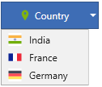

# Data Binding in WPF Dropdown Button (DropDownButtonAdv)

Data binding provides an easier way to assign, visualize and interact with the collection of predefined data. The data binding can be achieved by populating the [DropDownMenuGroup.ItemsSource](https://docs.microsoft.com/en-us/dotnet/api/system.windows.controls.itemscontrol.itemssource?redirectedfrom=MSDN&view=netframework-4.8#System_Windows_Controls_ItemsControl_ItemsSource) property.

## Creating model

Create a class that holds the model properties of the menu items. For example, `Country` class has been created with properties `Name` and `Flag`.




public class Country
{
    private string name;

    public string Name
    {
        get
        {       
            return name;
        }
        set
        {
            name = value;
        }
    }
    private BitmapImage flag;
    public BitmapImage Flag
    {
        get
        {
            return flag;
        }
        set
        {
            flag = value;
        }
    }
}




## Creating view model

Create a class that populates the list of model object representing dropdown menu items. For example, `CountryViewModel` class has been created with property [DropDownItems](https://help.syncfusion.com/cr/wpf/Syncfusion.DocIO.DLS.WDropDownFormField.html#Syncfusion_DocIO_DLS_WDropDownFormField_DropDownItems) with return type `List<Country>`.




public class CountryViewModel
{
    private List<Country> dropDownItems;

    public List<Country> DropDownItems
    {
        get
        {
            return dropDownItems;
        }
        set
        {
            dropDownItems = value;
        }
    }

    public CountryViewModel()
    {
        DropDownItems = new List<Country>();  
        DropDownItems.Add(new Country()
        {
            Name = "India",
            Flag = new BitmapImage(new Uri("Images/india.png", UriKind.RelativeOrAbsolute))
        });

        DropDownItems.Add(new Country()
        {
            Name = "France",
            Flag = new BitmapImage(new Uri("Images/france.png", UriKind.RelativeOrAbsolute))
        });
        DropDownItems.Add(new Country()
        {
            Name = "Germany",
            Flag = new BitmapImage(new Uri("Images/germany.png", UriKind.RelativeOrAbsolute))
        });
    }
}




## Bind data from view model

Bind the list of menu items to [DropDownMenuGroup.ItemsSource](https://docs.microsoft.com/en-us/dotnet/api/system.windows.controls.itemscontrol.itemssource?redirectedfrom=MSDN&view=netframework-4.8#System_Windows_Controls_ItemsControl_ItemsSource) property of [DropDownMenuGroup](https://help.syncfusion.com/cr/wpf/Syncfusion.Windows.Tools.Controls.DropDownMenuGroup.html) and also set the `DataContext` with ViewModel instance. For example, `CountryViewModel` instance has been set as DataContext.




<syncfusion:DropDownButtonAdv Label="Country" SmallIcon="Images\flagsmall.png" >
    <syncfusion:DropDownMenuGroup ItemsSource="{Binding DropDownItems}">
        <syncfusion:DropDownMenuGroup.ItemTemplate>
            <DataTemplate>
                <syncfusion:DropDownMenuItem Header="{Binding Name}">
                    <syncfusion:DropDownMenuItem.Icon>
                        <Image Source="{Binding Flag}"/>
                    </syncfusion:DropDownMenuItem.Icon>
                </syncfusion:DropDownMenuItem>
            </DataTemplate>
        </syncfusion:DropDownMenuGroup.ItemTemplate>
    </syncfusion:DropDownMenuGroup>
</syncfusion:DropDownButtonAdv> 




public partial class MainWindow:Window
{
    public MainWindow()
    {
        InitializeComponent();
        this.DataContext = new CountryViewModel();
    }
}




## Bind command from view model

Bind the command to [DropDownMenuItem.Command](https://help.syncfusion.com/cr/wpf/Syncfusion.Windows.Tools.Controls.DropDownMenuItem.html#Syncfusion_Windows_Tools_Controls_DropDownMenuItem_Command) property of [DropDownMenuItem](https://help.syncfusion.com/cr/wpf/Syncfusion.Windows.Tools.Controls.DropDownMenuItem.html). For example, `ClickCommand` has been bounded to `DropDownMenuItem`.

N> For more information on Command Binding, please refer [Command Binding](https://help.syncfusion.com/wpf/dropdown-button/command-binding)




<Window x:Class="Dropdown_Button_Data_Binding.MainWindow"
        xmlns="http://schemas.microsoft.com/winfx/2006/xaml/presentation"
        xmlns:x="http://schemas.microsoft.com/winfx/2006/xaml"
        xmlns:d="http://schemas.microsoft.com/expression/blend/2008"
        xmlns:mc="http://schemas.openxmlformats.org/markup-compatibility/2006"
        xmlns:local="clr-namespace:Dropdown_Button_Data_Binding"
        xmlns:syncfusion="http://schemas.syncfusion.com/wpf"
        mc:Ignorable="d"
        Title="MainWindow" Height="450" Width="800">
    <Window.DataContext>
        <local:CountryViewModel/>
    </Window.DataContext>
    <Grid VerticalAlignment="Center">
        <Grid.ColumnDefinitions>
            <ColumnDefinition Width="270"/>
            <ColumnDefinition Width="*"/>
        </Grid.ColumnDefinitions>
        <CheckBox IsChecked="{Binding CanPerformAction}" Grid.Column="0" Content="Can perform action in dropdown menu items"/>
        <syncfusion:DropDownButtonAdv x:Name="dropdownButton" Label="Country" Grid.Column="1" SmallIcon="Images\flagsmall.png" >
            <syncfusion:DropDownMenuGroup ItemsSource="{Binding DropDownItems}">
                <syncfusion:DropDownMenuGroup.ItemTemplate>
                    <DataTemplate>
                        <syncfusion:DropDownMenuItem Header="{Binding Name}"
                                                Command="{Binding DataContext.ClickCommand, Source={x:Reference dropdownButton}}"
                                                CommandParameter="{Binding .}">
                            <syncfusion:DropDownMenuItem.Icon>
                                 <Image Source="{Binding Flag}"/>
                            </syncfusion:DropDownMenuItem.Icon>
                        </syncfusion:DropDownMenuItem>
                    </DataTemplate>
                </syncfusion:DropDownMenuGroup.ItemTemplate>
            </syncfusion:DropDownMenuGroup>
        </syncfusion:DropDownButtonAdv>
    </Grid>
</Window>




public class DelegateCommand<T> : ICommand
{
    private Predicate<T> _canExecute;
    private Action<T> _method;
    bool _canExecuteCache = true;

    /// 

    /// Initializes a new instance of the <see cref="DelegateCommand"/> class.
    /// 

    /// <param name="method">The method.</param>
    public DelegateCommand(Action<T> method)
        : this(method, null)
    {
    }

    /// 

    /// Initializes a new instance of the <see cref="DelegateCommand"/> class.
    /// 

    /// <param name="method">The method.</param>
    /// <param name="canExecute">The can execute.</param>
    public DelegateCommand(Action<T> method, Predicate<T> canExecute)
    {
        _method = method;
        _canExecute = canExecute;
    }

    /// 

    /// Defines the method that determines whether the command can execute in its current state.
    /// 

    /// <param name="parameter">Data used by the command.  If the command does not require data to be passed, this object can be set to null.</param>
    /// <returns>
    /// true if this command can be executed; otherwise, false.
    /// </returns>
    public bool CanExecute(object parameter)
    {
        if (_canExecute != null)
        {
            bool tempCanExecute = _canExecute((T)parameter);

            if (_canExecuteCache != tempCanExecute)
                {
                _canExecuteCache = tempCanExecute;
                this.RaiseCanExecuteChanged();
            }
        }

        return _canExecuteCache;
    }

    /// 

    /// Raises CanExecuteChanged event to notify changes in command status.
    /// 

    public void RaiseCanExecuteChanged()
    {
        if (CanExecuteChanged != null)
        {
                CanExecuteChanged(this, new EventArgs());
        }
    }

    /// 

    /// Defines the method to be called when the command is invoked.
    /// 

    /// <param name="parameter">Data used by the command.  If the command does not require data to be passed, this object can be set to null.</param>
    public void Execute(object parameter)
    {
        if (_method != null)
            _method.Invoke((T)parameter);
    }

    #region ICommand Members

    /// 

    /// 
    /// 

    public event EventHandler CanExecuteChanged;

    #endregion
}

public class CountryViewModel: NotificationObject
{
    private List<Country> dropDownItems;

    private bool _canperformaction = true;

    public List<Country> DropDownItems
    {
        get
        {
            return dropDownItems;
        }
        set
        {
            dropDownItems = value;
        }
    }

    public bool CanPerformAction
    {
        get
        {
            return _canperformaction;
        }
        set
        {
            _canperformaction = value;
            this.ClickCommand.RaiseCanExecuteChanged();
            this.RaisePropertyChanged("CanPerformAction");
        }
    }

    public CountryViewModel()
    {
        DropDownItems = new List<Country>();
        ClickCommand = new DelegateCommand<object>(ClickAction, CanPerformClickAction);
        DropDownItems.Add(new Country()
        {
            Name = "India",
            Flag = new BitmapImage(new Uri("Images/india.png", UriKind.RelativeOrAbsolute))
        });

        DropDownItems.Add(new Country()
        {
            Name = "France",
            Flag = new BitmapImage(new Uri("Images/france.png", UriKind.RelativeOrAbsolute))
        });
        DropDownItems.Add(new Country()
        {
            Name = "Germany",
            Flag = new BitmapImage(new Uri("Images/germany.png", UriKind.RelativeOrAbsolute))
        });
    }

    private bool CanPerformClickAction(object parameter)
    {
        return CanPerformAction;
    }

    public DelegateCommand<object> ClickCommand { get; set; }

    private void ClickAction(object parameter)
    {
        Country country = (Country)parameter;
        MessageBox.Show(country.Name + " has been clicked");
    }
}




N> View [sample](https://github.com/SyncfusionExamples/wpf-dropdown-button-examples/blob/master/Samples/Data-Binding) in GitHub.
