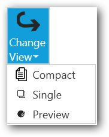

## DataBinding

 The below content explains about Data binding support in DropDownButtonAdv

In the below code, a DropDownButtonAdv named Change View has been created whose menu items are binded through a view model that hold the properties of the menu items. Menu item name and icon are displayed in the UI through Data binding. 

* 1.Create a class that holds the properties of the menu items (View model).




class Model
{
    private string name;
    public string Name
    {
        get
        {       
            return name;
        }
        set
        {
            name = value;
        }
    }
    private string image;
    public string Image
    {
        get
        {
            return image;
        }
        set
        {
            image = value;
        }
    }
}




* 2.Create a list that holds the objects of the class




class ViewModel
{
    private List<Model> dropDownItems;
    public List<Model> DropDownItems
    {
        get
        {
            return dropDownItems;
        }
        set
        {
            dropDownItems = value;
        }
    }
    public ViewModel()
    {
        DropDownItems = new List<Model>();
        DropDownItems.Add(new Model() {Name = "Compact",
        Image = "Images/Single.png"});
        DropDownItems.Add(new Model() { Name = "Single",  
        Image= "Images/Compact.png"});
        DropDownItems.Add(new Model() { Name = "Preview", 
        Image= "Images/Preview.png"});
    }
}




* 3.Bind the properties of the menu items, to display the item names and their respective icon image.




<syncfusion:DropDownButtonAdv Label="Change View" SizeMode="Large" LargeIcon="Images/images.png" >
<syncfusion:DropDownMenuGroup ItemsSource="{Binding DropDownItems}">
<syncfusion:DropDownMenuGroup.ItemTemplate>
<DataTemplate>
<syncfusion:DropDownMenuItem Header="{Binding Name}">
<syncfusion:DropDownMenuItem.Icon>
<Image Source="{Binding Image}"/>
</syncfusion:DropDownMenuItem.Icon>
</syncfusion:DropDownMenuItem>
</DataTemplate>
</syncfusion:DropDownMenuGroup.ItemTemplate>
</syncfusion:DropDownMenuGroup>
</syncfusion:DropDownButtonAdv> 





public partial class MainWindow:Window
{
   public MainWindow()
   {
        InitializeComponent();
        this.DataContext = new ViewModel();
   }
}




## ChangeView DropDownButtonAdv

## ChangeView DropDownButtonAdv with menu items

