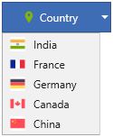
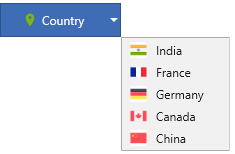
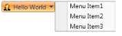
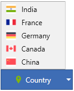
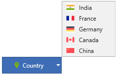

# Dropdown Direction in WPF Dropdown Button (DropDownButtonAdv)

Dropdown direction is used to change the position of the popup being loaded while clicking the dropdown arrow. The direction can be changed using the [DropDirection](https://help.syncfusion.com/cr/wpf/Syncfusion.Windows.Tools.Controls.DropDownButtonAdv.html#Syncfusion_Windows_Tools_Controls_DropDownButtonAdv_DropDirection) enumeration.

The [DropDirection](https://help.syncfusion.com/cr/wpf/Syncfusion.Windows.Tools.Controls.DropDownButtonAdv.html#Syncfusion_Windows_Tools_Controls_DropDownButtonAdv_DropDirection) enumeration comprises of following values: 

* Left
* Right
* BottomLeft
* BottomRight
* TopLeft
* TopRight

N> The default value is **BottomLeft**.




<syncfusion:DropDownButtonAdv DropDirection="BottomLeft" SmallIcon="images\country.png" Label="Country">
    <syncfusion:DropDownMenuGroup>
        <syncfusion:DropDownMenuItem HorizontalAlignment="Left" Header="India">
            <syncfusion:DropDownMenuItem.Icon>
                <Image Source="images\india.png"/>
            </syncfusion:DropDownMenuItem.Icon>
        </syncfusion:DropDownMenuItem>
        <syncfusion:DropDownMenuItem HorizontalAlignment="Left" Header="France">
            <syncfusion:DropDownMenuItem.Icon   >
                <Image Source="images\france.png"/>
            </syncfusion:DropDownMenuItem.Icon>
        </syncfusion:DropDownMenuItem>
        <syncfusion:DropDownMenuItem HorizontalAlignment="Left" Header="Germany">
            <syncfusion:DropDownMenuItem.Icon>
                <Image Source="images\germany.png"/>
            </syncfusion:DropDownMenuItem.Icon>
        </syncfusion:DropDownMenuItem>
        <syncfusion:DropDownMenuItem HorizontalAlignment="Left" Header="Canada">
            <syncfusion:DropDownMenuItem.Icon>
                <Image Source="images\canada.png"/>
            </syncfusion:DropDownMenuItem.Icon>
        </syncfusion:DropDownMenuItem>
        <syncfusion:DropDownMenuItem HorizontalAlignment="Left" Header="China">
            <syncfusion:DropDownMenuItem.Icon>
                <Image Source="images\china.png"/>
            </syncfusion:DropDownMenuItem.Icon>
        </syncfusion:DropDownMenuItem>
    </syncfusion:DropDownMenuGroup>
</syncfusion:DropDownButtonAdv>




DropDownButtonAdv dropdownbutton = new DropDownButtonAdv();
dropdownbutton.Label = "Country";
dropdownbutton.DropDirection = DropDirection.BottomLeft;
dropdownbutton.SmallIcon = new BitmapImage(new Uri("images\country.png"));
DropDownMenuGroup menu = new DropDownMenuGroup();
DropDownMenuItem Item1 = new DropDownMenuItem() { Header ="India", Icon =new BitmapImage(new Uri("images\india.png")), HorizontalAlignment="Left"};
DropDownMenuItem Item2 = new DropDownMenuItem() { Header ="France", Icon =new BitmapImage(new Uri("images\france.png")), HorizontalAlignment="Left"};
DropDownMenuItem Item3 = new DropDownMenuItem() { Header ="Germany", Icon =new BitmapImage(new Uri("images\germany.png")), HorizontalAlignment="Left"};
DropDownMenuItem Item4 = new DropDownMenuItem() { Header ="Canada", Icon =new BitmapImage(new Uri("images\canada.png")), HorizontalAlignment="Left"};
DropDownMenuItem Item5 = new DropDownMenuItem() { Header ="China", Icon =new BitmapImage(new Uri("images\china.png")), HorizontalAlignment="Left"};
menu.Items.Add(Item1);
menu.Items.Add(Item2);
menu.Items.Add(Item3);
menu.Items.Add(Item4);
menu.Items.Add(Item5);
dropdownbutton.Content = menu;




Drop Direction - BottomLeft
{:.caption}

Drop Direction - BottomRight
{:.caption}

Drop Direction - Right
{:.caption}

Drop Direction - Left
{:.caption}

Drop Direction - TopLeft
{:.caption}

Drop Direction - TopRight
{:.caption}

