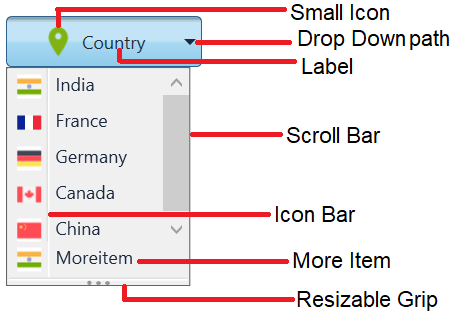
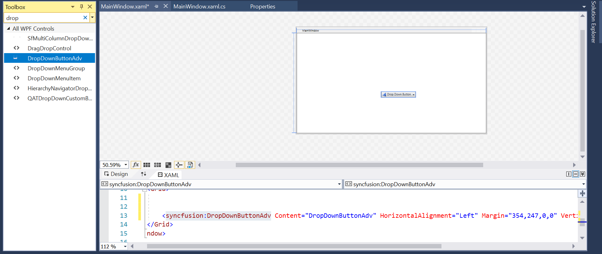
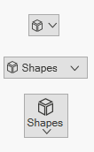
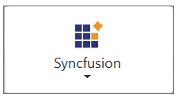
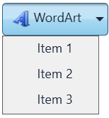

# Getting Started with Dropdown Button (DropDownButtonAdv)

This section provides an overview of how to work with Dropdown Button control. It describes the control structure, the control initialization, the image setting for the control and adding items to the Dropdown Button control.

## Control structure

## Assembly deployment

Refer [DropDownButtonAdv](https://help.syncfusion.com/wpf/control-dependencies#dropdownbuttonadv) control dependencies section to get the list of assemblies or [NuGet package](https://help.syncfusion.com/wpf/visual-studio-integration/nuget-packages) needs to be added as reference to use the DropDownButtonAdv control in any application.

## Creating simple application with Dropdown Button

In this walk through, will create WPF application that contains Dropdown Button control. By the following ways, one can add the controls:

1. [Adding control via designer](#adding-control-via-designer)

2. [Adding control manually in XAML](#adding-control-manually-in-xaml)

3. [Adding control manually in C#](#adding-control-manually-in-c)

### Adding control via designer

Dropdown Button control can be added to the application by dragging **DropDownButtonAdv** from toolbox and dropping it in designer view. After dropping the controls in designer view, the assemblies such as **Syncfusion.Shared.WPF** gets added into the project automatically. The following code snippets will be added into the XAML.




<syncfusion:DropDownButtonAdv x:Name="dropdownButtonAdv" Label="Drop Down Button"/>




N> **syncfusion** in XAML is an auto generated namespace.

### Adding control manually in XAML

In order to add the control manually in XAML, follow the below steps.

1. Add the below required assembly reference to the project.

    * Syncfusion.Shared.WPF

2. Import Syncfusion WPF schema `http://schemas.syncfusion.com/wpf` or the control namespace `Syncfusion.Windows.Tools.Controls` in XAML page.

3. Declare DropDownButtonAdv control in XAML page.




<Window xmlns="http://schemas.microsoft.com/winfx/2006/xaml/presentation"
        xmlns:x="http://schemas.microsoft.com/winfx/2006/xaml"
        xmlns:local="clr-namespace:DropDownButtonadv_GetStart_Sample"
        xmlns:syncfusion="http://schemas.syncfusion.com/wpf"
        xmlns:Syncfusion="http://schemas.microsoft.com/netfx/2009/xaml/presentation"
        mc:Ignorable="d"
        Title="MainWindow" Height="450" Width="800">
    <Grid>
        <syncfusion:DropDownButtonAdv Height="44"  VerticalAlignment="Center" HorizontalAlignment="Center" Width="162" />
    </Grid>
</Window>




### Adding control manually in C#

In order to add control manually in C#, do the below steps.

1. Add the below required assembly references to the project.

    * Syncfusion.Shared.WPF

2. Import the `Syncfusion.Windows.Tools.Controls` namespace.

3. Create DropDownButtonAdv control instance and add it to the window.




<Window xmlns="http://schemas.microsoft.com/winfx/2006/xaml/presentation"
        xmlns:x="http://schemas.microsoft.com/winfx/2006/xaml"
        xmlns:local="clr-namespace:DropDownButtonadv_GetStart_Sample"
        xmlns:syncfusion="http://schemas.syncfusion.com/wpf"
        xmlns:Syncfusion="http://schemas.microsoft.com/netfx/2009/xaml/presentation"
        mc:Ignorable="d"
        Title="MainWindow" Height="450" Width="800">
    <Grid x:Name="Root">

    </Grid>
</Window>




using Syncfusion.Windows.Tools.Controls;

    namespace DropDownButtonSample
    {
        public partial class MainWindow : Window
        {
            public MainWindow()
            {
                InitializeComponent();
                DropDownButtonAdv dropdownButtonAdv = new DropDownButtonAdv();
                dropdownButtonAdv.Height=44;
                dropdownButtonAdv.Width=31;
                Root.Children.Add(dropdownButtonAdv);
            }
        }
    }




## Setting label

The label on the button is a text that explains its action to the end-user. Apply the text by using the [Label](https://help.syncfusion.com/cr/wpf/Syncfusion.Windows.Tools.Controls.DropDownButtonAdv.html#Syncfusion_Windows_Tools_Controls_DropDownButtonAdv_Label) property.




<syncfusion:DropDownButtonAdv SmallIcon="Images\flagsmall.png" Label="Country"/>




DropDownButtonAdv button = new DropDownButtonAdv();
button.Label = "Country";
button.SmallIcon = new BitmapImage(new Uri("Images\flagsmall.png", UriKind.RelativeOrAbsolute)); 




## Setting size mode

Size mode is used to render Dropdown Button control in different pre-defined sizes based on application demand. Apply the size mode by setting the [SizeMode](https://help.syncfusion.com/cr/wpf/Syncfusion.Windows.Tools.Controls.DropDownButtonAdv.html#Syncfusion_Windows_Tools_Controls_DropDownButtonAdv_SizeMode) property.

 The **SizeMode** is an enumeration which contains the following values:

* Small
* Normal
* Large

### Small mode

When the mode is set to small, the control is displayed without the label. Only icon will be present in it.


 

<syncfusion:DropDownButtonAdv SmallIcon="Images\flagsmall.png" SizeMode="Small" Label="Country"/> 

 


DropDownButtonAdv button = new DropDownButtonAdv();
button.Label = "Country";
button.SizeMode = SizeMode.Small; 
button.SmallIcon = new BitmapImage(new Uri("Images\flagsmall.png", UriKind.RelativeOrAbsolute));




### Normal mode

In a normal size button, a small image with the text on the side will be displayed.


 

<syncfusion:DropDownButtonAdv SizeMode="Normal" SmallIcon="Images\flagsmall.png" Label="Country"/> 




DropDownButtonAdv button = new DropDownButtonAdv();
button.Label = "Country";
button.SizeMode = SizeMode.Normal;
button.SmallIcon = new BitmapImage(new Uri("Images\flagsmall.png", UriKind.RelativeOrAbsolute));




### Large mode

In a large size button, a large image along with the text at the bottom will be displayed.


 

<syncfusion:DropDownButtonAdv LargeIcon="Images\flaglarge.png" SizeMode="Large" Label="Country"/> 

 


DropDownButtonAdv button = new DropDownButtonAdv();
button.Label = "Country";
button.SizeMode = SizeMode.Large;
button.LargeIcon = new BitmapImage(new Uri("Images\flaglarge.png", UriKind.RelativeOrAbsolute));

 


## Setting icon template

The [IconTemplate](https://help.syncfusion.com/cr/wpf/Syncfusion.Windows.Tools.Controls.DropDownButtonAdv.html#Syncfusion_Windows_Tools_Controls_DropDownButtonAdv_IconTemplate) property provides support for setting up any type of image such as path data, font icons, etc. to the `DropDownButtonAdv`. The icon will automatically resize the template content according to its size provided in the data template.





<sync:DropDownButtonAdv Grid.Row="1" Grid.Column="1" SizeMode="Small" Label="New" HorizontalAlignment="Center" VerticalAlignment="Center">
    <sync:DropDownButtonAdv.IconTemplate>
        <DataTemplate>
            <Grid Width="12" Height="16">
                <Path
                        Data="M25.990023,11.689011L17.00602,15.955031 17.00602,28.605018 25.990023,23.618021z M2.0180035,11.688987L2.0180035,23.617996 11.003013,28.605 11.003013,15.95499z M27.990021,8.5260191L27.990021,24.796029 15.006021,32.002019 15.006021,14.690017z M0.018000603,8.5259848L13.003015,14.68999 13.003015,32.002002 0.018000603,24.795997z M14.044014,2.2129984L4.6760044,6.6469963 14.043014,11.079994 23.348023,6.6469963z M14.047014,0L27.996028,6.6469963 14.047014,13.293993 0,6.6469963z"
                        Fill="#FF3A3A38"
                        Stretch="Fill" />
            </Grid>
        </DataTemplate>
    </sync:DropDownButtonAdv.IconTemplate>
</sync:DropDownButtonAdv>
<sync:DropDownButtonAdv Grid.Row="2" Grid.Column="1" SizeMode="Normal" Label="Shapes" HorizontalAlignment="Center" VerticalAlignment="Center">
    <sync:DropDownButtonAdv.IconTemplate>
        <DataTemplate>
            <Grid Width="16" Height="16">
                <Path
                        Data="M25.990023,11.689011L17.00602,15.955031 17.00602,28.605018 25.990023,23.618021z M2.0180035,11.688987L2.0180035,23.617996 11.003013,28.605 11.003013,15.95499z M27.990021,8.5260191L27.990021,24.796029 15.006021,32.002019 15.006021,14.690017z M0.018000603,8.5259848L13.003015,14.68999 13.003015,32.002002 0.018000603,24.795997z M14.044014,2.2129984L4.6760044,6.6469963 14.043014,11.079994 23.348023,6.6469963z M14.047014,0L27.996028,6.6469963 14.047014,13.293993 0,6.6469963z"
                        Fill="#FF3A3A38"
                        Stretch="Fill" />
            </Grid>
        </DataTemplate>
    </sync:DropDownButtonAdv.IconTemplate>
</sync:DropDownButtonAdv>
<sync:DropDownButtonAdv Grid.Row="3" Grid.Column="1" SizeMode="Large" Label="Shapes" HorizontalAlignment="Center" VerticalAlignment="Center">
    <sync:DropDownButtonAdv.IconTemplate>
        <DataTemplate>
            <Grid  x:Name="Save"
                    Width="16"
                    Height="16">
                <Path
                        Width="16"
                        Height="16"
                        Data="M25.990023,11.689011L17.00602,15.955031 17.00602,28.605018 25.990023,23.618021z M2.0180035,11.688987L2.0180035,23.617996 11.003013,28.605 11.003013,15.95499z M27.990021,8.5260191L27.990021,24.796029 15.006021,32.002019 15.006021,14.690017z M0.018000603,8.5259848L13.003015,14.68999 13.003015,32.002002 0.018000603,24.795997z M14.044014,2.2129984L4.6760044,6.6469963 14.043014,11.079994 23.348023,6.6469963z M14.047014,0L27.996028,6.6469963 14.047014,13.293993 0,6.6469963z"
                        Fill="#FF3A3A38"
                        Stretch="Fill" />
            </Grid>
        </DataTemplate>
    </sync:DropDownButtonAdv.IconTemplate>
</sync:DropDownButtonAdv>

 

 

 

 N> The [DropDownButtonAdv](https://help.syncfusion.com/cr/wpf/Syncfusion.Windows.Tools.Controls.DropDownButton.html) the icon in the following priority order.
* [IconTemplate](https://help.syncfusion.com/cr/wpf/Syncfusion.Windows.Tools.Controls.DropDownButtonAdv.html#Syncfusion_Windows_Tools_Controls_DropDownButtonAdv_IconTemplate)
* [LargeIcon](https://help.syncfusion.com/cr/wpf/Syncfusion.Windows.Tools.Controls.DropDownButtonAdv.html#Syncfusion_Windows_Tools_Controls_DropDownButtonAdv_LargeIcon)
* [SmallIcon](https://help.syncfusion.com/cr/wpf/Syncfusion.Windows.Tools.Controls.DropDownButtonAdv.html#Syncfusion_Windows_Tools_Controls_DropDownButtonAdv_SmallIcon)

## Setting icon template selector

 The [IconTemplateSelector](https://help.syncfusion.com/cr/wpf/Syncfusion.Windows.Tools.Controls.DropDownButtonAdv.html#Syncfusion_Windows_Tools_Controls_DropDownButtonAdv_IconTemplateSelector) property allows you to specify a different data template based on the size mode or different validation criteria.

 

 

 <Window x:Class="TemplateSelector_DropDownButtonAdv.MainWindow"
        xmlns="http://schemas.microsoft.com/winfx/2006/xaml/presentation"
        xmlns:x="http://schemas.microsoft.com/winfx/2006/xaml"
        xmlns:d="http://schemas.microsoft.com/expression/blend/2008"
        xmlns:mc="http://schemas.openxmlformats.org/markup-compatibility/2006"
        xmlns:local="clr-namespace:TemplateSelector_DropDownButtonAdv"
        xmlns:Sync="http://schemas.syncfusion.com/wpf"
        mc:Ignorable="d"
        Title="MainWindow" Height="450" Width="800">
    <Window.Resources>
        <DataTemplate x:Key="newIcon">
            <Grid Width="12" Height="16">
                <Path
                      Margin="0.5"
                      Data="M0,0 L5.9999999,0 11,5 11,15 0,15 z"
                      Fill="White"
                      Stretch="Fill" />
                <Path
                     Data="M7,1.7070007 L7,5 10.292999,5 z M1,1 L1,15 11,15 11,6 6,6 6,1 z M0,0 L6.7070007,0 12,5.2929993 12,16 0,16 z"
                     Fill="#FF3A3A38"
                     Stretch="Fill" />
            </Grid>
        </DataTemplate>
        <DataTemplate x:Key="OpenIcon">
            <Grid Width="16" Height="16">
                <Path
                     Margin="0.5,0.5,0.738,0.502"
                     Data="M0,0 L5,0 6,1 12,1 12,3.4999998 11.499065,3.9999996 14.716998,3.9999996 11.92699,10.999 4.1853847,10.984859 0,10.982999 z"
                     Fill="White"
                     Stretch="Fill" />
                <Path
                     Data="M5.162991,5.0009986 L1.7839907,10.979999 4.3081884,10.984653 5.0009999,10.984999 5.0009999,10.98593 12.088991,10.999 14.480014,5.0009986 z M0,0 L5.7069998,0 6.7069998,1 13,1 13,3.9999998 12,3.9999998 12,1.9999998 6.2930002,1.9999998 5.2930002,1 0.99999994,1 0.99999994,10.335325 4.5790062,4.0009986 15.954991,4.0009986 12.765994,12.000998 4.552258,11.98482 0,11.982999 z"
                     Fill="#FF3A3A38"
                     Stretch="Fill" />
            </Grid>
        </DataTemplate>
        <local:TemplateSelector x:Key="IconTemp" NewIcon="{StaticResource newIcon}" OpenIcon="{StaticResource OpenIcon}"/>
    </Window.Resources>
    <Grid>
        <StackPanel VerticalAlignment="Center">
            <CheckBox Name="Check" IsChecked="True" Checked="Check_Checked" Unchecked="Check_Unchecked" HorizontalAlignment="Center" Command="{Binding CheckCommand}" Content="ChangeIcon"/>
            <Sync:DropDownButtonAdv HorizontalAlignment="Center" Margin="10" Content="{Binding IsChecked}" Label="IconTemplateSelector" IconTemplateSelector="{StaticResource IconTemp}"/>
        </StackPanel>
    </Grid>
</Window>

 

 

  public class TemplateSelector : DataTemplateSelector
  {
    public DataTemplate NewIcon { get; set; }
    public DataTemplate OpenIcon { get; set; }
    public override DataTemplate SelectTemplate(object item, DependencyObject container)
    {
        if (item == null)
        {
            return OpenIcon;
        }
        if ((item as Model).IsChecked)
        {
            return NewIcon;
        }
        return base.SelectTemplate(item, container);
    }
 }

 

 

 N> The [DropDownButtonAdv](https://help.syncfusion.com/cr/wpf/Syncfusion.Windows.Tools.Controls.DropDownButton.html) the icon in the following priority order.
* [IconTemplateSelector](https://help.syncfusion.com/cr/wpf/Syncfusion.Windows.Tools.Controls.DropDownButtonAdv.html#Syncfusion_Windows_Tools_Controls_DropDownButtonAdv_IconTemplateSelector)
* [IconTemplate](https://help.syncfusion.com/cr/wpf/Syncfusion.Windows.Tools.Controls.DropDownButtonAdv.html#Syncfusion_Windows_Tools_Controls_DropDownButtonAdv_IconTemplate)
* [LargeIcon](https://help.syncfusion.com/cr/wpf/Syncfusion.Windows.Tools.Controls.DropDownButtonAdv.html#Syncfusion_Windows_Tools_Controls_DropDownButtonAdv_LargeIcon)
* [SmallIcon](https://help.syncfusion.com/cr/wpf/Syncfusion.Windows.Tools.Controls.DropDownButtonAdv.html#Syncfusion_Windows_Tools_Controls_DropDownButtonAdv_SmallIcon)

## Setting image

The image option helps to provide pictorial representation of the button. Image can be added either using the [SmallIcon](https://help.syncfusion.com/cr/wpf/Syncfusion.Windows.Tools.Controls.DropDownButtonAdv.html#Syncfusion_Windows_Tools_Controls_DropDownButtonAdv_SmallIcon) or [LargeIcon](https://help.syncfusion.com/cr/wpf/Syncfusion.Windows.Tools.Controls.DropDownButtonAdv.html#Syncfusion_Windows_Tools_Controls_DropDownButtonAdv_LargeIcon) property.

* **SmallIcon** — This property will be used to set the image when size mode is **Normal** or **Small**.
* **LargeIcon** — This property will be used to set the image when size mode is **Large**.

The **SmallIcon** property can be set as follows:


 

<syncfusion:DropDownButtonAdv SizeMode="Small" Label="Syncfusion" SmallIcon ="Images\syncfusion.png"/> 

 
  

DropDownButtonAdv button = new DropDownButtonAdv();
button.Label = "Syncfusion";
button.SizeMode = SizeMode.Small;
button.SmallIcon = new BitmapImage(new Uri("Images\syncfusion.png", UriKind.RelativeOrAbsolute));

 


The **SmallIcon** property can be set even when the sizeMode is **Normal**.


 

<syncfusion:DropDownButtonAdv SizeMode="Normal" SmallIcon ="image\syncfusion.png" Label="Syncfusion"/>

 
 

DropDownButtonAdv button = new DropDownButtonAdv();
button.Label = "Syncfusion";
button.SizeMode = SizeMode.Normal;
button.SmallIcon = new BitmapImage(new Uri("Images\syncfusion.png", UriKind.RelativeOrAbsolute)); 

 


The **LargeIcon** property can be set as follows:


 

<syncfusion:DropDownButtonAdv SizeMode="Large" LargeIcon="Images\syncfusion.png" Label="Syncfusion"/> 

 
 

DropDownButtonAdv button = new DropDownButtonAdv();
button.Label = "Syncfusion";
button.SizeMode = SizeMode.Large;
button.LargeIcon = new BitmapImage(new Uri("Images\syncfusion.png", UriKind.RelativeOrAbsolute)); 




## Setting icon width and height

Icon width and icon height can be set using [IconWidth](https://help.syncfusion.com/cr/wpf/Syncfusion.Windows.Tools.Controls.DropDownButtonAdv.html#Syncfusion_Windows_Tools_Controls_DropDownButtonAdv_IconWidth) and [IconHeight](https://help.syncfusion.com/cr/wpf/Syncfusion.Windows.Tools.Controls.DropDownButtonAdv.html#Syncfusion_Windows_Tools_Controls_DropDownButtonAdv_IconHeight) properties respectively.




<syncfusion:DropDownButtonAdv x:Name="button1" SizeMode="Normal" IconHeight="20" IconWidth="20" Label="Syncfusion" SmallIcon ="Images\syncfusion.png" />




DropDownButtonAdv button1 = new DropDownButtonAdv();
button1.Label = "Syncfusion";
button1.IconWidth=20;
button1.IconHeight=20;
button1.SmallIcon = new BitmapImage(new Uri("Images\syncfusion.png", UriKind.RelativeOrAbsolute));







<syncfusion:DropDownButtonAdv x:Name="button2"  SizeMode="Normal" IconHeight="30" IconWidth="30"  Label="Syncfusion"  SmallIcon ="Images\syncfusion.png" />




DropDownButtonAdv button2 = new DropDownButtonAdv();
button2.Label = "Syncfusion";
button2.IconWidth=30;
button2.IconHeight=30;
button2.SmallIcon = new BitmapImage(new Uri(Images\syncfusion.png", UriKind.RelativeOrAbsolute));




N> View [sample](https://github.com/SyncfusionExamples/wpf-dropdown-button-examples/blob/master/Samples/Getting-Started) in GitHub. This sample showcases how to add dropdown button control and its basic features like image sizing options and size modes.

## Adding items to Dropdown Button

The DropDownMenuGroup acts as a container for the Dropdown Button control. It provides options to add menu items and also options like header name, re-sizing and scrollbar.

N> For more information on how to bind data with command actions for Dropdown Button please refer to the topics [Data Binding](https://github.com/SyncfusionExamples/wpf-dropdown-button-examples/blob/master/Samples/Data-Binding) and [Command Binding](https://github.com/SyncfusionExamples/wpf-dropdown-button-examples/blob/master/Samples/Command-Binding).


 

<Window x:Class="Dropdown_Button_Menuitem_Binding.MainWindow"
        xmlns="http://schemas.microsoft.com/winfx/2006/xaml/presentation"
        xmlns:x="http://schemas.microsoft.com/winfx/2006/xaml"
        xmlns:d="http://schemas.microsoft.com/expression/blend/2008"
        xmlns:mc="http://schemas.openxmlformats.org/markup-compatibility/2006"
        xmlns:local="clr-namespace:Dropdown_Button_Menuitem_Binding"
        xmlns:syncfusion="http://schemas.syncfusion.com/wpf"
        mc:Ignorable="d"
        Title="MainWindow" Height="450" Width="800">
    <Window.DataContext>
        <local:CountryViewModel/>
    </Window.DataContext>
    <Grid>
        <syncfusion:DropDownButtonAdv Label="Country" SmallIcon="Images/flagsmall.png" >
            <syncfusion:DropDownMenuGroup ItemsSource="{Binding DropDownItems}">
                <syncfusion:DropDownMenuGroup.ItemTemplate>
                    <DataTemplate>
                        <syncfusion:DropDownMenuItem Header="{Binding Name}">
                            <syncfusion:DropDownMenuItem.Icon>
                                <Image Source="{Binding Flag}"/>
                            </syncfusion:DropDownMenuItem.Icon>
                        </syncfusion:DropDownMenuItem>
                    </DataTemplate>
                </syncfusion:DropDownMenuGroup.ItemTemplate>
            </syncfusion:DropDownMenuGroup>
        </syncfusion:DropDownButtonAdv>
    </Grid>
</window>

 
 

public class Country
{
    private string name;

    public string Name
    {
        get
        {
            return name;
        }
        set
        {
            name = value;
        }
    }
    private BitmapImage flag;
    public BitmapImage Flag
    {
        get
        {
            return flag;
        }
        set
        {
            flag = value;
        }
    }
}
    
public class CountryViewModel
{
    private List<Country> dropDownItems;

    public List<Country> DropDownItems
    {
        get
        {
            return dropDownItems;
        }
        set
        {
            dropDownItems = value;
        }
    }

    public CountryViewModel()
    {
        DropDownItems = new List<Country>();
        DropDownItems.Add(new Country()
        {
            Name = "India",
            Flag = new BitmapImage(new Uri("/Images/india.png", UriKind.RelativeOrAbsolute))
        });
        DropDownItems.Add(new Country()
        {
            Name = "France",
            Flag = new BitmapImage(new Uri("/Images/france.png", UriKind.RelativeOrAbsolute))
        });
        DropDownItems.Add(new Country()
        {
            Name = "Germany",
            Flag = new BitmapImage(new Uri("/Images/germany.png", UriKind.RelativeOrAbsolute))
        });
    }
}




N> View [sample](https://github.com/SyncfusionExamples/wpf-dropdown-button-examples/blob/master/Samples/Add-Menu-Items) in GitHub.