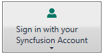

# Multiline Text in WPF Dropdown Button (DropDownButtonAdv)

Multiline text support is used to render text content of the Dropdown Button control in multiple lines for precise view. One can apply the multiline text by using the [IsMultiLine](https://help.syncfusion.com/cr/wpf/Syncfusion.Windows.Tools.Controls.DropDownButtonAdv.html#Syncfusion_Windows_Tools_Controls_DropDownButtonAdv_IsMultiLine) property.

N> This property is only applicable for large size mode of the Dropdown Button.




<syncfusion:DropDownButtonAdv Label="Sign in with your Syncfusion Account" LargeIcon="image\employee.png" SizeMode="Large" IsMultiLine="True"/>




DropDownButtonAdv dropdownbutton = new DropDownButtonAdv();
dropdownbutton.SizeMode = SizeMode.Large;
dropdownbutton.Label = "Sign in with your Syncfusion Account";
dropdownbutton.IsMultiLine =true;
dropdownbutton.LargeIcon = new BitmapImage(new Uri("image\employee.png"));




