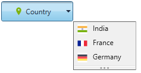

# Resizing dropdown in WPF Dropdown Button (DropDownButtonAdv)

The dropdown menu group popup height can be increased or decreased using the resizing gripper. One can enable the resizing behavior by setting the [IsResizable](https://help.syncfusion.com/cr/wpf/Syncfusion.Shared.Wpf~Syncfusion.Windows.Tools.Controls.DropDownMenuGroup~IsResizable.html) property to **true**.




    <syncfusion:DropDownButtonAdv Label="Country" x:Name="dropdownbutton" SmallIcon="images\country.png">
        <syncfusion:DropDownMenuGroup IsResizable="True">
            <syncfusion:DropDownMenuItem HorizontalAlignment="Left" Header="India">
                <syncfusion:DropDownMenuItem.Icon>
                    <Image Source="images\india.png"/>
                </syncfusion:DropDownMenuItem.Icon>
            </syncfusion:DropDownMenuItem>
            <syncfusion:DropDownMenuItem HorizontalAlignment="Left" Header="France">
                <syncfusion:DropDownMenuItem.Icon   >
                    <Image Source="images\france.png"/>
                </syncfusion:DropDownMenuItem.Icon>
            </syncfusion:DropDownMenuItem>
            <syncfusion:DropDownMenuItem HorizontalAlignment="Left" Header="Germany">
                <syncfusion:DropDownMenuItem.Icon>
                    <Image Source="images\germany.png"/>
                </syncfusion:DropDownMenuItem.Icon>
            </syncfusion:DropDownMenuItem>
        </syncfusion:DropDownMenuGroup>
    </syncfusion:DropDownButtonAdv>




    DropDownButtonAdv dropdownbutton = new DropDownButtonAdv();
    DropDownMenuGroup menu = new DropDownMenuGroup();
    DropDownMenuItem Item1 = new DropDownMenuItem() { Header ="India", Icon =new BitmapImage(new Uri("images\india.png")), HorizontalAlignment="Left"};
    DropDownMenuItem Item2 = new DropDownMenuItem() { Header ="France", Icon =new BitmapImage(new Uri("images\france.png")), HorizontalAlignment="Left"};
    DropDownMenuItem Item3 = new DropDownMenuItem() { Header ="Germany", Icon =new BitmapImage(new Uri("images\germany.png")), HorizontalAlignment="Left"};
    menu.Items.Add(Item1);
    menu.Items.Add(Item2);
    menu.Items.Add(Item3);
    menu.IsResizable = true;
    dropdownbutton.Content = menu;
    dropdownbutton.Label = "Country";
    dropdownbutton.DropDirection = DropDirection.BottomRight;
    dropdownbutton.SmallIcon = new BitmapImage(new Uri("images\country.png"));




