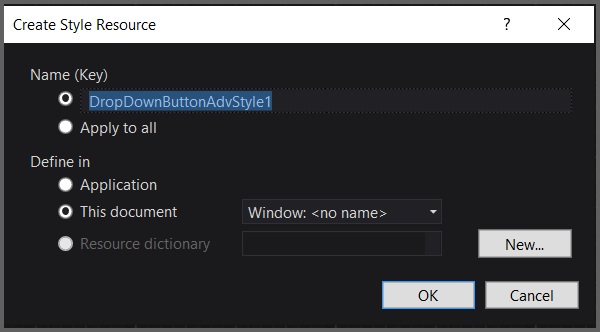
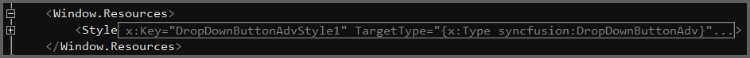

# Blendability

The button controls can be modified using Expression Blend.

To modify the button control:

* Open Sample in the Expression Blend. 
* Right click on the button control and choose Edit Template option as below:

 

* Then Create Style Resource window will appear as shown below. Click OK to create a new style for Button Control.

* All the resources will be displayed on the XAML file of the application. These resources can be edited to create a new Style.

