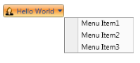

# Drop Direction

The DropDown Direction can be changed using the property DropDirection. The DropDirection Enum takes the following values: 

* Left
* Right
* BottomLeft
* BottomRight
* TopLeft
* TopRight

## The default value is BottomLeft.

The DropDirection property can be set as follows:

## To set BottomLeft DropDirection



<sync:DropDownButtonAdv  DropDirection="BottomLeft"/>


## To set BottomRight Drop Direction



<sync:DropDownButtonAdv  DropDirection="BottomRight"/>


## To set Right Drop Direction



<sync:DropDownButtonAdv  DropDirection="Right"/>



## To set Left Drop Direction



<sync:DropDownButtonAdv  DropDirection="Left"/>


