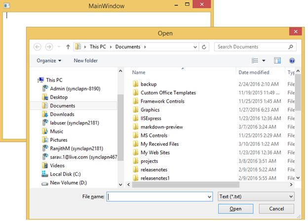
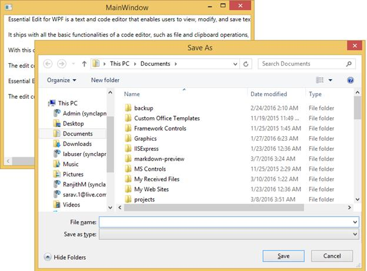

## File Support

Essential Edit WPF facilitates users to create, open, modify and save text files and programming language files. EditControl provides built-in support for a variety of text based file formats such as txt, cs, vb, sql, xaml and xml. It also enables to specify custom file types in the custom language configurations.

**Open** **a** **file**

**DocumentSource** property of EditControl is used to specify the file to be opened with EditControl. The following code can be used to set the **DocumentSource** property.


<sfedit:EditControl x:Name="editControl" DocumentSource="C:\Content.txt" ShowLineNumber="False" EnableOutlining="False"/>





editControl.DocumentSource = @"C:\Content.txt";



The following image displays the contents from file set as DocumentSource window

Files can also be opened using the **LoadFile** method. **LoadFile** method displays a **FileOpenDialog** to enable you to choose the file that needs to be opened in the EditControl.



editControl.LoadFile();



The following image displays the FileOpenDialog box

**Save** **the** **text** **in** **a** **file**

SaveFile method in the EditControl class is used to save the text in EditControl to a file. EditControl does support saving all the built-in languages, file types and custom language file type respectively.

Enable save file, by using the following code.


editControl.SaveFile();



The following image displays the **SaveFileDialog** box

