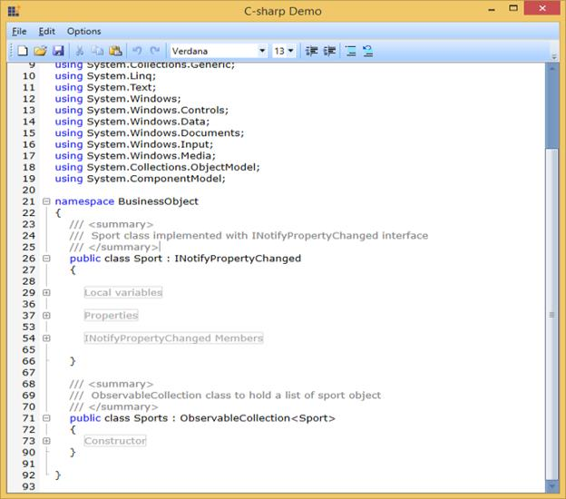
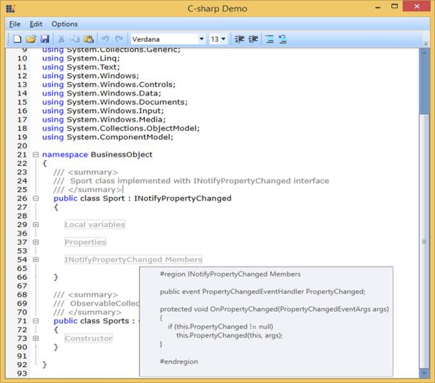
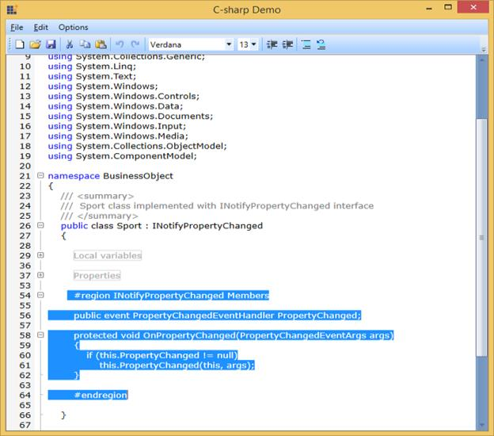

## Expand-Collapse Support

**EditControl** provides built-in support for outlining. With this support, users can expand or collapse a block of text. EditControl provides expand-collapse support in **C#**, **Visual** **Basic**, **XAML** and **Xml** languages. It also provides expand-collapse support for custom languages based on the base class used for custom language (built-in expand and collapse support will be available if the custom language is implemented inheriting from **ProceduralLanguageBase** or **MarkupLanguageBase** class). Users can also implement their custom expand-collapse logic using **ApplyExpandCollapse** override method available in the custom language class. Refer to Creating a custom language topic for more information on expand-collapse implementations for custom languages.

**EditControl** automatically identify the collapsible blocks using the language configurations of the current **DocumentLanguage**. EditControl displays + or – button in the expand collapse area of the EditControl to indicate that the lines under the block can be collapsed. The lines can be collapsed by pressing on the “–“button and can be expanded using the “+” button. 

**Enabling** **Expand**-**Collapse** **Button**

Expand-collapse feature can be enabled/disabled using **EnableOutlining** property of EditControl class. The following code can be used to set the **EnableOutlining** property.


<sfedit:EditControl x:Name="editControl" DocumentLanguage="CSharp" DocumentSource="C:\Source.cs" FontSize="13" EnableOutlining="False"/>





editControl.EnableOutlining = false;



The following image displays the EnableOutlining Is Set to False Window

The following image displays EnableOutlining Set to True Window

**ToolTip** **and** **Selection** **Support**

**EditControl** is enhanced with **ToolTip** displaying the collapsed lines of text when mouse is hovered on a collapsed region or ellipses. It also enables the users to select the entire collapsed area by clicking on collapsed region or ellipses.

The following screenshot displays the Tooltip

The following screenshot displays the Collapsed Region Window

The following screenshot displays the Text Selection Window

