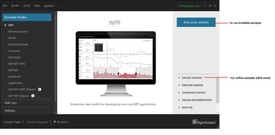

## Guide to run the samples

To run the samples, open the corresponding Dashboard from the following location:

**Start -> All Programs -> Syncfusion -> Essential Studio <x.x.x.x> -> Dashboard**

Else open the Dashboard from the following installed location:

**C:\Program Files (x86)\Syncfusion\Essential Studio\x.x.x.x\Infrastructure\Dashboard\4.0\Dashboard.exe**

The following screenshot displays the Dashboard.

To execute the locally installed samples, select the corresponding product and click RUN local samples.

