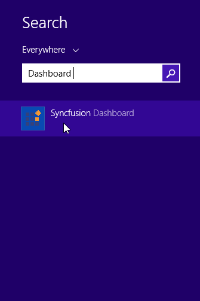
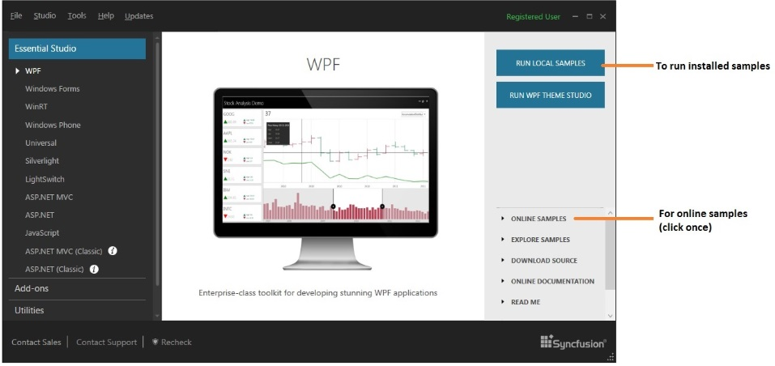

#Featured Samples 

## Guide to run the samples

To run the samples, search it from Start by name of "Dashboard"

Else open the Dashboard from the following installed location:

C:\Program Files (x86)\Syncfusion\Essential Studio\{{ site.releaseversion }}\Infrastructure\Dashboard\4.0\Dashboard.exe

N> In above section, Latest Essential Studio version details has been provided. User can refer installed Essential Studio version instead of mentioned version.

To execute the locally installed samples, select the corresponding product and click "RUN LOCAL SAMPLES".

## Online Samples

To execute the online [samples](https://wpf.syncfusion.com/samples.html) click “ONLINE SAMPLES” that navigates to ClickOnce download. 

## Offline samples

Featured samples are installed along with the Essential Studio installation by Syncfusion installer. The samples are available in “[Installed Drive]:\Users[user name]\AppData\Local\Syncfusion\EssentialStudio\{{ site.releaseversion }}\WPF\samples"

N> In above section, Latest Essential Studio version details has been provided. User can refer installed Essential Studio version instead of mentioned version.
