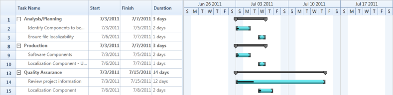

# Auto Update Hierarchy in WPF Gantt

Essential Gantt provides support for auto updating hierarchy, in which the Gantt control will listen to the change in child tasks/activities and automatically update them in the parent task/activity accordingly. There is no need to have any custom logics in business objects to update the hierarchy. You can enable or disable this functionality by using the UseAutoUpdateHierarchy property. 

## Use Case Scenario

1. When using this, no need to have custom logics in the business objects for updating the hierarchy so that codes in a business object class/data structure will be reduced.
2. This enables you to create the abstract class/data structure for the business objects.

## Properties

<table>
<tr>
<th>
Property </th><th>
Description </th><th>
Type </th><th>
Data Type </th></tr>
<tr>
<td>
UseAutoUpdateHierarchy</td><td>
Enable or disable the auto update hierarchy support.</td><td>
Dependency Property</td><td>
bool</td></tr>
</table>

## Using the Auto Update Hierarchy Support in an Application

By default, the UseAutoUpdateHierarchy property is set to true so that this feature will work in all applications by default. If you need to prevent this and want to update the hierarchy by your own logics, then you have to set this property as false.

## Default Scenario

To use the auto updating hierarchy support in an application:

1. Create a simple class structure for business objects.


public class Task : NotificationObject
{
    public Task()
    {
        ChildTask = new ObservableCollection<Task>();
    }

    //No need to do the calculation for end date when the duration is changed
    public TimeSpan Duration
    {
        get
        {
            return duration;
        }
        set
        {
            duration = value;
            RaisePropertyChanged("Duration");
        }
    }

    //No need to do the calculation for duration when the end date is changed.
    public DateTime EndDate
    {
        get
        {
            return endDate;
        }
        set
        {
            endDate = value;
            RaisePropertyChanged("EndDate");
        }
    }

    //No need to do the calculation for duration when the starting date is changed
    public DateTime StDate
    {
        get
        {
            return stDate;
        }
        set
        {
            stDate = value;
            RaisePropertyChanged("StDate");
        }
    }

    //No need to hook the collection based on the changes made in child nodes to listen and refresh the parent nodes.
    public ObservableCollection<Task> ChildTask
    {
        get
        {
            return childTask;
        }
        set
        {
            childTask = value;
            RaisePropertyChanged("ChildTask");
        }
    }
    
    public string Name
    {
        get
        {
            return name;
        }
        set
        {
            name = value;
            RaisePropertyChanged("Name");
        }
    }

    public int Id
    {
        get
        {
            return id;
        }
        set
        {
            id = value;
            RaisePropertyChanged("Id");
        }
    }

    public double Complete
    {
        get
        {
            return Math.Round(complete, 2);
        }
        set
        {
            complete = value;
            RaisePropertyChanged("Complete");
        }
    }
}
		


2. Create a collection of business objects to bind them as ItemsSource for the Gantt control.

		
TaskDetails = new ObservableCollection<Task>();
TaskDetails = GetData();

ObservableCollection<Task> GetData()
{
    ObservableCollection<Task> data = new ObservableCollection<Task>();
    data.Add(
        new Task()
            {
                Id = 1,
                Name = "Analysis/Planning",
                StDate = new DateTime(2012, 7, 3),
                EndDate = new DateTime(2012, 8, 14),
                Complete = 40d
            });
    data[0].ChildTask.Add(
        (new Task()
             {
                 Id = 2,
                 Name = "Identify Components to be Localized",
                 StDate = new DateTime(2012, 7, 3),
                 EndDate = new DateTime(2012, 7, 5),
                 Complete = 20d
             }));
    data[0].ChildTask.Add(
        (new Task()
             {
                 Id = 3,
                 Name = "Ensure file localizability",
                 StDate = new DateTime(2012, 7, 6),
                 EndDate = new DateTime(2012, 7, 7),
                 Complete = 20d
             }));
    data.Add(
        new Task()
            {
                Id = 8,
                Name = "Production",
                StDate = new DateTime(2012, 7, 3),
                EndDate = new DateTime(2012, 7, 14),
                Complete = 40d
            });
    data[1].ChildTask.Add(
        (new Task()
             {
                 Id = 9,
                 Name = "Software Components",
                 StDate = new DateTime(2012, 7, 3),
                 EndDate = new DateTime(2012, 7, 5),
                 Complete = 20d,
             }));
    data[1].ChildTask.Add(
        (new Task()
             {
                 Id = 10,
                 Name = "Localization Component - User Interface",
                 StDate = new DateTime(2012, 7, 6),
                 EndDate = new DateTime(2012, 7, 7),
                 Complete = 20d
             }));
    data.Add(
        new Task()
            {
                Id = 13,
                Name = "Quality Assurance",
                StDate = new DateTime(2012, 7, 3),
                EndDate = new DateTime(2012, 7, 12),
                Complete = 40d,
            });
    data[2].ChildTask.Add(
        (new Task()
             {
                 Id = 14,
                 Name = "Review project information",
                 StDate = new DateTime(2012, 7, 3),
                 EndDate = new DateTime(2012, 7, 15),
                 Complete = 20d
             }));
    data[2].ChildTask.Add(
        (new Task()
             {
                 Id = 15,
                 Name = "Localization Component",
                 StDate = new DateTime(2012, 7, 6),
                 EndDate = new DateTime(2012, 7, 8),
                 Complete = 20d
             }));
}


3. Set the collection as ItemsSource of the Gantt control.


<gantt:GanttControl x:Name="Gantt"
                    Grid.Row="1"
                    UseAutoUpdateHierarchy="True"
                    ItemsSource="{Binding TaskDetails}">
    <gantt:GanttControl.TaskAttributeMapping>
        <gantt:TaskAttributeMapping TaskIdMapping="Id"
                                    TaskNameMapping="Name"
                                    StartDateMapping="StDate" 
                                    ChildMapping="ChildTask"
                                    FinishDateMapping="EndDate"
                                    DurationMapping="Duration"/>
    </gantt:GanttControl.TaskAttributeMapping>
</gantt:GanttControl>


## Using Custom Logics in Business Objects

To use your own logics in business objects:

1. Create a simple class structure for business objects. Add custom calculations on business objects to update the hierarchy when its state changed.



public class Task : NotificationObject
{
    public Task()
    {
        ChildTask = new ObservableCollection<Task>();
    }
    
	public TimeSpan Duration
    {
        get
        {
            if (childTask != null && childTask.Count >= 1)
            {
                var sum = new TimeSpan(0, 0, 0, 0);
                sum = childTask.Aggregate(sum, (current, task) => current + task.Duration);
                return sum;
            }

            /// The difference between the end date and starting date is calculated exactly.
            duration = endDate.Subtract(stDate);
            return duration;
        }
        set
        {
            if (childTask != null && childTask.Count >= 1)
            {
                var sum = new TimeSpan(0, 0, 0, 0);
                sum = childTask.Aggregate(sum, (current, task) => current + task.Duration);
                duration = sum;
                return;
            }
            duration = value;
            /// The end date is calculated to make the change in end date based on duration. The duration is interlinked with the starting date and end date, so it will affect the both based on the changes.
            EndDate = stDate.AddDays(Double.Parse(duration.TotalDays.ToString()));
        }
    }
    
	public DateTime EndDate
    {
        get { return endDate; }
        set
        {
            if (childTask != null && childTask.Count >= 1)
            {
                /// If this task is a parent task, then it should have the maximum end time to compare the date with maximum date of its child tasks.
                if (value >= childTask.Max(s => s.EndDate) && endDate != value)
                    endDate = value;
            }
            else
                endDate = value;
            RaisePropertyChanged("EndDate");
            /// The changed duration is invoked to notify the change in duration based on the new end date.
            RaisePropertyChanged("Duration");
        }
    }
    
	public DateTime StDate
    {
        get
        {
            return stDate;
        }
        set
        {
            /// If this task is a parent task, then it should have the minimum starting time to compare the date with minimum date of its child tasks.

            if (childTask != null && childTask.Count >= 1)
            {
                if (value <= childTask.Min(s => s.stDate) && stDate != value)
                    stDate = value;
            }
            else
                stDate = value;
            RaisePropertyChanged("StDate");
            /// The changed duration is invoked to notify the change in duration based on the new start date.
            RaisePropertyChanged("Duration");
        }
    }
    
	public string Name
    {
        get { return name; }
        set
        {
            name = value;
            RaisePropertyChanged("Name");
        }
    }
    
	public int Id
    {
        get { return id; }
        set
        {
            id = value;
            RaisePropertyChanged("Id");
        }
    }
    
	public ObservableCollection<Task> ChildTask
    {
        get
        {
            if (childTask == null)
            {
                childTask = new ObservableCollection<Task>();
                /// The changed collection of child tasks is hooked to listen and refresh the parent node based on the changes made in child des.
                childTask.CollectionChanged += ChildNodesCollectionChanged;
            }
            return childTask;
        }
        set
        {
            childTask = value;
            ///The changed collection of child tasks is hooked to listen and refresh the parent node based on the changes made in child nodes.
            childTask.CollectionChanged += ChildNodesCollectionChanged;
            if (value.Count > 0)
            {
                childTask.ToList().ForEach(n =>
                {
                    /// To listen the changes made in child tasks.
                    n.PropertyChanged += ChildNodePropertyChanged;
                });
                UpdateData();
            }
            RaisePropertyChanged("ChildTask");
        }
    }
    
	void ChildNodePropertyChanged(object sender, PropertyChangedEventArgs e)
    {
        if (e.PropertyName != null)
            if (e.PropertyName == "StDate" || e.PropertyName == "EndDate" || e.PropertyName == "Complete")
            {
                UpdateData();
            }
    }
    
	private void UpdateData()
    {
        /// Update the starting date and end date based on the changes made in the date of child tasks.
        StDate = childTask.Select(c => c.StDate).Min();
        EndDate = childTask.Select(c => c.EndDate).Max();
        Complete = (childTask.Aggregate(0d, (cur, task) => cur + task.Complete)) / childTask.Count;
    }
    
	public void ChildNodesCollectionChanged(object sender, System.Collections.Specialized.NotifyCollectionChangedEventArgs e)
    {
        if (e.Action == NotifyCollectionChangedAction.Add)
        {
            foreach (Task node in e.NewItems)
            {
                node.PropertyChanged += ChildNodePropertyChanged;
            }
        }
        else
        {
            foreach (Task node in e.OldItems)
                node.PropertyChanged -= ChildNodePropertyChanged;
        }
        UpdateData();
    }
}



2. Create a collection of business objects to bind it as ItemsSource of the Gantt control.



TaskDetails = new ObservableCollection<Task>();

TaskDetails = GetData();

ObservableCollection<Task> GetData()

{

    ObservableCollection<Task> data = new ObservableCollection<Task>();

    data.Add(new Task()

    {

        Id = 1,

        Name = "Analysis/Planning",

        StDate = new DateTime(2012, 7, 3),

        EndDate = new DateTime(2012, 8, 14),

        Complete = 40d

    });

    data[0].ChildTask.Add((new Task()

    {

        Id = 2,

        Name = "Identify Components to be Localized",

        StDate = new DateTime(2012, 7, 3),

        EndDate = new DateTime(2012, 7, 5),

        Complete = 20d

    }));

    data[0].ChildTask.Add((new Task()

    {

        Id = 3,

        Name = "Ensure file localizability",

        StDate = new DateTime(2012, 7, 6),

        EndDate = new DateTime(2012, 7, 7),

        Complete = 20d

    }));

    data.Add(new Task()

    {

        Id = 8,

        Name = "Production",

        StDate = new DateTime(2012, 7, 3),

        EndDate = new DateTime(2012, 7, 14),

        Complete = 40d

    });

    data[1].ChildTask.Add((new Task()

    {

        Id = 9,

        Name = "Software Components",

        StDate = new DateTime(2012, 7, 3),

        EndDate = new DateTime(2012, 7, 5),

        Complete = 20d,

    }));

    data[1].ChildTask.Add((new Task()

    {

        Id = 10,

        Name = "Localization Component - User Interface",

        StDate = new DateTime(2012, 7, 6),

        EndDate = new DateTime(2012, 7, 7),

        Complete = 20d

    }));

    data.Add(new Task()

    {

        Id = 13,

        Name = "Quality Assurance",

        StDate = new DateTime(2012, 7, 3),

        EndDate = new DateTime(2012, 7, 12),

        Complete = 40d,

    });

    data[2].ChildTask.Add((new Task()

    {

        Id = 14,

        Name = "Review project information",

        StDate = new DateTime(2012, 7, 3),

        EndDate = new DateTime(2012, 7, 15),

        Complete = 20d

    }));

    data[2].ChildTask.Add((new Task()

    {

        Id = 15,

        Name = "Localization Component",

        StDate = new DateTime(2012, 7, 6),

        EndDate = new DateTime(2012, 7, 8),

        Complete = 20d

    }));

}



3. Set the UseAutoUpdateHierarchy property as false to handle the custom calculations on the business objects. Set the collection as ItemsSource of the Gantt control.

   N> If you use the TaskDetails class as your business object, then you should not set the UseAutoUpdateHierarchy property as false.



<gantt:GanttControl x:Name="Gantt"
                    Grid.Row="1"
                    UseAutoUpdateHierarchy="False"
                    ItemsSource="{Binding TaskDetails}">
    <gantt:GanttControl.TaskAttributeMapping>
        <gantt:TaskAttributeMapping TaskIdMapping="Id"
                                    TaskNameMapping="Name"
                                    StartDateMapping="StDate" 
                                    ChildMapping="ChildTask"
                                    FinishDateMapping="EndDate"
                                    DurationMapping="Duration"/>
    </gantt:GanttControl.TaskAttributeMapping>
</gantt:GanttControl>

	

Output:

The corresponding output for the code is as follows.

Gantt Control with Auto Updated Hierarchy
{:.caption}

## Sample Link

To view samples:

1. Go to the Syncfusion Essential Studio installed location. 
    Location: Installed Location\Syncfusion\Essential Studio\{{ site.releaseversion }}\Infrastructure\Launcher\Syncfusion Control Panel 
2. Open the Syncfusion Control Panel in the above location (or) Double click on the Syncfusion Control Panel desktop shortcut menu.
3. Click Run Samples for WPF under User Interface Edition panel .
4. Select Gantt.
5. Expand the Data Binding Features item in the Sample Browser.
6. Choose the External Property Binding Demo sample to launch.

