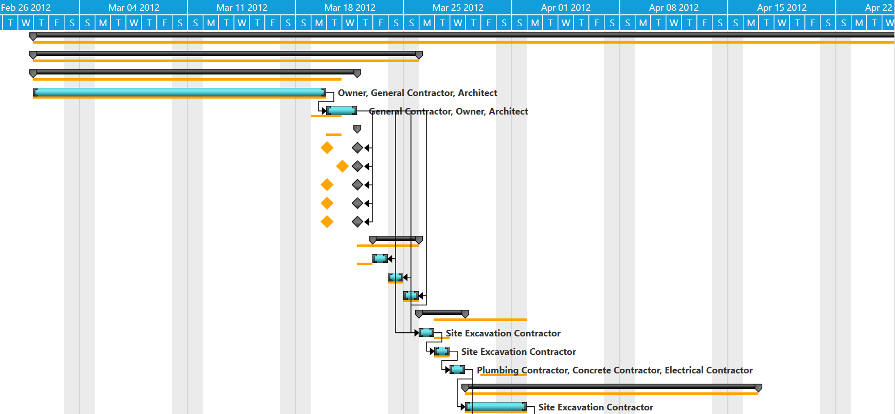
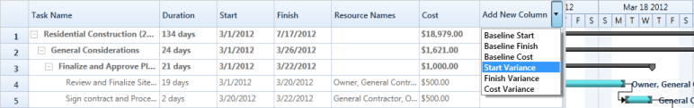

# Baseline Support in WPF Gantt

## Baseline Table View

Baseline Table View will display the differences between the current progresses and the baseline of the project in the Gantt Grid.

While invoking the appropriate method, the variance will be calculated between the actual value and the mapped baseline value, and displayed as variance view in the Gantt Grid.

The variances will be calculated only for the mapped baseline fields. For example, if you have mapped only the Baseline Start to TaskMappingAttribute, then it will calculate the variance only between Start and Baseline Start and display it in the Grid.

You can revert to the default view of the Grid by invoking the corresponding method in Gantt.

N> Variance view will have the read-only Grid. You cannot edit the cells in Gantt Grid, when it is in variance view.

## Use Case Scenario

This will help the Project Leads to compare the current progress of the project to the baseline and modify or rework the plan of existing tasks in order to meet deadlines. Organizations can use this to compare the current progress of the project to the initial estimation, analyze the rework of the plan or the budget of the project in to meet deadlines and exact user requirements.

### Methods

<table>
<tr>
<th>
Method </th><th>
Description </th><th>
Parameters </th><th>
Type </th><th>
Return Type </th></tr>
<tr>
<td>
LoadVarianceTableView</td><td>
this method is used to load the Variance view of the Gantt.</td><td>
LoadVarianceTableView()</td><td>
N/A</td><td>
void </td></tr>
<tr>
<td>
LoadDefaultTableView</td><td>
this method is used to load the Default (Editing) view of the Gantt.</td><td>
LoadDefaultTableView()</td><td>
N/A</td><td>
void</td></tr>
</table>

## Adding Baseline Table View to an Application

To add Baseline Table View to an application:

1. Declare the baseline properties in the view model.
2. Map the properties to Gantt in the corresponding TaskAttributeMappingProperty.
3. To load the Variance view, call the LoadVarianceTableView() method of the Gantt.
4. To load the Default (Editing) view, call the LoadDefaultTableView() method of the Gantt.

The following codes illustrate this:




<gantt:GanttControl Grid.Row="1" x:Name="Gantt"  
                    ItemsSource="{Binding GanttItemSource}"  
                    ToolTipTemplate="{StaticResource toolTipTemplate}"
                    ShowBaseline="True">
    <gantt:GanttControl.TaskAttributeMapping>
        <gantt:TaskAttributeMapping TaskIdMapping="Id"
                                    TaskNameMapping="Name"
                                    DurationMapping="Duration"
                                    StartDateMapping="StDate"  
                                    FinishDateMapping="EndDate"
                                    ChildMapping="ChildTask"  
                                    ProgressMapping="Complete"
                                    PredecessorMapping="Predecessor"   
                                    ResourceInfoMapping="Resource"
                                    CostMapping="Cost"
                                    BaselineCostMapping="BaselineCost"
                                    BaselineFinishMapping="BaselineEnd"
                                    BaselineStartMapping="BaselineStart" >
        </gantt:TaskAttributeMapping>
    </gantt:GanttControl.TaskAttributeMapping>
</gantt:GanttControl>




// To load the Variance Table View 
this.Gantt.LoadVarianceTableView();

// To load the Default [Editing] View
this.Gantt.LoadDefaultTableView();




The following image shows the BaseLine Table View:

BaseLine Table View
{:.caption}

## Baseline Chart View

In Gantt chart, baseline start and end values are graphically visualized.

* Line shape represents the header node and node.
* Diamond shape represents the milestone.

### Properties

<table>
<tr>
<th>
Property</th><th>
Description</th><th>
Type</th><th>
Data Type</th><th>
Reference links</th></tr>
<tr>
<td>
ShowBaseline</td><td>
Controls the view of baseline in the Gantt Chart. Default value is false</td><td>
DependencyProperty</td><td>
bool</td><td>
NA</td></tr>
</table>

## Baseline Customization

Able to customize the baseline color and thickness by using following properties.

### Properties

<table>
<tr>
<th>
Property</th><th>
Description</th><th>
Type</th><th>
Data Type</th><th>
Reference links</th></tr>
<tr>
<td>
BaselineColor</td><td>
Used to customize the baseline color. Default value is Orange</td><td>
DependencyProperty</td><td>
Brush</td><td>
NA</td></tr>
<tr>
<td>
BaselineStrokeThickness</td><td>
Used to customize the baseline thickness. Default value is 3d</td><td>
DependencyProperty</td><td>
bool</td><td>
NA</td></tr>
</table>

The following image shows the BaseLine Chart View:

## Samples

To view samples:

1. Select Start -> Programs -> Syncfusion -> Essential Studio x.x.xx -> Dashboard.
2. Click Run Samples for WPF under User Interface Edition panel.
3. Select Gantt.
4. Expand the Baseline Support item in the Sample Browser.
5. Choose the Baseline TableView sample to launch.

## On-Demand Baseline Column Inclusion

On-Demand Baseline Column inclusion will dynamically add the baseline columns namely Baseline Start, Baseline End, Baseline Cost, Start Variance, Finish Variance, Cost Variance to Gantt Grid on demand basis. These columns will be listed in a drop down cell. By picking a column from that cell, it will get added to the current table. 

Initially, Gantt will get loaded with a default set of columns. Then, you can add the baseline columns on demand basis to Gantt Grid, by selecting the columns from the drop down cell. 

### Use Case Scenario

This helps the Project Lead to store the estimation and will help to schedule the project in an efficient way by comparing the progress on planning itself. Organizations can have the default set of columns on Gantt Grid on loading, and when they need to compare a field with the estimate data, they can pick that column from the drop down. 

On-Demand Baseline Column Inclusion
{:caption}

### Properties

<table>
<tr>
<th>
Property </th><th>
Description </th><th>
Type </th><th>
Data Type </th></tr>
<tr>
<td>
ShowAddNewColumn</td><td>
Gets/Sets the  value that is used in displaying/hiding the add new column combo box in grid</td><td>
DependencyProperty </td><td>
bool</td></tr>
</table>

Adding On-Demand Baseline Column Inclusion to an Application

To add the On-Demand Baseline Column Inclusion to an application you need to enable the AddNewColumn of Gantt Grid, which will have a drop down cell on its head, which in turn will have the baseline columns that can be added dynamically. To enable this feature:

1. To show the Add New Column of Gantt Grid, set the ShowAddNewColumn Property to true in Gantt.
2. To include the Baseline columns in the Add New Columns drop down cell, provide the corresponding mapping name in TaskAttributeMapping. 
3. Mapped Baseline columns will be listed in the drop down cell.
4. By selecting a column name from the drop down cell, the corresponding column will be dynamically added to the Gantt Grid.

The following codes illustrate Adding On-Demand Baseline Column Inclusion to an Application:



<gantt:GanttControl Grid.Row="1" x:Name="Gantt"  
                    ItemsSource="{Binding GanttItemSource}"  
                    ToolTipTemplate="{StaticResource toolTipTemplate}"
                    ShowAddNewColumn="True">
    <gantt:GanttControl.TaskAttributeMapping>
        <gantt:TaskAttributeMapping TaskIdMapping="Id"
                                    TaskNameMapping="Name"
                                    DurationMapping="Duration"
                                    StartDateMapping="StDate"            
                                    FinishDateMapping="EndDate"
                                    ChildMapping="ChildTask"  
                                    ProgressMapping="Complete"
                                    PredecessorMapping="Predecessor"     
                                    ResourceInfoMapping="Resource"
                                    CostMapping="Cost"
                                    BaselineCostMapping="BaselineCost"
                                    BaselineFinishMapping="BaselineEnd"
                                    BaselineStartMapping="BaselineStart">
        </gantt:TaskAttributeMapping>
    </gantt:GanttControl.TaskAttributeMapping>
</gantt:GanttControl>




// Displaying the Add New column drop down 
this.Gantt.ShowAddNewColumn = true;




## Samples Link

To view samples:

1. Go to the Syncfusion Essential Studio installed location. 
    Location: Installed Location\Syncfusion\Essential Studio\{{ site.releaseversion }}\Infrastructure\Launcher\Syncfusion Control Panel 
2. Open the Syncfusion Control Panel in the above location (or) Double click on the Syncfusion Control Panel desktop shortcut menu.
3. Click Run Samples for WPF under User Interface Edition panel.
4. Select Gantt.
5. Expand the Baseline Support item in the Sample Browser.
6. Choose the Baseline Table View sample to launch.

## Project Statistics

Project statistics will provide the current statistics of the project in an object form. It will have all the basic information about the project and will provide the variance between the initial plan and current progress. 

This will provide enough information about the project. The entire project information will be available in the form of an object of type “ProjectInfo”. You can set your own visual to display the statistics. 

### Use Case Scenario

This will be useful for Project Leads to take decisions based on the current status. An Organization can use this to present the current statuses of their projects to their clients. They can also use this for analysis before making important decisions on projects.

### Methods

<table>
<tr>
<th>
Method </th><th>
Description </th><th>
Parameters </th><th>
Type </th><th>
Return Type </th></tr>
<tr>
<td>
GetProjectStatistics</td><td>
this method is used to get the current statistics information about the project</td><td>
GetProjectStatistics()</td><td>
N/A</td><td>
ProjectInfo </td></tr>
</table>

### Adding Project Statistics to an Application

To add Project Statistics to an application:

1. Initialize new instance of ‘ProjectInfo’ class.
2. Assign the GetProjectStatistics() Methods’ return value to that instance.
3. Use the instance for further process.

The following codes illustrate adding Project Statistics to an application:




<gantt:GanttControl Grid.Row="1" x:Name="Gantt"  
                    ItemsSource="{Binding GanttItemSource}"  
                    ToolTipTemplate="{StaticResource toolTipTemplate}">
    <gantt:GanttControl.TaskAttributeMapping>
        <gantt:TaskAttributeMapping TaskIdMapping="Id"
                                    TaskNameMapping="Name"
                                    DurationMapping="Duration"
                                    StartDateMapping="StDate"            
                                    FinishDateMapping="EndDate"
                                    ChildMapping="ChildTask"  
                                    ProgressMapping="Complete"
                                    PredecessorMapping="Predecessor"     
                                    ResourceInfoMapping="Resource"
                                    CostMapping="Cost"
                                    BaselineCostMapping="BaselineCost"
                                    BaselineFinishMapping="BaselineEnd"
                                    BaselineStartMapping="BaselineStart">
        </gantt:TaskAttributeMapping>
    </gantt:GanttControl.TaskAttributeMapping>
</gantt:GanttControl>




// To get the Project Statistics 
ProjectInfo projInfo = this.Gantt.GetProjectStatistics(); 

	   (or)

ProjectInfo projInfo = new ProjectInfo();
projInfo = this.Gantt.GetProjectStatistics();      




Sample Project Statistic Visual:

Project Statistics
{:.caption}

### Samples

To view samples:

1. Select Start -> Programs -> Syncfusion -> Essential Studio x.x.xx -> Dashboard.
2. Click Run Samples for WPF under User Interface Edition panel.
3. Select Gantt.
4. Expand the Baseline Support item in the Sample Browser.
5. Choose the Project Statistics sample to launch.
