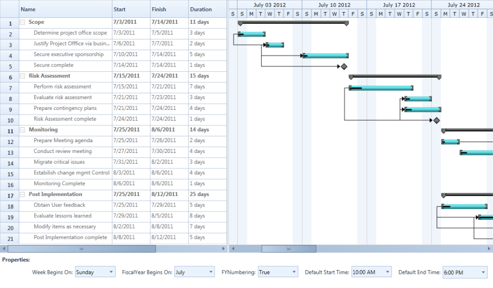

# Calendar Customization in WPF Gantt

This feature allows you to set your own schedule for the entire project. Using this feature you can customize the calendar as per the organization’s requirement. 

## Use Case Scenarios

You can use this feature when you want to change the schedule as needed. For example, if April to March is your financial year, you can set this as your fiscal year and schedule the tasks accordingly. 

You can also use this to schedule the works that have different week cycle. For example if your organization follows the week cycle from Wednesday to Tuesday, you can achieve this using calendar Customization feature.

## Properties

<table>
<tr>
<th>
Property </th><th>
Description </th><th>
Type </th><th>
Data Type </th><th>
Reference links </th></tr>
<tr>
<td>
WeekBeginsOn</td><td>
Gets or sets the starting day of a week in the project schedule. By default it is set to Sunday. </td><td>
DependencyProperty </td><td>
Enum</td><td>
N/A</td></tr>
<tr>
<td>
FiscalYearBeginsOn</td><td>
Gets or sets the starting month of a fiscal year. By default it is set to January</td><td>
DependencyProperty</td><td>
Enum</td><td>
N/A</td></tr>
<tr>
<td>
IsFYNumberingEnabled</td><td>
Gets or sets the Fiscal Year Numbering. If this property is changed, it will be reflected in the schedule.By default FY Numbering is set to false.</td><td>
Dependency Property</td><td>
bool</td><td>
N/A</td></tr>
<tr>
<td>
DefaultStartTime</td><td>
Gets or sets the task starting time in a day. This is based on the {{ '_GanttTime_' | markdownify }} class of the Gantt control.By default this is set to 9.00 AM</td><td>
Dependency Property</td><td>
GanttTime</td><td>
N/A</td></tr>
<tr>
<td>
DefaultEndTime</td><td>
Gets or sets the task ending time in a day. This is based on the {{ '_GanttTime_' | markdownify }} class of the Gantt control.By default this is set to 6.00 PM</td><td>
Dependency Property</td><td>
GanttTime</td><td>
N/A</td></tr>
<tr>
<td>
Weekends</td><td>
Gets or sets the weekend days. Default value is Saturday, Sunday.</td><td>
Dependency Property</td><td>
Days</td><td>
N/A</td></tr>
<tr>
<td>
ShowWeekends</td><td>
Enables or disables the weekend days in schedule. Default value is true.</td><td>
Dependency Property</td><td>
bool</td><td>
N/A</td></tr>
<tr>
<td>
ExcludeWeekends</td><td>
Excludes or includes the weekend days in duration calculation. Default value is false.</td><td>
Dependency Property</td><td>
bool</td><td>
N/A</td></tr>
<tr>
<td>
ShowNonWorkingHoursBackground</td><td>
Enables or disables the background for weekend days. Default value is true.</td><td>
Dependency Property</td><td>
bool</td><td>
N/A</td></tr>
</table>

N> Currently DefaultStartTime and DefaultEndTime will reflect only in the Chart Background Panel.

## Adding Calendar Customization to an Application 

Define the value to weekdays, months, FY Numbering, default start time and default end time as required and assign it to the appropriate APIs in the Gantt.

The following code illustrates adding Calendar Customization to an Application:




<!--Gantt Control Calendar Customization and Weekends Customization Info-->
<sync:GanttControl x:Name="Gantt" Grid.Row="1" WeekBeginsOn="Friday"    

                   Weekends="Wednesday,Thursday"

                   ItemsSource="{Binding TaskCollection}"   

                   FiscalYearBeginsOn="June"

                   IsFYNumberingEndbled="True" DefaultEndTime="16:00:00" 

                   ShowWeekends="True" ExcludeWeekends="True"   

                   DefaultStartTime="10:00:00"  

                   ShowNonWorkingHoursBackground="True">  

    <sync:GanttControl.TaskAttributeMapping>

        <sync:TaskAttributeMapping TaskIdMapping="Id"

                                   TaskNameMapping="Name"

                                   StartDateMapping="StDate" 

                                   ChildMapping="ChildTask"

                                   FinishDateMapping="EndDate"

                                   DurationMapping="Duration"

                                   ProgressMapping="Complete"

                                   PredecessorMapping="Predecessor">

        </sync:TaskAttributeMapping>

    </sync:GanttControl.TaskAttributeMapping>

</sync:GanttControl>           




//To set WeekBeginsOn
Gantt.WeekBeginsOn = DayOfWeek.Friday;

//To set FY Numbering
Gantt.IsFYNumberingEndbled = true;

//To set FiscalYearBeginsOn
Gantt.FiscalYearBeginsOn = Month.June;

//To set DefaultStartTime
Gantt.DefaultStartTime = new TimeSpan(10,0,0);

//To set DefaultEndTime
Gantt.DefaultEndTime = new TimeSpan(16, 0, 0);

//To set Weekends
Gantt.Weekends = Days.Wednesday | Days.Thursday;

//To set ShowWeekends
Gantt.ShowWeekends = true;

//To set ExcludeWeekends
Gantt.ExcludeWeekends = true;

//To set ShowNonWorkingHoursBackground
Gantt.ShowNonWorkingHoursBackground = true;

// To Set FY Numbering
Gantt.IsFYNumberingEndbled = true;




The following image shows Customized Calender and Weekends:

Customized Calender
{:.caption}

### Samples Link

To view samples:

1. Go to the Syncfusion Essential Studio installed location. 
    Location: Installed Location\Syncfusion\Essential Studio\{{ site.releaseversion }}\Infrastructure\Launcher\Syncfusion Control Panel 
2. Open the Syncfusion Control Panel in the above location (or) Double click on the Syncfusion Control Panel desktop shortcut menu.
3. Click Run Samples for WPF under User Interface Edition panel.
4. Select Gantt.
5. Expand the Interactive Features item in the Sample Browser.
6. Choose the Calendar Customization sample to launch.

