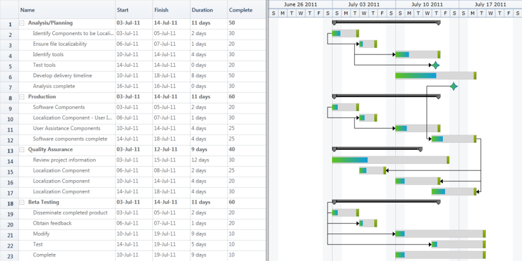
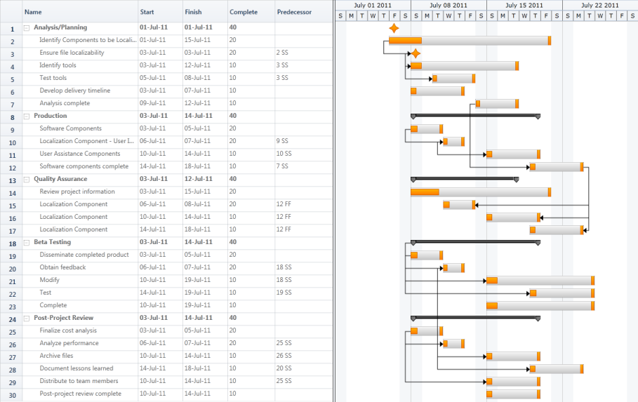

# Custom Node Style in WPF Gantt

Custom node style enables you to design your own style to the nodes that will be displayed in the Gantt. You can also customize the progress bar of the Task Node.Currently Gantt Control supports three types of node. They are:

* Header Node 
* Task Node
* Milestone

You can apply custom styles for all the three nodes. The basic functionalities of the Gantt nodes like resizing, drag and drop and tooltip are available only when the custom node style has the built-in node style’s such as drag and drop the thumb and resizing the thumbs. Otherwise the custom node will work properly, but you cannot access these features of Gantt. 

## Use Case Scenarios

You can customize the node to give a similar look and feel of your product. For example if you are from a steel company, then you can add a style that gives steel rod like look and feel to the node. 

You can also design the node based on your organization’s logo.

## Adding Custom Node Style to an Application 

The following are the steps to add custom node style to an application:

1. Define a style as needed with the target type for each node type as given in the following table:

### Custom Node Types

<table>
<tr>
<th>
Node Type</th><th>
Target Type</th></tr>
<tr>
<td>
Header Node</td><td>
HeaderNode</td></tr>
<tr>
<td>
Task Node</td><td>
GanttNode</td></tr>
<tr>
<td>
Milestone</td><td>
MileStone</td></tr>
</table>

The following code illustrates how to define style:



<ResourceDictionary xmlns="http://schemas.microsoft.com/winfx/2006/xaml/presentation"
                    xmlns:x="http://schemas.microsoft.com/winfx/2006/xaml"
                    xmlns:gantt="http://schemas.syncfusion.com/wpf"
                    xmlns:chart="clr-namespace:Syncfusion.Windows.Controls.Gantt.Chart;assembly=Syncfusion.Gantt.Wpf" >

    <!-- Header Node style-->
    

    <!-- Task Node style-->
    

 <!--Milestone style-->
    
</ResourceDictionary>



1. Add the style as a resource to the Gantt control in your application.

The following code illustrates how to add the styles to the application:



<sync:GanttControl Grid.Row="1" x:Name="Gantt" 
                   ItemsSource="{Binding GanttItemSource}"
                   ToolTipTemplate="{StaticResource toolTipTemplate}"
                   VisualStyle="Office2010Silver">
    <sync:GanttControl.TaskAttributeMapping>
        <sync:TaskAttributeMapping TaskIdMapping="Id"
                                   TaskNameMapping="Name"
                                   StartDateMapping="StDate" 
                                   ChildMapping="ChildTask"
                                   FinishDateMapping="EndDate"
                                   DurationMapping="Duration"
                                   ProgressMapping="Complete"
                                   PredecessorMapping="Predecessor">
        </sync:TaskAttributeMapping>
    </sync:GanttControl.TaskAttributeMapping>
    
    <sync:GanttControl.Resources>
        <Style TargetType="chart:GanttNode" BasedOn="{StaticResource TaskNode}"/>
        <Style TargetType="chart:MileStone" BasedOn="{StaticResource MileStone}"/>
    </sync:GanttControl.Resources>
</sync:GanttControl>



_Custom Node Style_

Custom Node Style
{:.caption}

## Samples Link

To view samples: 

1. Go to the Syncfusion Essential Studio installed location. 
    Location: Installed Location\Syncfusion\Essential Studio\{{ site.releaseversion }}\Infrastructure\Launcher\Syncfusion Control Panel 
2. Open the Syncfusion Control Panel in the above location (or) Double click on the Syncfusion Control Panel desktop shortcut menu.
3. Click Run Samples for WPF under User Interface Edition panel.
4. Select Gantt.
5. Expand the Styles item in the Sample Browser.
6. Choose the Custom Node Style sample to launch.

