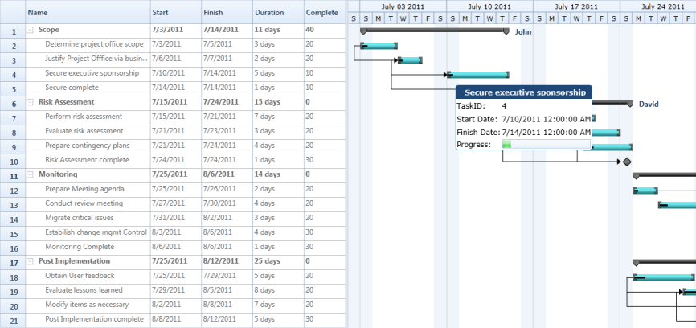

# CustomToolTip in WPF Gantt

Essential Gantt provides tooltip support for the TaskBar. Tooltip is a small pop-up box, which is usually displayed on mouse hover. This is used to display additional information about the elements without increasing the window size. Essential Gantt provides support to add customizable tooltip. You can add text or image to your tooltip as needed. 

## Properties

<table>
<tr>
<th>
Property </th><th>
Description </th><th>
Type </th><th>
Data Type </th></tr>
<tr>
<td>
ToolTipTemplate</td><td>
Gets or set the TaskBarCollection Property of GanttControl</td><td>
Dependency Property</td><td>
DataTemplate</td></tr>
</table>

## Adding CustomToolTip to Gantt 

The following code illustrates how to add a custom tooltip to the Gantt control.



<DataTemplate x:Key="ToolTipTemp">
    <Grid>
        <Grid.ColumnDefinitions>
            <ColumnDefinition/>
            <ColumnDefinition/>
        </Grid.ColumnDefinitions>
        <Grid.RowDefinitions>
            <RowDefinition Height="40"/>
            <RowDefinition Height="40"/>
            <RowDefinition Height="40"/>
            <RowDefinition Height="40"/>
            <RowDefinition Height="40"/>
        </Grid.RowDefinitions>
        <Border Grid.Column="0"
                Grid.Row="0" 
                Margin="-2"
                CornerRadius="5" 
                Grid.ColumnSpan="2" 
                Background="#FF1F4877"
                BorderThickness="2">
            <TextBlock Text="{Binding TaskName}"
                       Margin="5,0,0,0"
                       HorizontalAlignment="Center"
                       VerticalAlignment="Center" 
                       FontWeight="Bold"
                       FontFamily="Verdana"
                       Foreground="WhiteSmoke"/>
        </Border>
        <TextBlock Margin = "1"
                   Text="TaskID:" 
                   Grid.Column="0"
                   Grid.Row="1" 
                   VerticalAlignment="Center"
                   FontFamily="Verdana"/>
        
        <TextBlock Margin="1" Text="{Binding TaskId}" 
                   Grid.Column="1"
                   VerticalAlignment="Center" 
                   Grid.Row="1"
                   FontFamily="Verdana"/>

        <TextBlock Margin="1" Text="Start Date:" 
                   Grid.Column="0"
                   Grid.Row="2" 
                   VerticalAlignment="Center"
                   FontFamily="Verdana"/>

        <TextBlock Margin="1" Text="{Binding StartDate}" 
                   Grid.Row="2"
                   Grid.Column="1" 
                   VerticalAlignment="Center"
                   FontFamily="Verdana"/>
        
        <TextBlock Margin="1" Text="Finish Date:"  
                   Grid.Column="0"
                   Grid.Row="3" 
                   VerticalAlignment="Center"
                   FontFamily="Verdana"/>

        <TextBlock Margin="1" Text="{Binding FinishDate}" 
                   Grid.Column="1"
                   Grid.Row="3"
                   VerticalAlignment="Center"
                   FontFamily="Verdana"/>
        
        <TextBlock Margin="1" Text="Progress:" 
                   Grid.Column="0"
                   Grid.Row="4" 
                   VerticalAlignment="Center" 
                   FontFamily="Verdana"/>
        
        <ProgressBar Margin="1" Height="25" 
                     Value="{Binding Progress}"
                     Grid.Column="1" 
                     VerticalAlignment="Center"
                     Grid.Row="4"/>
    </Grid>
</DataTemplate>

<Sync:GanttControl x:Name="Gantt" ToolTipTemplate="{StaticResource ToolTipTemp}"/>



The following image shows Custom ToolTip:

Custom ToolTip Demo
{:.caption}

## Samples Link

To view samples: 

1. Go to the Syncfusion Essential Studio installed location. 
    Location: Installed Location\Syncfusion\Essential Studio\{{ site.releaseversion }}\Infrastructure\Launcher\Syncfusion Control Panel 
2. Open the Syncfusion Control Panel in the above location (or) Double click on the Syncfusion Control Panel desktop shortcut menu.
2. Click Run Samples for WPF under User Interface Edition panel .
3. Select Gantt.
4. Expand the Interactive Features item in the Sample Browser.
5. Choose the CustomToolTip samples to launch.

