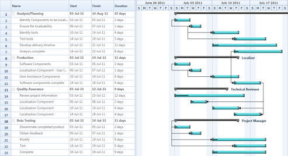

# Data Binding in WPF Gantt

## TaskDetails Binding

Essential Gantt for WPF includes an built-in class called TaskDetails, which is inherited from the IGanttTask interface. A collection of the TaskDetails can be bounded as an ItemsSource for the GanttControl.

### Use Case Scenarios

You can easily create the task details collection using the TaskDetails class or by creating a new class by inheriting the IGantt interface.

Binding TaskDetails collection to Gantt Control

The following code illustrates how to bind the Task Details to the Gantt Control:




<Sync:GanttControl ItemsSource="{Binding TaskCollection}">
    <Sync:GanttControl.DataContext>
        <local:ViewModel></local:ViewModel>
    </Sync:GanttControl.DataContext>
</Sync:GanttControl>




GanttControl Gantt = new GanttControl();
ViewModel model = new ViewModel();
this.Gantt.DataContext = model;
Gantt.ItemsSource = model.GanttItemSource;

public class ViewModel
{
    public ObservableCollection<TaskDetails> TaskCollection { get; set; }
    public ViewModel()
    {
        TaskCollection = this.GetDataSource();
    }

    private ObservableCollection<TaskDetails> GetDataSource()
    {
        ObservableCollection<TaskDetails> task = new ObservableCollection<TaskDetails>();
        task.Add(
            new TaskDetails
                {
                    TaskId = 1,
                    TaskName = "Scope",
                    StartDate = new DateTime(2011, 1, 3),
                    FinishDate = new DateTime(2011, 1, 14),
                    Progress = 40d
                });

        task[0].Child.Add(
            new TaskDetails
                {
                    TaskId = 2,
                    TaskName = "Determine project office scope",
                    StartDate = new DateTime(2011, 1, 3),
                    FinishDate = new DateTime(2011, 1, 5),
                    Progress = 20d
                });

        task[0].Child.Add(
            new TaskDetails
                {
                    TaskId = 3,
                    TaskName = "Justify project office via business model",
                    StartDate = new DateTime(2011, 1, 6),
                    FinishDate = new DateTime(2011, 1, 7),
                    Duration = new TimeSpan(1, 0, 0, 0),
                    Progress = 20d
                });

        task[0].Child.Add(
            new TaskDetails
                {
                    TaskId = 4,
                    TaskName = "Secure executive sponsorship",
                    StartDate = new DateTime(2011, 1, 10),
                    FinishDate = new DateTime(2011, 1, 14),
                    Duration = new TimeSpan(1, 0, 0, 0),
                    Progress = 20d
                });

        task[0].Child.Add(
            new TaskDetails
                {
                    TaskId = 5,
                    TaskName = "Secure complete",
                    StartDate = new DateTime(2011, 1, 14),
                    FinishDate = new DateTime(2011, 1, 14),
                    Duration = new TimeSpan(1, 0, 0, 0),
                    Progress = 20d
                });

        return task;
    }
}



The following image shows the BindingTask Details:

### Samples Link

To view samples: 

1. Go to the Syncfusion Essential Studio installed location. 
    Location: Installed Location\Syncfusion\Essential Studio\{{ site.releaseversion }}\Infrastructure\Launcher\Syncfusion Control Panel 
2. Open the Syncfusion Control Panel in the above location (or) Double click on the Syncfusion Control Panel desktop shortcut menu.
3. Click Run Samples for WPF under User Interface Edition panel.
4. Select Gantt.
5. Expand the DataBinding Features item in the Sample Browser.
6. Choose the Binding Task Details samples to launch.

## External Property Binding

Essential Gantt for WPF allow you to bind any type of IEnumerable source to Gantt.You can bind any collection to Gantt using the TaskAttributeMapping class. This will get the mapping name of the required fields from the underlying source. With this mapping the Gantt will get the required information to render the Chart nodes.

The following code illustrate how to map the properties using the TaskAttributeMapping class:



<Sync:TaskAttributeMapping 
    TaskIdMapping="Id"                 
    TaskNameMapping="Name"                  
    StartDateMapping="StartDate"               
    ChildMapping="ChildTask"                
    FinishDateMapping="EndDate"               
    DurationMapping="Duration"                 
    ResourceInfoMapping="Resource"                 
    ProgressMapping="Complete"               
    PredecessorMapping="Predecessor">
</Sync:TaskAttributeMapping>




TaskAttributeMapping attributes = new TaskAttributeMapping();
attributes.TaskIdMapping = "Id";
attributes.TaskNameMapping = "Name";
attributes.StartDateMapping = "StartDate";
attributes.FinishDateMapping = "EndDate";
attributes.DurationMapping = "Duration";
attributes.ChildMapping = "ChildTask";
attributes.ResourceInfoMapping = "Resource";
attributes.ProgressMapping = "Predecessor";
this.Gantt.TaskAttributeMapping = attributes;




The following code illustrates how to bind the external source to Gantt control:




<Sync:GanttControl ItemsSource="{Binding TaskCollection}">
    <Sync:GanttControl.DataContext>
        <local:ViewModel></local:ViewModel>
    </Sync:GanttControl.DataContext>
    <Sync:GanttControl.TaskAttributeMapping>
        <Sync:TaskAttributeMapping
            TaskIdMapping="ID"
            TaskNameMapping="Name"
            StartDateMapping="StartDate"
            FinishDateMapping="EndDate"
            ChildMapping="ChildCollection"
            ProgressMapping="Progress"
            DurationMapping="Duration">
           </Sync:TaskAttributeMapping>
    </Sync:GanttControl.TaskAttributeMapping>
</Sync:GanttControl>




 //Initializing Gantt
 GanttControl Gantt = new GanttControl();
 ViewModel model=  new ViewModel();
 TaskAttributeMapping attributes = new TaskAttributeMapping();
 attributes.TaskIdMapping = "ID";
 attributes.TaskNameMapping = "Name";
 attributes.StartDateMapping = "StartDate";
 attributes.FinishDateMapping = "EndDate";
 attributes.DurationMapping = "Duration";
 attributes.ChildMapping = "ChildCollection"; 
 this.Gantt.DataContext = model;
 Gantt.TaskAttributeMapping = attributes;
 Gantt.ItemsSource = model.GanttItemSource;

public class Task : INotifyPropertyChanged
{   
    private DateTime startDate,endDate;
    
    private TimeSpan duration;
    
    private double progress;
    
    private int id;

    private string name;

    private ObservableCollection<Task> childCollection;

    /// 

    /// Property for Start Date.
    /// 

    public DateTime StartDate
    {
        get
        {
            return this.startDate;
        }
        set
        {
            this.startDate = value;
            OnPropertyChanged("StartDate");
        }
    }

    /// 

    /// Property for Finish Date.
    /// 

    public DateTime EndDate
    {
        get
        {
            return this.endDate;
        }
        set
        {
            this.endDate = value;
            OnPropertyChanged("EndDate");
        }
    }

    /// 

    /// Property for duration value.
    /// 

    public TimeSpan Duration
    {
        get
        {
            return this.duration;
        }
        set
        {
            this.duration = value;
            OnPropertyChanged("Duration");
        }
    }
    
    /// 

    /// Property for ID value.
    /// 

    public int ID 
    {
        get
        {
            return this.id;
        }
        set
        {
            this.id = value;
            OnPropertyChanged("ID");
        }
    }
    
    /// 

    /// Property for Name.
    /// 

    public string Name 
    {
        get
        {
            return this.name;
        }
        set
        {
            this.name = value;
            OnPropertyChanged("Name");
        }
    }
    
    /// 

    /// Property to define progress value.
    /// 

    public double Progress 
    {
        get
        {
            return this.progress;
        }
        set
        {
            this.progress = value;
            OnPropertyChanged("Progress");
        }
    }

    public ObservableCollection<Task> ChildCollection
    {
        get
        {
            return this.childCollection;
        }
        set
        {
            this.childCollection = value;
            OnPropertyChanged("ChildCollection");
        }
    }
    
    private void OnPropertyChanged(string propName)
    {
        if (this.PropertyChanged != null)
        {
            PropertyChanged(this,new PropertyChangedEventArgs(propName));
        }
    }
    
    public event PropertyChangedEventHandler PropertyChanged;
}
 
public class ViewModel
{
    public ObservableCollection<Task> TaskCollection { get; set; }
    
    public ViewModel()
    {
        TaskCollection = this.GetDataSource();
    }

    private ObservableCollection<Task> GetDataSource()
    {
        ObservableCollection<Task> task = new ObservableCollection<Task>();
        task.Add(
            new Task
                {
                    ID = 1,
                    Name = "Scope",
                    StartDate = new DateTime(2011, 1, 3),
                    EndDate = new DateTime(2011, 1, 14),
                    Progress = 40d
                });

        task[0].ChildCollection = new ObservableCollection<Task>();
        task[0].ChildCollection.Add(
            new Task
                {
                    ID = 2,
                    Name = "Determine project office scope",
                    StartDate = new DateTime(2011, 1, 3),
                    EndDate = new DateTime(2011, 1, 5),
                    Progress = 20d
                });

        task[0].ChildCollection.Add(
            new Task
                {
                    ID = 3,
                    Name = "Justify project office via business model",
                    StartDate = new DateTime(2011, 1, 6),
                    EndDate = new DateTime(2011, 1, 7),
                    Duration = new TimeSpan(1, 0, 0, 0),
                    Progress = 20d
                });

        task[0].ChildCollection.Add(
            new Task
                {
                    ID = 4,
                    Name = "Secure executive sponsorship",
                    StartDate = new DateTime(2011, 1, 10),
                    EndDate = new DateTime(2011, 1, 14),
                    Duration = new TimeSpan(1, 0, 0, 0),
                    Progress = 20d
                });

        task[0].ChildCollection.Add(
            new Task
                {
                    ID = 5,
                    Name = "Secure complete",
                    StartDate = new DateTime(2011, 1, 14),
                    EndDate = new DateTime(2011, 1, 14),
                    Duration = new TimeSpan(1, 0, 0, 0),
                    Progress = 20d
                });

        return task;
   }
}




The following image shows the External Property Binding:

### Samples Link

To view samples: 

1. Go to the Syncfusion Essential Studio installed location. 
    Location: Installed Location\Syncfusion\Essential Studio\{{ site.releaseversion }}\Infrastructure\Launcher\Syncfusion Control Panel 
2. Open the Syncfusion Control Panel in the above location (or) Double click on the Syncfusion Control Panel desktop shortcut menu.
3. Click Run Samples for WPF under User Interface Edition panel.
4. Select Gantt.
5. Expand the DataBinding Features item in the Sample Browser.
6. Choose the External Property Binding sample to launch.
