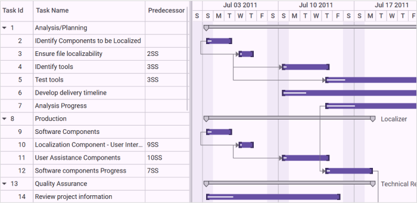
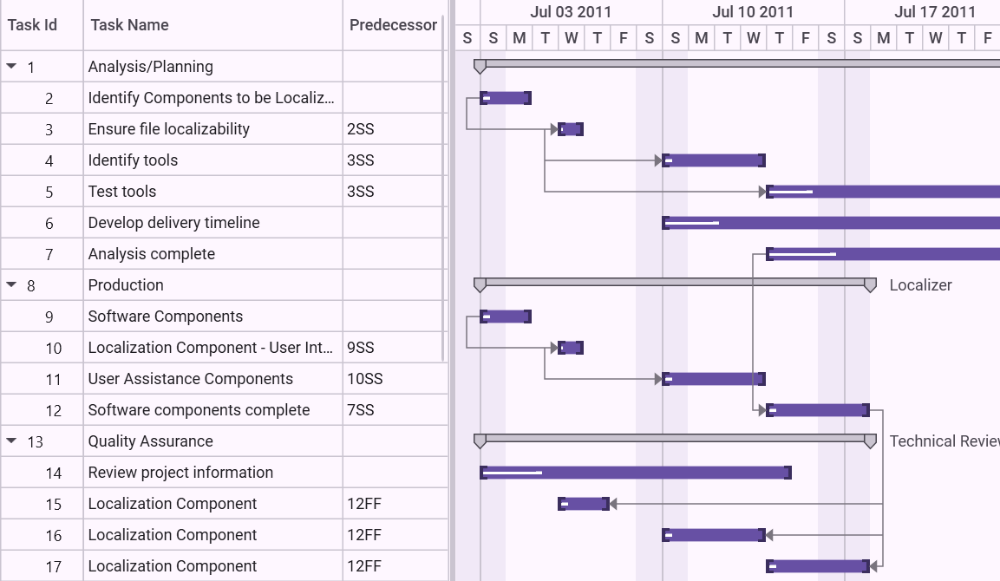
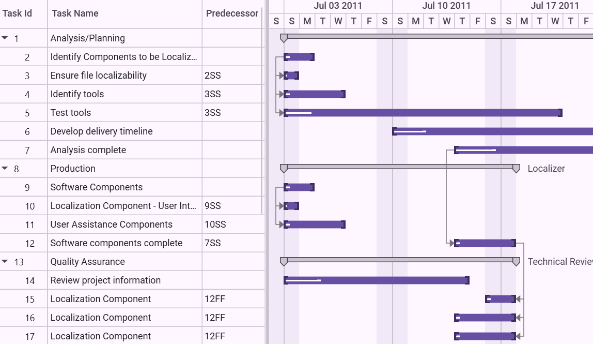
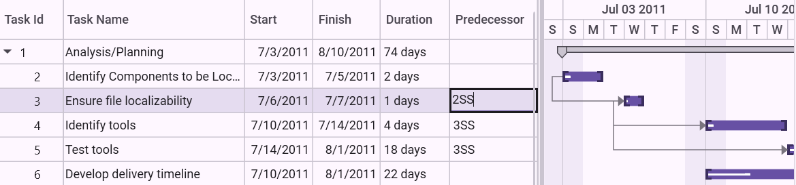

# Dependency Relationship in WPF Gantt

Dependency relationship is the relationship between two tasks. These relationship has been categorized into four types based on the start and finish date of the task. They are:

* FinishToStart 
* FinishToFinish
* StartToStart
* StartToFinish

Finish-to-start—You cannot start a task until the other task is completed.

Finish-to-finish—You cannot finish a task until the other task is completed.

Start-to-start—You cannot start a task until the other task is also started.

Start-to-Finish—You cannot finish a task until another the other task is started.

## Properties

<table>
<tr>
<th>
Property </th><th>
Description </th><th>
Type </th><th>
Data Type </th><th>
Reference links </th></tr>
<tr>
<td>
Predecessor</td><td>
This enables you to set the relationship between the tasks.</td><td>
Object</td><td>
Object</td><td>
NA</td></tr>
<tr>
<td>
GanttTaskRelationship</td><td>
This contains four relationships. They are:

* StartToStart
* StartToFinish
* FinishToFinish
* FinishToStart

You can assign this to the {{ '_TaskDetails_' | markdownify }} to set the relationship between tasks.</td><td>
Predecessor</td><td>
Enum</td><td>
NA</td></tr>
</table>

Specifying the Relationship between Tasks 

The following code illustrates how to add the Dependency Relationship between tasks:




<syncfusion:GanttControl x:Name="ganttControl"
                         ItemsSource="{Binding TaskCollection}">
    <syncfusion:GanttControl.TaskAttributeMapping>
        <syncfusion:TaskAttributeMapping ChildMapping="ChildCollection"
                                         DurationMapping="Duration"
                                         FinishDateMapping="EndDate"
                                         PredecessorMapping="Predecessor"
                                         ProgressMapping="Progress"
                                         ResourceInfoMapping="Resource"
                                         StartDateMapping="StartDate"
                                         TaskIdMapping="ID"
                                         TaskNameMapping="Name" />
    </syncfusion:GanttControl.TaskAttributeMapping>
    <syncfusion:GanttControl.DataContext>
        <local:ViewModel/>
    </syncfusion:GanttControl.DataContext>
</syncfusion:GanttControl>




GanttControl ganttControl = new GanttControl();
 viewModel = new ViewModel();
ganttControl.DataContext = viewModel;
ganttControl.ItemsSource = viewModel.TaskCollection;

// Task attribute mapping
TaskAttributeMapping attributes = new TaskAttributeMapping();
attributes.ChildMapping = "ChildCollection";
attributes.DurationMapping = "Duration";
attributes.FinishDateMapping = "EndDate";
attributes.PredecessorMapping = "Predecessor";
attributes.ProgressMapping = "Progress";
attributes.ResourceInfoMapping = "Resource";
attributes.StartDateMapping = "StartDate";
attributes.TaskIdMapping = "ID";
attributes.TaskNameMapping = "Name";
ganttControl.TaskAttributeMapping = attributes;
this.Content = ganttControl;




public class Task : INotifyPropertyChanged
{
    private DateTime startDate, endDate;

    private TimeSpan duration;

    private double progress;

    private int id;

    private string name;

    private ObservableCollection<Task> childCollection;

    private ObservableCollection<Resource> resource;

    private ObservableCollection<Predecessor> predecessor;

    public Task()
    {
        ChildCollection = new ObservableCollection<Task>();
        Predecessor = new ObservableCollection<Predecessor>();
        Resource = new ObservableCollection<Resource>();
    }

    /// 

    /// Property for Start Date.
    /// 

    public DateTime StartDate
    {
        get
        {
            return this.startDate;
        }
        set
        {
            this.startDate = value;
            OnPropertyChanged("StartDate");
        }
    }

    /// 

    /// Property for Finish Date.
    /// 

    public DateTime EndDate
    {
        get
        {
            return this.endDate;
        }
        set
        {
            this.endDate = value;
            OnPropertyChanged("EndDate");
        }
    }

    /// 

    /// Property for duration value.
    /// 

    public TimeSpan Duration
    {
        get
        {
            return this.duration;
        }
        set
        {
            this.duration = value;
            OnPropertyChanged("Duration");
        }
    }

    /// 

    /// Property for ID value.
    /// 

    public int ID
    {
        get
        {
            return this.id;
        }
        set
        {
            this.id = value;
            OnPropertyChanged("ID");
        }
    }

    /// 

    /// Property for Name.
    /// 

    public string Name
    {
        get
        {
            return this.name;
        }
        set
        {
            this.name = value;
            OnPropertyChanged("Name");
        }
    }

    /// 

    /// Property to define progress value.
    /// 

    public double Progress
    {
        get
        {
            return this.progress;
        }
        set
        {
            this.progress = value;
            OnPropertyChanged("Progress");
        }
    }

    /// 

    /// Property to add child collection.
    /// 

    public ObservableCollection<Task> ChildCollection
    {
        get
        {
            return this.childCollection;
        }
        set
        {
            this.childCollection = value;
            OnPropertyChanged("ChildCollection");
        }
    }

    /// 

    /// Property to define resource value.
    /// 

    public ObservableCollection<Resource> Resource
    {
        get
        {
            return this.resource;
        }
        set
        {
            this.resource = value;
            OnPropertyChanged("Resource");
        }
    }

    /// 

    /// Property to define predecessor value.
    /// 

    public ObservableCollection<Predecessor> Predecessor
    {
        get
        {
            return this.predecessor;
        }
        set
        {
            this.predecessor = value;
            OnPropertyChanged("Predecessor");
        }
    }

    private void OnPropertyChanged(string propName)
    {
        if (this.PropertyChanged != null)
        {
            PropertyChanged(this, new PropertyChangedEventArgs(propName));
        }
    }

    public event PropertyChangedEventHandler PropertyChanged;
}



 
public class ViewModel
{
    public ObservableCollection<Task> TaskCollection { get; set; }

    public ViewModel()
    {
    TaskCollection = this.GetDataSource();
    }

    private ObservableCollection<Task> GetDataSource()
    {

        var data = new ObservableCollection<Task>();
        data.Add(new Task() { ID = 1, Name = "Analysis/Planning", StartDate = new DateTime(2011, 7, 3), EndDate = new DateTime(2011, 8, 14), Progress = 40d });
        data[0].ChildCollection.Add((new Task() { ID = 2, Name = "IDentify Components to be Localized", StartDate = new DateTime(2011, 7, 3), EndDate = new DateTime(2011, 7, 5), Progress = 20d }));
        data[0].ChildCollection.Add((new Task() { ID = 3, Name = "Ensure file localizability", StartDate = new DateTime(2011, 7, 6), EndDate = new DateTime(2011, 7, 7), Progress = 20d }));
        data[0].ChildCollection.Add((new Task() { ID = 4, Name = "IDentify tools", StartDate = new DateTime(2011, 7, 10), EndDate = new DateTime(2011, 7, 14), Progress = 10d }));
        data[0].ChildCollection.Add((new Task() { ID = 5, Name = "Test tools", StartDate = new DateTime(2011, 7, 14), EndDate = new DateTime(2011, 8, 1), Progress = 10d }));
        data[0].ChildCollection.Add((new Task() { ID = 6, Name = "Develop delivery timeline", StartDate = new DateTime(2011, 7, 10), EndDate = new DateTime(2011, 8, 1), Progress = 10d }));
        data[0].ChildCollection.Add((new Task() { ID = 7, Name = "Analysis Progress", StartDate = new DateTime(2011, 7, 14), EndDate = new DateTime(2011, 8, 10), Progress = 10d }));

        data.Add(new Task() { ID = 8, Name = "Production", StartDate = new DateTime(2011, 7, 3), EndDate = new DateTime(2011, 7, 14), Progress = 40d });
        data[1].ChildCollection.Add((new Task() { ID = 9, Name = "Software Components", StartDate = new DateTime(2011, 7, 3), EndDate = new DateTime(2011, 7, 5), Progress = 20d, }));
        data[1].ChildCollection.Add((new Task() { ID = 10, Name = "Localization Component - User Interface", StartDate = new DateTime(2011, 7, 6), EndDate = new DateTime(2011, 7, 7), Progress = 20d }));
        data[1].ChildCollection.Add((new Task() { ID = 11, Name = "User Assistance Components", StartDate = new DateTime(2011, 7, 10), EndDate = new DateTime(2011, 7, 14), Progress = 10d }));
        data[1].ChildCollection.Add((new Task() { ID = 12, Name = "Software components Progress", StartDate = new DateTime(2011, 7, 14), EndDate = new DateTime(2011, 7, 18), Progress = 10d }));

        data.Add(new Task() { ID = 13, Name = "Quality Assurance", StartDate = new DateTime(2011, 7, 3), EndDate = new DateTime(2011, 7, 12), Progress = 40d, });
        data[2].ChildCollection.Add((new Task() { ID = 14, Name = "Review project information", StartDate = new DateTime(2011, 7, 3), EndDate = new DateTime(2011, 7, 15), Progress = 20d }));
        data[2].ChildCollection.Add((new Task() { ID = 15, Name = "Localization Component", StartDate = new DateTime(2011, 7, 6), EndDate = new DateTime(2011, 7, 8), Progress = 20d }));
        data[2].ChildCollection.Add((new Task() { ID = 16, Name = "Localization Component", StartDate = new DateTime(2011, 7, 10), EndDate = new DateTime(2011, 7, 14), Progress = 10d }));
        data[2].ChildCollection.Add((new Task() { ID = 17, Name = "Localization Component", StartDate = new DateTime(2011, 7, 14), EndDate = new DateTime(2011, 7, 18), Progress = 10d }));

        data.Add(new Task() { ID = 18, Name = "Beta Testing", StartDate = new DateTime(2011, 7, 3), EndDate = new DateTime(2011, 7, 14), Progress = 40d });
        data[3].ChildCollection.Add((new Task() { ID = 19, Name = "Disseminate Progressd product", StartDate = new DateTime(2011, 7, 3), EndDate = new DateTime(2011, 7, 5), Progress = 20d }));
        data[3].ChildCollection.Add((new Task() { ID = 20, Name = "Obtain feedback", StartDate = new DateTime(2011, 7, 6), EndDate = new DateTime(2011, 7, 7), Progress = 20d }));
        data[3].ChildCollection.Add((new Task() { ID = 21, Name = "Modify", StartDate = new DateTime(2011, 7, 10), EndDate = new DateTime(2011, 7, 19), Progress = 10d }));
        data[3].ChildCollection.Add((new Task() { ID = 22, Name = "Test", StartDate = new DateTime(2011, 7, 14), EndDate = new DateTime(2011, 7, 19), Progress = 10d }));
        data[3].ChildCollection.Add((new Task() { ID = 23, Name = "Progress", StartDate = new DateTime(2011, 7, 10), EndDate = new DateTime(2011, 7, 19), Progress = 10d }));

        data.Add(new Task() { ID = 24, Name = "Post-Project Review", StartDate = new DateTime(2011, 7, 3), EndDate = new DateTime(2011, 7, 14), Progress = 40d, });
        data[4].ChildCollection.Add((new Task() { ID = 25, Name = "Finalize cost analysis", StartDate = new DateTime(2011, 7, 3), EndDate = new DateTime(2011, 7, 5), Progress = 20d }));
        data[4].ChildCollection.Add((new Task() { ID = 26, Name = "Analyze performance", StartDate = new DateTime(2011, 7, 6), EndDate = new DateTime(2011, 7, 7), Progress = 20d }));
        data[4].ChildCollection.Add((new Task() { ID = 27, Name = "Archive files", StartDate = new DateTime(2011, 7, 10), EndDate = new DateTime(2011, 7, 14), Progress = 10d }));
        data[4].ChildCollection.Add((new Task() { ID = 28, Name = "Document lessons learned", StartDate = new DateTime(2011, 7, 14), EndDate = new DateTime(2011, 7, 18), Progress = 10d }));
        data[4].ChildCollection.Add((new Task() { ID = 29, Name = "Distribute to team members", StartDate = new DateTime(2011, 7, 10), EndDate = new DateTime(2011, 7, 14), Progress = 10d }));
        data[4].ChildCollection.Add((new Task() { ID = 30, Name = "Post-project review Progress", StartDate = new DateTime(2011, 7, 10), EndDate = new DateTime(2011, 7, 14), Progress = 10d }));

        data[1].Resource.Add(new Resource() { ID = 1, Name = "Localizer" });
        data[2].Resource.Add(new Resource() { ID = 2, Name = "Technical Reviewer" });
        data[3].Resource.Add(new Resource() { ID = 3, Name = "Project Manager" });

        data[0].ChildCollection[1].Predecessor.Add(new Predecessor() { GanttTaskIndex = 2, GanttTaskRelationship = GanttTaskRelationship.StartToStart });
        data[0].ChildCollection[2].Predecessor.Add(new Predecessor() { GanttTaskIndex = 3, GanttTaskRelationship = GanttTaskRelationship.StartToStart });
        data[0].ChildCollection[3].Predecessor.Add(new Predecessor() { GanttTaskIndex = 3, GanttTaskRelationship = GanttTaskRelationship.StartToStart });

        data[1].ChildCollection[1].Predecessor.Add(new Predecessor() { GanttTaskIndex = 9, GanttTaskRelationship = GanttTaskRelationship.StartToStart });
        data[1].ChildCollection[2].Predecessor.Add(new Predecessor() { GanttTaskIndex = 10, GanttTaskRelationship = GanttTaskRelationship.StartToStart });
        data[1].ChildCollection[3].Predecessor.Add(new Predecessor() { GanttTaskIndex = 7, GanttTaskRelationship = GanttTaskRelationship.StartToStart });

        data[2].ChildCollection[1].Predecessor.Add(new Predecessor() { GanttTaskIndex = 12, GanttTaskRelationship = GanttTaskRelationship.FinishToFinish });
        data[2].ChildCollection[2].Predecessor.Add(new Predecessor() { GanttTaskIndex = 12, GanttTaskRelationship = GanttTaskRelationship.FinishToFinish });
        data[2].ChildCollection[3].Predecessor.Add(new Predecessor() { GanttTaskIndex = 12, GanttTaskRelationship = GanttTaskRelationship.FinishToFinish });

        data[3].ChildCollection[1].Predecessor.Add(new Predecessor() { GanttTaskIndex = 18, GanttTaskRelationship = GanttTaskRelationship.StartToStart });
        data[3].ChildCollection[2].Predecessor.Add(new Predecessor() { GanttTaskIndex = 18, GanttTaskRelationship = GanttTaskRelationship.StartToStart });
        data[3].ChildCollection[3].Predecessor.Add(new Predecessor() { GanttTaskIndex = 19, GanttTaskRelationship = GanttTaskRelationship.StartToStart });

        data[4].ChildCollection[1].Predecessor.Add(new Predecessor() { GanttTaskIndex = 25, GanttTaskRelationship = GanttTaskRelationship.StartToStart });
        data[4].ChildCollection[2].Predecessor.Add(new Predecessor() { GanttTaskIndex = 28, GanttTaskRelationship = GanttTaskRelationship.StartToStart });
        data[4].ChildCollection[3].Predecessor.Add(new Predecessor() { GanttTaskIndex = 30, GanttTaskRelationship = GanttTaskRelationship.StartToStart });
        data[4].ChildCollection[4].Predecessor.Add(new Predecessor() { GanttTaskIndex = 27, GanttTaskRelationship = GanttTaskRelationship.StartToStart });
        return data;
    }
}




The following image shows the Dependency Relationship:

#### Samples Link

To view samples: 

1. Go to the Syncfusion Essential Studio installed location. 
    Location: Installed Location\Syncfusion\Essential Studio\{{ site.releaseversion }}\Infrastructure\Launcher\Syncfusion Control Panel 
2. Open the Syncfusion Control Panel in the above location (or) Double click on the Syncfusion Control Panel desktop shortcut menu.
3. Click Run Samples for WPF under User Interface Edition panel .
4. Select Gantt.
5. Expand the Connectors Features item in the Sample Browser.
6. Choose the Predecessor sample to launch. 

## Dynamic Predecessors and Resources

Essential Gantt provides support for dynamic editing of predecessors in the Grid area. Using this feature, you can dynamically add the predecessor on-demand basis to Gantt. You can add/remove the predecessor in the corresponding cell in the GanttGrid.

You can add/remove/update the predecessors and resources of tasks at run time. Initially, the Gantt is loaded with the Predecessor/Resource information in the underlying collection and you can update this information if required.

You can edit the predecessor information from the GanttGrid. For resource, you can edit in the underlying source, Gantt will listen to the change in the underlying source and reflect it in both GanttGrid and GanttChart.

## Predecessor Validation

There are two predecessor validation modes in Gantt Control. 

* Auto - Successor nodes will adjust its position based on its predecessor nodes automatically.
* Manual - Successor nodes need to adjust manually with respect to predecessor.

#### Properties

<table>
<tr>
<th>
Property</th><th>
Description</th><th>
Type</th><th>
Data Type</th><th>
Reference links</th></tr>
<tr>
<td>
ValidationMode</td><td>
This contains two modes.<ul><li>
Manual,</li><li>
Auto.</li></ul>
Default value is Manual.</td><td>
DependencyProperty</td><td>
Enum</td><td>
NA</td></tr>
</table>

The following image shows the Predecessor in Manual Mode:

The following image shows the Predecessor in Auto Mode:

#### Editing Predecessors

While creating a new predecessor in Grid, it should be in the following format:



	{Task ID}{GanttTaskRelationship} 
	


Here the {GanttTaskRelationship} is any one of the following:

* SS
* FS
* SF
* FF

The following are what you should use for different relationships:

* Use “SS” to define the “StartToStart” relationship
* Use “FS” to define the “FinishToStart” relationship
* Use “SF” to define the “StartToFinish” relationship
* Use “FF” to define the “FinishToFinish” relationship

If any other data is added, the current editing relationship will be deleted and only the valid predecessors remain for the task.

#### Editing Resources

As of now, resources cannot be edited in Grid. You can update the resource collection in the underlying source whenever you need. Gantt will listen to the changes in the collection and will update the GanttGrid and GanttChart accordingly.

#### Use Case Scenario

This helps to change the dependency relationships and resources of the tasks dynamically.

Adding Dynamic Predecessors and Resources to an Application

The dynamic editing of predecessor will be automatically included in the Gantt by default. There is no need to provide any additional data for that. The following codes illustrate this:




<syncfusion:GanttControl x:Name="ganttControl"
                         ItemsSource="{Binding TaskCollection}">
    <syncfusion:GanttControl.TaskAttributeMapping>
        <syncfusion:TaskAttributeMapping ChildMapping="ChildCollection"
                                         DurationMapping="Duration"
                                         FinishDateMapping="EndDate"
                                         PredecessorMapping="Predecessor"
                                         ProgressMapping="Progress"
                                         ResourceInfoMapping="Resource"
                                         StartDateMapping="StartDate"
                                         TaskIdMapping="ID"
                                         TaskNameMapping="Name" />
    </syncfusion:GanttControl.TaskAttributeMapping>
    <syncfusion:GanttControl.DataContext>
        <local:ViewModel/>
    </syncfusion:GanttControl.DataContext>
</syncfusion:GanttControl>
 



//// The following code will illustrate how to dynamically add resource and predecessor in the underlying collection:
// To Add the Dynamic Predecessors
viewModel.TaskCollection[2].Predecessor.Add(new Predecessor()
{
    GanttTaskIndex = 3,
    GanttTaskRelationship = GanttTaskRelationship.StartToFinish
});

//To Add the Dynamic Resources   
viewModel.TaskCollection[2].Resource.Add(new Resource { ID = 3, Name = "Resource3" });


