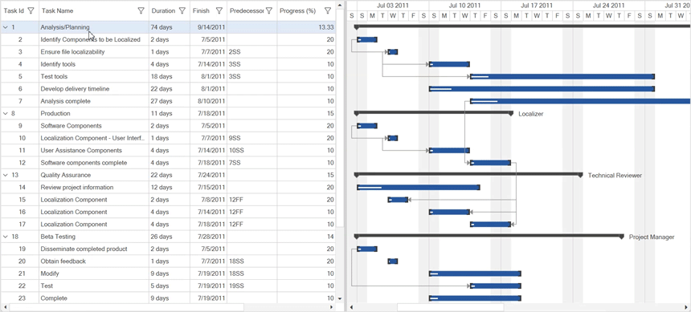

# Drag and drop support in GanttControl
The WPF `GanttControl` allows you to reorder rows and columns within the `GanttGrid` and rearrange nodes in the `GanttChart` by dragging and dropping them. You can disable drag and drop by setting the `AllowDragDrop` property to false. The default value is `true`.




<sync:GanttControl x:Name="ganttControl" 
                   AllowDragDrop="False">
</Sync:GanttControl>



this.ganttControl.AllowDragDrop = false;



## Handle node drag starting
You can get the node details and handle whether the node can be draggable or not by using the `TreeGridNodeDragStarting` event. This event will be triggered when the node is started dragging. The `TreeGridNodeDragStartingEventArgs` argument contains the `Nodes` property which gets the nodes that contain the associated data while dragging the rows.




<sync:GanttControl x:Name="ganttControl"
                   TreeGridNodeDragStarting="OnGanttControlTreeGridNodeDragStarting"> 
</Sync:GanttControl>




this.ganttControl.TreeGridNodeDragStarting += OnGanttControlTreeGridNodeDragStarting;

...

private void OnGanttControlTreeGridNodeDragStarting(object sender, TreeGridNodeDragStartingEventArgs e)
{
    var nodes = e.Nodes;
    e.Cancel = true;
}




## Handle node dragging
You can get the dragging node details in gantt grid by using the `TreeGridNodeDragging` event. This event will be continuously triggered when the node is being dragged. The `TreeGridNodeDraggingEventArgs` argument contains the `Nodes` property which gets the nodes that are being dragged.




<sync:GanttControl x:Name="ganttControl"
                   TreeGridNodeDragging="OnGanttControlTreeGridNodeDragging">
</Sync:GanttControl>




this.ganttControl.TreeGridNodeDragging += OnGanttControlTreeGridNodeDragging;

...

private void OnGanttControlTreeGridNodeDragging(object sender, TreeGridNodeDraggingEventArgs e)
{
    var nodes = e.Nodes;
}




## Handle node drop
Using the `TreeGridNodeDrop` event you can get the dropping node details, target node, and you can handle whether the node can be dropped to the specific position or not. This event will trigger after dropping the node. The `TreeGridNodeDropEventArgs` argument contains the following properties.

* `Nodes` - Gets the item that contains the associated data while dragging the rows.
* `TargetNode` - Gets a value indicating the target node which is going to drop.




<sync:GanttControl x:Name="ganttControl"
                   TreeGridNodeDrop="OnGanttControlTreeGridNodeDrop">
</Sync:GanttControl>




this.ganttControl.TreeGridNodeDrop += OnGanttControlTreeGridNodeDrop;

...

private void OnGanttControlTreeGridNodeDrop(object sender, TreeGridNodeDropEventArgs e)
{
    var nodes = e.Nodes;
    var targetNode = e.TargetNode;
    e.Cancel = false;
}




## Handle drag and drop in Gantt chart
You can get the dragging and dropping node details in gantt chart by using the `NodeDragDelta` and `NodeDragCompleted` events. The `NodeDragAndDropEventArgs` argument contains the following properties.

* `Node` - Gets or sets the node.
* `HorizontalChange` - Gets or sets the horizontal change.
* `StartTime` - Gets or sets the start time.
* `EndTime` - Gets or sets the end time.
* `Start` - Gets or sets the start.
* `End` - Gets or sets the end.
* `NodePresenter` - Gets or sets the node parent.

### Handle node dragging in Gantt chart



<sync:GanttControl x:Name="ganttControl"
                   NodeDragDelta="OnGanttControlNodeDragDelta">
</Sync:GanttControl>




this.ganttControl.NodeDragDelta += OnGanttControlNodeDragDelta;

...

private void OnGanttControlNodeDragDelta(object sender, NodeDragAndDropEventArgs args)
{
    var node = args.Node;
}




### Handle node drop in Gantt chart



<sync:GanttControl x:Name="ganttControl"
                   NodeDragCompleted="OnGanttControlNodeDragCompleted">
</Sync:GanttControl>




this.ganttControl.NodeDragCompleted += OnGanttControlNodeDragCompleted;

...

private void OnGanttControlNodeDragCompleted(object sender, NodeDragAndDropEventArgs args)
{
    var startTime = args.StartTime;
    var endTime = args.EndTime;
}


