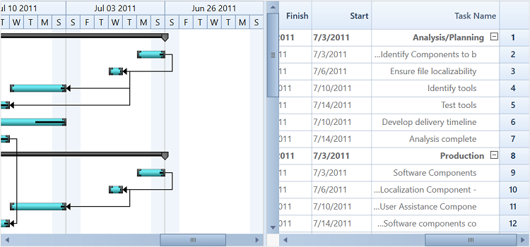

# Flow Direction

Gantt provides support to display the contents from right-to-left or left-to-right direction. It can be achieved by setting the `FlowDirection` property value as “RightToLeft” or “LeftToRight” in the Gantt control. The following code sample explains how to set this property.





<Sync:GanttControl x:Name="Gantt" ItemsSource="{Binding GanttItemSource}" FlowDirection="RightToLeft"/>




 
this.Gantt.FlowDirection = System.Windows.FlowDirection.RightToLeft;





